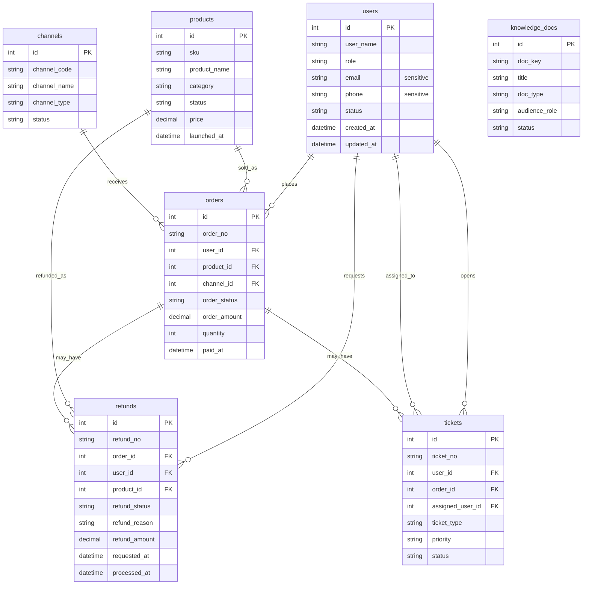

# DataPilot

企业数据分析 Agent 系统——自然语言 → SQL/RAG → 可视化 + 分析报告。

✅ 阶段二 v1 已收尾。阶段三A（M8-M12）Text2SQL 深化已完成：Schema Retrieval、QueryPlanStep、新 Text2SQL Pipeline、Trace Steps 和对照报告。下一步进入阶段三 RAG / Hybrid。

## 快速开始

### 环境

- Python：`D:\.Programs\Python\anaconda3\envs\fastapi0614\python.exe`
- 数据库：MySQL 开发库 `datapilot_dev`（SQLAlchemy + Alembic 管理建表和迁移；SQLite 仅用于测试兜底）

### 安装依赖

```powershell
D:\.Programs\Python\anaconda3\envs\fastapi0614\python.exe -m pip install -e ".[dev]"
```

### 配置环境变量

```powershell
Copy-Item .env.example .env
```

### 启动 API

```powershell
D:\.Programs\Python\anaconda3\envs\fastapi0614\python.exe -m uvicorn app.main:app --reload
```

健康检查：

```powershell
Invoke-RestMethod http://127.0.0.1:8000/health
```

预期返回：

```json
{
  "status": "ok"
}
```

M2 已提供 4 类基础列表接口，供后续 Agent、评测和演示页读取业务数据：

| 接口 | 主要筛选条件 |
|---|---|
| `GET /api/products` | `category`、`status`、`page`、`page_size` |
| `GET /api/orders` | `paid_from`、`paid_to`、`channel_id`、`order_status`、`page`、`page_size` |
| `GET /api/refunds` | `requested_from`、`requested_to`、`refund_status`、`refund_reason`、`page`、`page_size` |
| `GET /api/tickets` | `status`、`priority`、`ticket_type`、`page`、`page_size` |

分页响应统一为：

```json
{
  "items": [],
  "total": 0,
  "page": 1,
  "page_size": 20,
  "trace_id": "..."
}
```

异常响应统一为：

```json
{
  "code": "validation_error",
  "message": "Request validation failed.",
  "trace_id": "...",
  "details": []
}
```

每次请求都会生成或透传 `X-Trace-Id`，服务端日志记录 `method / path / status / latency_ms / trace_id`。
Redis 在 M2 只保留 `NullCache` wrapper 骨架，暂未接入真实缓存能力。

### v0 模板 SQL 查询

M3 提供 `POST /api/query`：自然语言问题先匹配白名单模板 SQL，再经过 sqlglot SQL Guard
只读检查，最后执行数据库查询并返回简化版 AgentResponse。M4 之后仍然保持“模板优先”，
这些高价值问题不会被 LLM 波动影响。

请求示例：

```powershell
Invoke-RestMethod `
  -Method Post `
  -Uri http://127.0.0.1:8000/api/query `
  -ContentType 'application/json' `
  -Body '{"question":"2026年6月退款率最高的商品是什么？","user_role":"ops"}'
```

当前 5 个模板问题：

| 问题 | 关键结果 |
|---|---|
| `2026年6月退款率最高的商品是什么？` | `Aurora Noise Cancelling Headphones` |
| `各渠道订单量是多少？` | 返回各渠道 `order_count` |
| `2026年6月本月GMV是多少？` | 返回 `gmv` |
| `Top退款原因是什么？` | `quality_issue` |
| `待处理高优先级工单有多少？` | `12` |

简化版 AgentResponse：

```json
{
  "route": "sql",
  "answer": "2026-06 退款率最高商品：product_name=Aurora Noise Cancelling Headphones...",
  "sql": "SELECT ...",
  "columns": ["product_name", "refund_count", "order_count", "refund_rate"],
  "rows": [],
  "safety_status": "passed",
  "blocked_reason": null,
  "trace_id": "..."
}
```

危险 DDL / DML 会被结构化拦截：

```json
{
  "route": "sql",
  "answer": "SQL Guard 已拦截该请求。",
  "sql": "DROP TABLE orders",
  "columns": [],
  "rows": [],
  "safety_status": "blocked",
  "blocked_reason": "只允许 SELECT 只读查询...",
  "trace_id": "..."
}
```

v0 smoke：

```powershell
$env:PYTHONDONTWRITEBYTECODE='1'; D:\.Programs\Python\anaconda3\envs\fastapi0614\python.exe scripts\smoke_v0.py
```

输出摘要会写入 `.agent_work/temp/v0-smoke.md`。

### v1 NL2SQL、Trace 与图表

M4 在模板未命中时接入 DeepSeek NL2SQL：`schema_desc`、`metrics.yaml` 和 M3 模板 SQL
few-shot 会被组装进 prompt，模型输出 SQL 后仍必须经过增强 SQL Guard：

- 只允许单条 `SELECT`。
- 拦截 `DROP / DELETE / UPDATE / INSERT / ALTER / TRUNCATE`。
- 拦截 `users.email`、`users.phone` 等敏感字段，除 `admin` 外不可访问。
- 按角色做表级 allowlist：`customer_service` 当前只允许 `tickets` 和 `knowledge_docs`。

M5 把查询执行收口成 SQL Tool，并扩展 AgentResponse：每次 `/api/query` 都会返回
`tables_used`、`docs_used`、`chart_spec`、`cost`、`tool_calls`、`error_type` 和 `trace_id`。
成功查询会把完整 trace 追加到 `eval/traces/traces.jsonl`；该 JSONL 默认不提交，M6
EvalOps-lite 后续按行读取即可。

扩展版 AgentResponse 示例：

```json
{
  "route": "sql",
  "answer": "各渠道订单量：channel_name=Mobile App，order_count=93（共 6 行结果）",
  "sql": "SELECT ...",
  "columns": ["channel_name", "order_count"],
  "rows": [{"channel_name": "Mobile App", "order_count": 93}],
  "tables_used": ["channels", "orders"],
  "docs_used": [],
  "chart_spec": {
    "$schema": "https://vega.github.io/schema/vega-lite/v5.json",
    "mark": "bar",
    "data": {"values": [{"channel_name": "Mobile App", "order_count": 93}]},
    "encoding": {
      "x": {"field": "channel_name", "type": "nominal"},
      "y": {"field": "order_count", "type": "quantitative"}
    }
  },
  "safety_status": "passed",
  "blocked_reason": null,
  "cost": {
    "latency_ms": 15.0,
    "sql_time_ms": 12.0,
    "model": null,
    "prompt_tokens": 0,
    "completion_tokens": 0
  },
  "tool_calls": [
    {
      "tool_name": "sql_query",
      "status": "success",
      "latency_ms": 12.0,
      "sql": "SELECT ...",
      "tables_used": ["channels", "orders"],
      "error_type": null,
      "message": null
    }
  ],
  "error_type": null,
  "trace_id": "..."
}
```

基础图表规则：

| 结果形状 | 图表 |
|---|---|
| 类别 + 数值，例如各渠道订单量 | `bar` |
| 日期 / 月份 + 数值 | `line` |
| Top N / 最高类排名，例如退款率最高商品 | 横向 `bar` |
| GMV 这类单指标 | 单柱 `bar` |

LLM 配置示例：

```powershell
$env:LLM_PROVIDER='deepseek'
$env:LLM_MODEL='deepseek-v4-pro'
$env:DEEPSEEK_API_KEY='<your_key>'
$env:DEEPSEEK_BASE_URL='https://api.deepseek.com'
```

M4 smoke：

```powershell
$env:PYTHONDONTWRITEBYTECODE='1'; D:\.Programs\Python\anaconda3\envs\fastapi0614\python.exe scripts\smoke_m4_nl2sql.py
```

脚本会为 6 条 simple SQL 生成 prompt 快照到 `.agent_work/temp/prompt-snapshots.md`，
并把实际执行摘要写入 `.agent_work/temp/m4-smoke.md`。

M5 smoke：

```powershell
$env:PYTHONDONTWRITEBYTECODE='1'; D:\.Programs\Python\anaconda3\envs\fastapi0614\python.exe scripts\smoke_m5_agent_response.py
```

脚本会验证渠道订单量、商品退款率、GMV 和危险 SQL 拦截 4 条用例；摘要写入
`.agent_work/temp/m5-smoke.md`，测试用 trace 写入 `.agent_work/temp/m5-traces.jsonl`。

### M6 EvalOps-lite 与演示页

M6 提供最小 EvalOps-lite：从 `eval/cases/smoke.yaml` 读取 6 条 smoke case，通过 FastAPI
`/api/query` 批量执行，并把每条的 `pass / fail / error_type / trace_id` 写入 Markdown 报告。
当前 smoke 覆盖 2 条简单 SQL、2 条聚合、1 条多表 join、1 条安全拦截。

```powershell
$env:PYTHONDONTWRITEBYTECODE='1'; D:\.Programs\Python\anaconda3\envs\fastapi0614\python.exe -m eval.run_eval
```

最新报告写入 `eval/reports/latest.md`。当前验证快照：`6/6 passed`；评测 trace 写入
`.agent_work/temp/m6-eval-traces.jsonl`，避免污染正式 `eval/traces/traces.jsonl`。

启动 Streamlit 演示页：

```powershell
# 终端 1：启动 FastAPI
D:\.Programs\Python\anaconda3\envs\fastapi0614\python.exe -m uvicorn app.main:app --reload

# 终端 2：启动演示页
D:\.Programs\Python\anaconda3\envs\fastapi0614\python.exe -m streamlit run demo\streamlit_app.py
```

演示页通过 HTTP 调用本地 `/api/query`，展示 `answer`、`SQL`、表格、Vega-Lite 图表、
`safety_status`、`trace_id` 和 tool trace。

### Phase 3A Text2SQL 深化

M8-M12 把阶段二 v1 的 SQL 主链路升级为可检索、可计划、可校验、可追踪的 Text2SQL 中间层。

**核心能力**：

| 能力 | 模块 | 说明 |
|---|---|---|
| Schema Retrieval（字段/指标/关系三级检索） | M9 | keyword + vector 双路召回，结果含 `score/source/rank/doc_type` |
| SchemaGraph + JoinPath | M9 | 从 `relations.yaml` 构建局部表关系图，Join 条件不靠 LLM 猜 |
| QueryPlanStep 结构化计划与自检 | M10 | LLM 先输出 JSON plan，再校验表/字段/Join/敏感字段 |
| 新 Text2SQL Pipeline | M11 | `schema_retrieval → plan → local prompt → SQL → Guard → execute` |
| 分步骤 Trace（trace_steps） | M11 | 每次请求记录 9 步：schema_retrieval 到 chart_decision |
| 强制新链路评测开关 | M11 | `QueryRequest.force_new_pipeline=true` + `pipeline_mode=new_text2sql` |
| 新旧链路对照报告 | M12 | 10 条 formal + 16 条 challenge + 32 条 diagnostic 对比 |

**运行 Phase 3A 评测**：

```powershell
# 新 pipeline 10 条 formal 回归
D:\.Programs\Python\anaconda3\envs\fastapi0614\python.exe -m eval.run_eval --pipeline-mode new_text2sql --cases eval/cases/phase3a-regression.yaml --report eval/reports/phase3a-new-pipeline.md --trace .agent_work/temp/phase3a-new-traces.jsonl

# 生成新旧对照报告
D:\.Programs\Python\anaconda3\envs\fastapi0614\python.exe -m eval.compare_phase3a --baseline-trace .agent_work/temp/phase3a-baseline-traces.jsonl --new-trace .agent_work/temp/phase3a-new-traces.jsonl --report eval/reports/phase3a-comparison.md

# 一键 smoke（运行全部报告 + 对照）
D:\.Programs\Python\anaconda3\envs\fastapi0614\python.exe scripts\smoke_phase3a_text2sql.py
```

**当前边界（如实说明，不虚报）**：

| 项目 | 状态 |
|---|---|
| Schema Retrieval keyword + vector 双路召回 | 已完成（in-memory vector index） |
| Milvus 向量数据库 | 测试兜底（adapter 已实现，pytest 用 in-memory，smoke 可选接 Docker Milvus） |
| 真实中文 Embedding（BGE-M3 / Qwen3） | 可选（SiliconFlow adapter 已实现，默认不联网） |
| RRF 融合 / Rerank | 未实现（接口字段已预留） |
| Schema Linking LLM 二次筛选 | 未实现（hook 位置已预留） |
| SQL 自动修复 / EXPLAIN 风险检查 | 未实现 |
| LangGraph / MCP / Skill 编排 | 未实现（Phase 3A 坚持普通 Python pipeline） |
| 多 SQL Agent / Plan-and-Execute | 未实现（QueryPlan.steps 和 TraceStep.parent_step_id 已预留） |

阶段二已完成能力：

| 能力 | 状态 |
|---|---|
| MySQL + Alembic + 确定性 seed 数据（14 表） | 已完成 |
| 4 类基础列表 API、分页、筛选、统一异常 | 已完成 |
| 模板 SQL + SQL Guard v0 | 已完成 |
| DeepSeek NL2SQL + schema / KPI / few-shot prompt | 已完成 |
| 表级 RBAC + 敏感字段拦截 | 已完成 |
| AgentResponse + SQL Tool + JSONL Trace + 基础图表 | 已完成 |
| EvalOps-lite SQL smoke + Markdown 报告（10 formal + 16 challenge + 32 diagnostic） | 已完成 |
| Streamlit 最小演示控制台 | 已完成 |
| Schema Retrieval（field/metric/relation 三级，keyword+vector 双路召回） | 已完成 |
| SchemaGraph + JoinPath（relations.yaml 驱动） | 已完成 |
| QueryPlanStep 结构化计划 + 自检 | 已完成 |
| 新 Text2SQL Pipeline + force_new_pipeline 开关 | 已完成 |
| 分步骤 trace_steps（9 步，JSONL） | 已完成 |
| 新旧链路对照报告 | 已完成 |
| Milvus 向量数据库 | 测试兜底（adapter 已实现，pytest 用 in-memory） |
| RAG / Hybrid 正式检索链路 | 阶段三 |
| LangGraph 编排、MCP、Skill 化 | 后续计划 |

### 运行测试

```powershell
$env:PYTHONDONTWRITEBYTECODE='1'; D:\.Programs\Python\anaconda3\envs\fastapi0614\python.exe -m pytest -p no:cacheprovider
```

### 数据库迁移与 Seed

建表主路径使用 Alembic，目标库是 MySQL 开发库 `datapilot_dev`：

```powershell
D:\.Programs\Python\anaconda3\envs\fastapi0614\python.exe -m alembic upgrade head
```

写入确定性模拟数据：

```powershell
D:\.Programs\Python\anaconda3\envs\fastapi0614\python.exe -m scripts.seed_data --reset
```

M1 seed 固定写入以下数据量：用户 200、商品 50、类目 15、渠道 6、订单 10000、订单明细 18000、退款 1000、工单 300、知识文档 10、优惠券 10、订单优惠券 3000、行为日志 10000、价格历史 150、宽表快照 10000。

固定业务事实锚点：

- 2026-06 退款率最高商品：`Aurora Noise Cancelling Headphones`
- 2026-06 GMV 最高渠道：`Mobile App`
- 全量退款 Top 原因：`quality_issue`
- 待处理高优先级工单数量：`12`

## M1 ER 图草稿



## 项目结构

```text
app/                    # FastAPI 应用层
  api/                  # REST API 路由
  core/                 # 配置、日志、异常处理
  db/                   # SQLAlchemy engine/session
  models/               # ORM 模型
  schemas/              # Pydantic 请求/响应模型
engine/                 # 通用 Agent 引擎
  nl2sql/               # 模板 SQL / NL2SQL / Planner / Pipeline
  schema_retrieval/     # Schema 检索（field/metric/relation doc + vector index + SchemaGraph）
  sql_guard/            # SQL 安全检查
  tools/                # Agent tools
  trace/                # Trace 与成本延迟记录
domain_pack/            # 电商/SaaS 业务配置
  chart_templates/      # 图表模板
  kb_docs/              # 知识库文档
  metrics.yaml          # KPI 口径
  schema_desc/          # 表结构与字段语义（含 relations.yaml）
  sql_examples/         # few-shot 与模板 SQL
eval/                   # EvalOps-lite
  cases/                # YAML 测试用例
    smoke.yaml          # M6 6 条 SQL smoke case
    phase3a-regression.yaml  # Phase 3A 10 条 formal regression
    database-upgrade-challenge.yaml  # 16 条 challenge
    phase3a-diagnostic-benchmark.yaml  # 16 条 diagnostic extra
  compare_phase3a.py    # M12 新旧链路对照报告生成器
  reports/              # 评测报告
  run_eval.py           # 评测入口
demo/                   # Streamlit 演示页
  streamlit_app.py      # M6 最小演示控制台
scripts/                # 数据生成和维护脚本
tests/                  # 自动化测试
```
