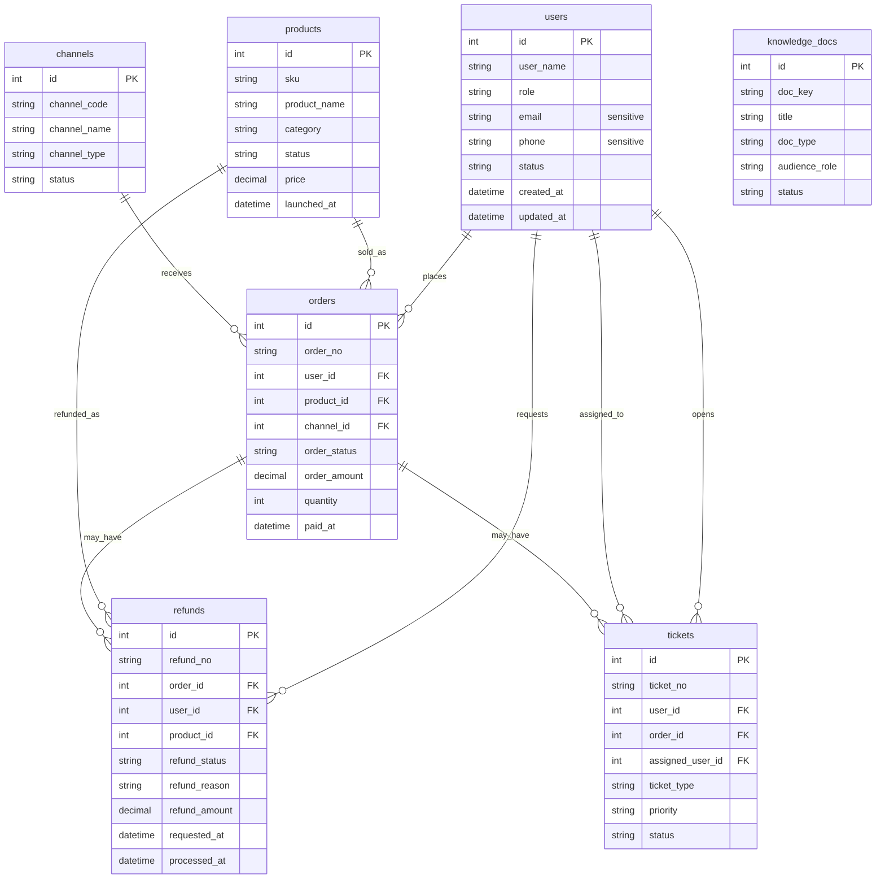

# DataPilot

企业数据分析 Agent 系统——自然语言 → SQL/RAG → 可视化 + 分析报告。

🚧 阶段二进行中：M2 API 与后端工程基础已完成，下一步推进 M3 v0 模板 SQL 闭环

## 快速开始

### 环境

- Python：`D:\.Programs\Python\anaconda3\envs\fastapi0614\python.exe`
- 数据库：MySQL 开发库 `datapilot_dev`（SQLAlchemy + Alembic 管理建表和迁移；SQLite 仅用于测试兜底）

### 安装依赖

```powershell
D:\.Programs\Python\anaconda3\envs\fastapi0614\python.exe -m pip install -e ".[dev]"
```

### 配置环境变量

```powershell
Copy-Item .env.example .env
```

### 启动 API

```powershell
D:\.Programs\Python\anaconda3\envs\fastapi0614\python.exe -m uvicorn app.main:app --reload
```

健康检查：

```powershell
Invoke-RestMethod http://127.0.0.1:8000/health
```

预期返回：

```json
{
  "status": "ok"
}
```

M2 已提供 4 类基础列表接口，供后续 Agent、评测和演示页读取业务数据：

| 接口 | 主要筛选条件 |
|---|---|
| `GET /api/products` | `category`、`status`、`page`、`page_size` |
| `GET /api/orders` | `paid_from`、`paid_to`、`channel_id`、`order_status`、`page`、`page_size` |
| `GET /api/refunds` | `requested_from`、`requested_to`、`refund_status`、`refund_reason`、`page`、`page_size` |
| `GET /api/tickets` | `status`、`priority`、`ticket_type`、`page`、`page_size` |

分页响应统一为：

```json
{
  "items": [],
  "total": 0,
  "page": 1,
  "page_size": 20,
  "trace_id": "..."
}
```

异常响应统一为：

```json
{
  "code": "validation_error",
  "message": "Request validation failed.",
  "trace_id": "...",
  "details": []
}
```

每次请求都会生成或透传 `X-Trace-Id`，服务端日志记录 `method / path / status / latency_ms / trace_id`。
Redis 在 M2 只保留 `NullCache` wrapper 骨架，暂未接入真实缓存能力。

### 运行测试

```powershell
$env:PYTHONDONTWRITEBYTECODE='1'; D:\.Programs\Python\anaconda3\envs\fastapi0614\python.exe -m pytest -p no:cacheprovider
```

### 数据库迁移与 Seed

建表主路径使用 Alembic，目标库是 MySQL 开发库 `datapilot_dev`：

```powershell
D:\.Programs\Python\anaconda3\envs\fastapi0614\python.exe -m alembic upgrade head
```

写入确定性模拟数据：

```powershell
D:\.Programs\Python\anaconda3\envs\fastapi0614\python.exe -m scripts.seed_data --reset
```

M1 seed 固定写入以下数据量：用户 50、商品 30、渠道 6、订单 500、退款 80、工单 120、知识文档 8。

固定业务事实锚点：

- 2026-06 退款率最高商品：`Aurora Noise Cancelling Headphones`
- 2026-06 GMV 最高渠道：`Mobile App`
- 全量退款 Top 原因：`quality_issue`
- 待处理高优先级工单数量：`12`

## M1 ER 图草稿



## 项目结构

```text
app/                    # FastAPI 应用层
  api/                  # REST API 路由
  core/                 # 配置、日志、异常处理
  db/                   # SQLAlchemy engine/session
  models/               # ORM 模型
  schemas/              # Pydantic 请求/响应模型
engine/                 # 通用 Agent 引擎
  nl2sql/               # 模板 SQL / NL2SQL
  sql_guard/            # SQL 安全检查
  tools/                # Agent tools
  trace/                # Trace 与成本延迟记录
domain_pack/            # 电商/SaaS 业务配置
  chart_templates/      # 图表模板
  kb_docs/              # 知识库文档
  schema_desc/          # 表结构与字段语义
  sql_examples/         # few-shot 与模板 SQL
eval/                   # EvalOps-lite
  cases/                # YAML 测试用例
  reports/              # 评测报告
demo/                   # Streamlit 演示页
scripts/                # 数据生成和维护脚本
tests/                  # 自动化测试
```
