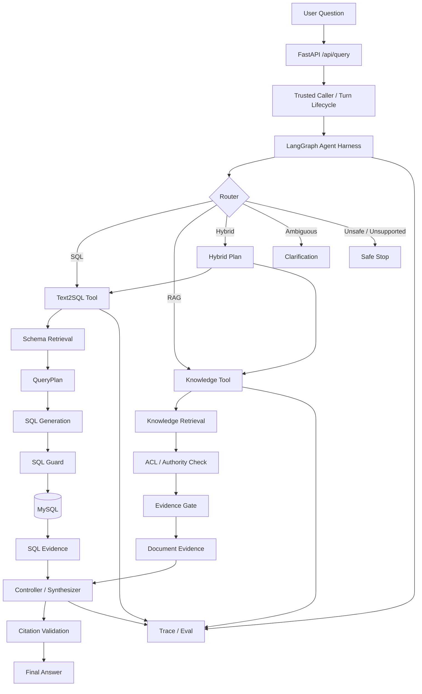

# DataPilot

> **A trustworthy multi-evidence Data Agent for enterprise analytics.**
> 面向企业数据分析场景的可信 Data Agent：通过 LangGraph 编排 **Text2SQL、RAG 与 Hybrid** 多证据链路，在权限边界内获取数据与文档证据，并提供可追踪、可引用、可评测的回答。

## Overview

传统 NL2SQL Demo 往往只解决“自然语言 → SQL”，但企业数据分析还需要回答更多问题：

- 这个问题应该查数据库，还是查业务文档？
- SQL 使用了哪些表和指标口径？Join 是否可靠？
- 用户是否有权限访问这些字段或文档？
- 一个结论同时需要数据库数据和业务规则时怎么办？
- 检索证据不足时，Agent 应继续搜索、澄清，还是停止？
- 最终答案能否追溯到真实使用过的 Evidence？
- Agent 的路由、Tool 调用、Evidence、Citation 和终止原因能否被评测和审计？

**DataPilot 的目标不是构建一个“会调用工具的聊天机器人”，而是构建一个按 Evidence 工作的数据分析 Agent。**

当前系统支持三条核心路径：

| Route      | Use Case                               | Pipeline                                                     |
| ---------- | -------------------------------------- | ------------------------------------------------------------ |
| **SQL**    | GMV、退款率、渠道表现等结构化数据分析  | Schema Retrieval → QueryPlan → SQL Generation → SQL Guard → Execute |
| **RAG**    | 退款规则、客服政策、指标定义等知识问题 | Knowledge Retrieval → ACL → Evidence Gate → Answer → Citation |
| **Hybrid** | 同时需要“数据表现 + 业务规则”的问题    | SQL Evidence + Document Evidence → Controlled Synthesis      |

------

## Current Status

**Phase 4 — Trustworthy Multi-Evidence Agent**

当前已完成 **M40 / P7 technical assurance**，SQL、RAG、Hybrid、澄清恢复和安全拒绝等主路径已经进入统一 Agent Harness、Evidence 与 Trace 合同。

```text
Phase 2        Basic NL2SQL / API / SQL Guard
    ↓
Phase 3A       Schema Retrieval + QueryPlan + Text2SQL Pipeline
    ↓
Phase 3B       Eval / Retrieval / Runtime hardening
    ↓
Phase 4
    ├── P1  Knowledge lifecycle & Document Evidence
    ├── P2  RAG retrieval / citation / Evidence Gate
    ├── P3  LangGraph Agent Harness
    ├── P4  bounded clarification / resume / follow-up
    ├── P5  SQL + RAG Hybrid Evidence
    ├── P6  Agentic-RAG readiness audit → NO-GO
    └── P7  cross-route Trace & runtime assurance   ✅
```

Latest deterministic regression snapshot:

```text
447 passed
3 skipped
1 warning
```

> P7 technical assurance means the current contracts and deterministic rehearsal pass.
> It **does not** mean production authentication, distributed conversation persistence, universal intent routing, or production certification are complete.

------

## Architecture



设计原则是：

> **Router 决定需要什么 Evidence，Tool 负责取得 Evidence，Controller 决定是否足够回答。**

业务逻辑不会为了“画 Graph”被拆成大量浅节点。Text2SQL、Knowledge Retrieval 等仍作为内部完整的 deep Tool，由顶层 LangGraph 负责跨能力状态迁移、预算和停止语义。

------

## Core Capabilities

### 1. Text2SQL

DataPilot 的 SQL 路径不是直接把完整 Schema 丢给 LLM，而是先缩小问题需要的数据库上下文：

```text
Question
  ↓
Schema Retrieval
  ↓
SchemaGraph / JoinPath
  ↓
Structured QueryPlan
  ↓
Local SQL Prompt
  ↓
SQL Generation
  ↓
SQL Guard
  ↓
Execution
  ↓
SQL Evidence
```

主要能力包括：

- Field / Metric / Relation 三级 Schema Retrieval
- keyword + vector Schema 检索
- `relations.yaml` 驱动的 SchemaGraph 与 JoinPath
- 结构化 QueryPlan 与计划自检
- SQL AST 只读检查
- 表级 RBAC
- 敏感字段访问控制
- SQL / QueryPlan / Result / Trace 联合验证
- MySQL + SQLAlchemy + Alembic
- deterministic seed dataset

Schema Retrieval 默认使用本地 deterministic in-memory backend；Milvus 和远程 embedding adapter 已实现，但只在显式实验中启用。

------

### 2. Trustworthy RAG

RAG 路径围绕 **Document Evidence** 而不是单纯的向量 Top-K 构建。

Knowledge corpus 与 Text2SQL Schema corpus 是两套独立的 retrieval lifecycle，防止业务知识正文意外进入 SQL Schema prompt。

核心链路：

```text
Question
  ↓
Knowledge Retrieval
  ↓
Authorization / ACL
  ↓
Revision & Authority Validation
  ↓
Evidence Gate
  ↓
Answer Context
  ↓
Generation
  ↓
Claim-to-Evidence Citation
```

Document Evidence 会保留稳定的文档 identity、revision、anchor 与授权状态，使最终 citation 能回到**本轮真实进入生成上下文的 Evidence**，而不是只返回一个文件名。

当 Evidence 不足、失效或无权访问时，系统选择停止或请求澄清，而不是强行生成答案。

当前业务 Knowledge Retrieval 默认采用 deterministic lexical pipeline。Semantic candidate 和 external benchmark 均通过独立 Eval 比较，现有 semantic candidate 尚未证明优于 lexical baseline，因此没有为了“技术栈更先进”而强制切换默认方案。

------

### 3. Hybrid Evidence

部分企业分析问题同时需要数据库事实与业务知识，例如：

> “这个月退款率明显升高，根据公司的退款政策，我们应该重点排查什么？”

这种问题不能只靠 SQL，也不能只靠 RAG。

DataPilot 的 Hybrid 路径使用：

```text
Question
       │
       ▼
  Hybrid Plan
    /       \
   /         \
SQL Tool    RAG Tool
   │           │
SQL Evidence Document Evidence
   \           /
    \         /
 Controlled Synthesizer
         │
         ▼
      Answer
```

SQL 与 Document branch 使用独立的 Evidence 类型和安全合同。

当前 canonical Hybrid 默认将两个 branch 都视为 required。任何必要 Evidence 获取失败时，系统不会伪造“完整分析”；只有独立成立且安全的部分结果才允许作为 partial result 返回。

------

### 4. Bounded Agent Loop

DataPilot 没有实现无限 ReAct 循环，而是使用**有预算、可证明终止的状态迁移**。

当前支持：

- initial request
- 一次结构化 clarification → resume
- SQL / RAG 成功后的一次 closed-world follow-up
- Evidence validity check
- 必要时重新查询 / 重新检索
- ACL、身份或 Evidence 失效后的安全停止
- Tool-call budget 与 no-progress termination

当前 checkpoint 为：

```text
inprocess-bounded-thread-v2
TTL: 900s
```

它只保存恢复任务所需的最小状态，不保存旧 answer、完整 SQL rows、文档正文或 citation。

当前设计明确**不宣称通用多轮对话**；进程重启或多 worker 之间也不会共享该 checkpoint。

------

### 5. Security & Authorization

SQL 与 Document 使用不同的安全边界：

```text
SQL
├── readonly AST
├── table-level RBAC
└── sensitive-column policy

RAG
├── caller / role
├── document ACL
├── authority
├── revision validity
└── generation-time authorization recheck
```

本地 `local / demo / test` 环境通过显式 fixture Caller Resolver 提供可信身份 seam。

客户端提交的 `user_role` 不能自行提升权限，只能在 Resolver 已解析的角色范围内选择。

其他环境如果没有 authenticated Caller Resolver，会在 Tool 调用前 fail closed。

> 当前项目尚未接入 JWT / OAuth / SSO 等生产认证系统，因此不能将现有 Caller seam 描述为 production authentication。

------

## Evidence-First Design

DataPilot 中一个核心抽象是：

```text
Question
   ↓
Evidence Requirement
   ↓
Authorized Tool Execution
   ↓
Typed Evidence
   ↓
Evidence Gate
   ↓
Answer
   ↓
Citation
```

系统不会只根据最终答案判断一次 Agent Run 是否正确。

Eval 与 Trace 会分别检查：

```text
Route
Tool Call
Observation
Evidence
Authorization
Generation Context
Citation
Lifecycle
Termination
Runtime Identity
```

这样可以区分：

- 没有召回正确文档
- 召回了但没有进入生成上下文
- Evidence 正确但生成器没有使用
- 回答正确但 citation 错误
- SQL 正确但 QueryPlan 与结果合同不一致
- Tool 不应该执行却被执行
- Agent 重复调用但没有获得新 Evidence

------

## Evaluation

DataPilot 将 Eval 作为架构的一部分，而不是项目完成后才补几个测试。

当前主要有三类独立评测合同：

| Evaluation             | Purpose                                                      |
| ---------------------- | ------------------------------------------------------------ |
| **Text2SQL Eval**      | QueryPlan、Schema Context、SQL、执行结果、安全与业务语义     |
| **RAG Eval**           | Retrieval、Evidence、ACL、Answer、Citation                   |
| **Agent Harness Eval** | Router、Tool budget、Hybrid、Clarification、Follow-up、Lifecycle、Trace |

Text2SQL 当前 canonical contract 为 `m27-v3`。

RAG 另外使用 EnterpriseRAG-Bench external profile 做 retrieval / answer / citation 分析，dev 与 held-out 保持独立。

项目不会使用“最终答案看起来正确”替代结构化 assertion，也不会因为一次 provider timeout 就自动重跑并覆盖失败证据。

------

## Why No Agentic RAG Subgraph?

Phase 4 曾预留进一步构建 Observation-driven Agentic RAG Subgraph 的能力。

在 M39 中，项目先对已有 RAG failure evidence 做 readiness audit，而不是直接增加：

```text
retrieve → observe → rewrite → retrieve → rerank → ...
```

审计结果没有证明：

1. 当前失败存在明确的、可通过额外 Observation-driven Evidence action 修复的稳定失败簇；
2. 增加 Tool budget 后能够形成公平、可比较的收益证明。

因此 P6 最终做出：

```text
NO-GO
```

当前继续保留更简单的 deterministic retrieval pipeline。

这是一个刻意的工程决策：

> **复杂度必须由 Eval 证据证明，而不是因为 Agent 框架支持循环就增加循环。**

如果未来新的未污染 dev evidence 证明需要额外 Evidence action，P6 才会重新打开。

------

## Tech Stack

| Layer               | Technology                                         |
| ------------------- | -------------------------------------------------- |
| API                 | FastAPI, Pydantic                                  |
| Agent Orchestration | LangGraph                                          |
| Database            | MySQL                                              |
| ORM / Migration     | SQLAlchemy, Alembic                                |
| SQL Parsing / Guard | sqlglot                                            |
| LLM                 | Qwen / DeepSeek adapter                            |
| Schema Retrieval    | deterministic / vector retrieval                   |
| Vector Store        | in-memory default, Milvus experimental adapter     |
| Evaluation          | Pytest + custom Scenario / typed assertion runners |
| Trace               | JSONL default, LangFuse optional                   |
| Demo                | Streamlit                                          |
| Python              | 3.11+                                              |

------

## Quick Start

### 1. Install

```bash
python -m pip install -e ".[dev]"
```

### 2. Configure

```bash
cp .env.example .env
```

Windows PowerShell:

```powershell
Copy-Item .env.example .env
```

默认模型配置：

```env
LLM_PROVIDER=qwen
QWEN_MODEL=qwen3.7-plus
```

需要真实模型调用时配置对应 API Key。

### 3. Initialize Database

```bash
python -m alembic upgrade head
python -m scripts.seed_data --reset
```

### 4. Start API

```bash
python -m uvicorn app.main:app --reload
```

Health check:

```text
GET http://127.0.0.1:8000/health
```

### 5. Start Demo

```bash
python -m streamlit run demo/streamlit_app.py
```

### 6. Run Tests

```bash
python -m pytest -p no:cacheprovider
```

具体 Text2SQL、RAG、Harness Eval 和 external benchmark 命令请参考：

```text
docs/state/runbook.md
```

------

## Example

```http
POST /api/query
Content-Type: application/json
{
  "question": "2026年6月退款率最高的商品是什么？",
  "user_role": "ops"
}
```

SQL route 会经历：

```text
route
→ schema retrieval
→ query planning
→ SQL generation
→ SQL Guard
→ execution
→ SQL Evidence
→ controller
→ trace
```

对于政策问题则进入 RAG route；需要数据库事实与业务知识共同回答的问题进入受控 Hybrid route。

------

## Project Structure

```text
data-pilot/
├── app/                     # FastAPI application
│   ├── api/
│   ├── core/
│   ├── db/
│   ├── models/
│   └── schemas/
│
├── engine/
│   ├── agent/               # LangGraph Harness / routing / lifecycle
│   ├── nl2sql/              # Text2SQL pipeline
│   ├── schema_retrieval/    # Schema retrieval / SchemaGraph
│   ├── rag/                 # Knowledge retrieval / Evidence / Answer flow
│   ├── sql_guard/           # SQL safety
│   ├── tools/               # Deep Tool adapters
│   └── trace/               # Runtime trace
│
├── domain_pack/
│   ├── kb_docs/             # Knowledge source documents
│   ├── metrics.yaml         # Business metric definitions
│   ├── schema_desc/         # Schema semantics / relations
│   └── sql_examples/        # SQL examples
│
├── eval/                    # Evaluation contracts / cases / reports
├── demo/                    # Streamlit demo
├── scripts/                 # Maintenance / benchmark scripts
├── tests/                   # Deterministic regression tests
└── docs/
    ├── state/               # Current runtime / eval truth
    ├── notes/               # Module plans and implementation notes
    └── phase4-roadmap.md     # Phase 4 architecture roadmap
```

------

## Known Boundaries

当前项目刻意保留以下边界，而不是将其包装成已经解决：

| Area               | Current Boundary                                             |
| ------------------ | ------------------------------------------------------------ |
| Authentication     | local/demo/test fixture resolver；尚无生产 JWT/OAuth/SSO     |
| Conversation state | 单进程内存 checkpoint；重启 / 多 worker 不共享               |
| Router             | closed-world deterministic route 为主，开放式混合意图仍较保守 |
| RAG retrieval      | 当前 lexical baseline 优于已测试 semantic candidate          |
| Agentic RAG        | P6 readiness audit 为 NO-GO，未实现 RAG Subgraph             |
| Hybrid             | canonical controlled operators，不是开放式 research Agent    |
| Milvus             | adapter 已实现，但不是默认 runtime                           |
| LangFuse           | optional observability side path，默认本地 JSONL Trace       |

------

## Engineering Principles

DataPilot 当前遵循几个核心原则：

**Evidence before generation.**
没有足够 Evidence 就不生成完整结论。

**Authorization before retrieval and generation.**
权限不是 UI 字段，而是 Evidence 生命周期的一部分。

**Bounded agent behavior.**
任何恢复、追问和 Tool 调用都有预算和明确停止条件。

**Trace from runtime truth.**
Response、Trace 和 Eval 尽量从同一运行事实投影，避免多套事实源。

**Eval before complexity.**
新模型、新 Retriever、新 Agent loop 或新基础设施只有在可比较 Eval 中证明收益后才进入默认路径。

------

## Roadmap

当前 Phase 4 核心技术链路已经完成 P7 technical assurance。

后续重点不再是简单增加更多 Agent 节点，而是围绕真实失败证据推进：

```text
RAG retrieval / context quality
        ↓
open-world routing quality
        ↓
production authentication
        ↓
persistent / distributed thread state
        ↓
real Hybrid quality evaluation
        ↓
production deployment hardening
```

任何默认模型、retrieval、Agent loop 或远程数据出站策略的变化，都应通过独立 Eval 与安全边界验证后再切换。

------

## Project Goal

DataPilot 最终希望回答的不只是：

> “LLM 能不能生成正确 SQL？”

而是：

> **一个企业 Data Agent 能否知道结论需要什么 Evidence，在权限允许的范围内取得 Evidence，并让最终答案、Citation、Agent 行为和失败原因都可解释、可追踪、可评测？**

这也是这个项目从 NL2SQL Demo 逐步演进到 Trustworthy Multi-Evidence Agent 的核心方向。
