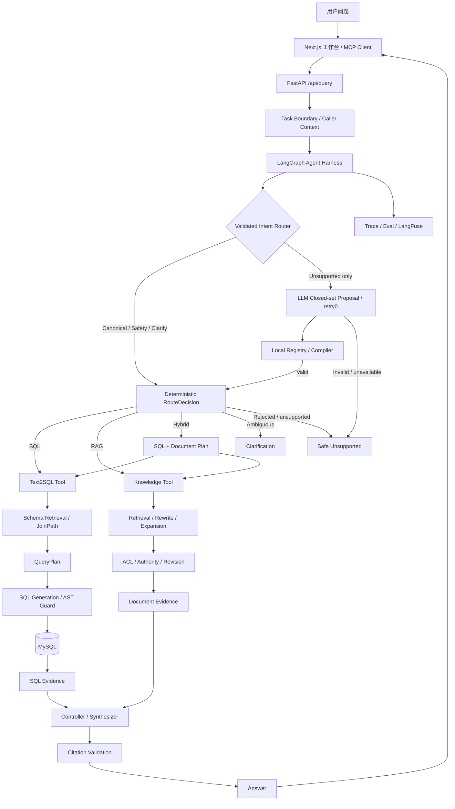
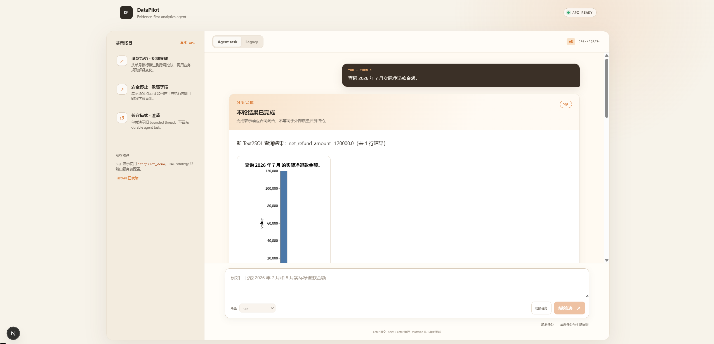
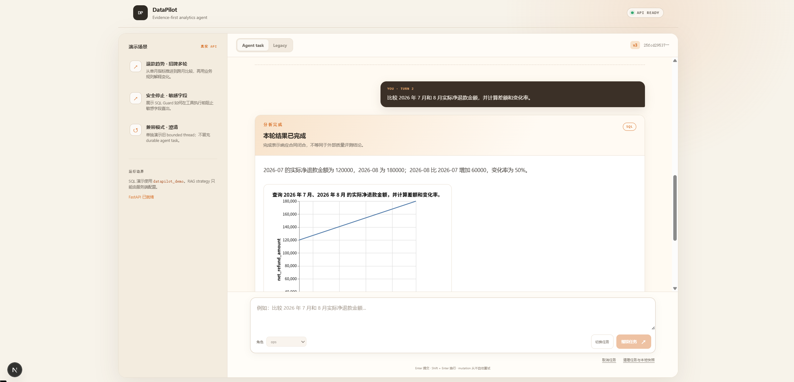
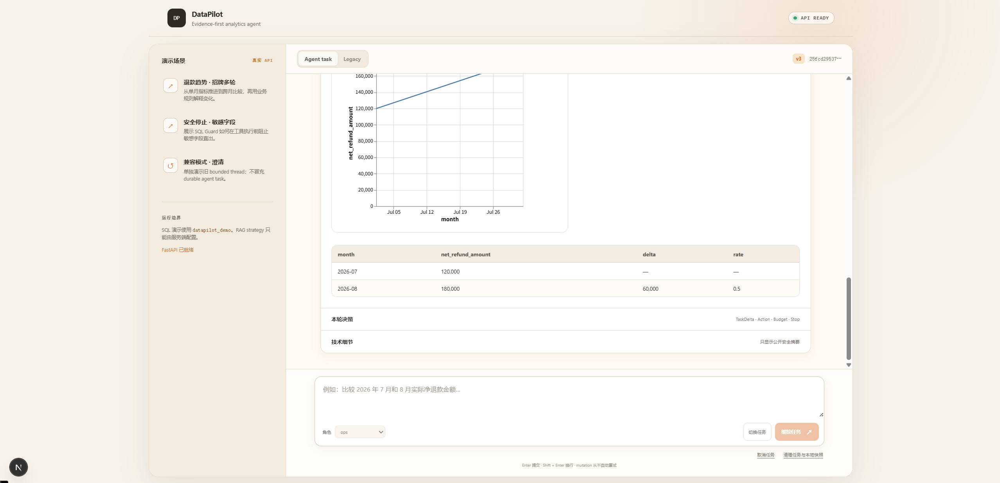
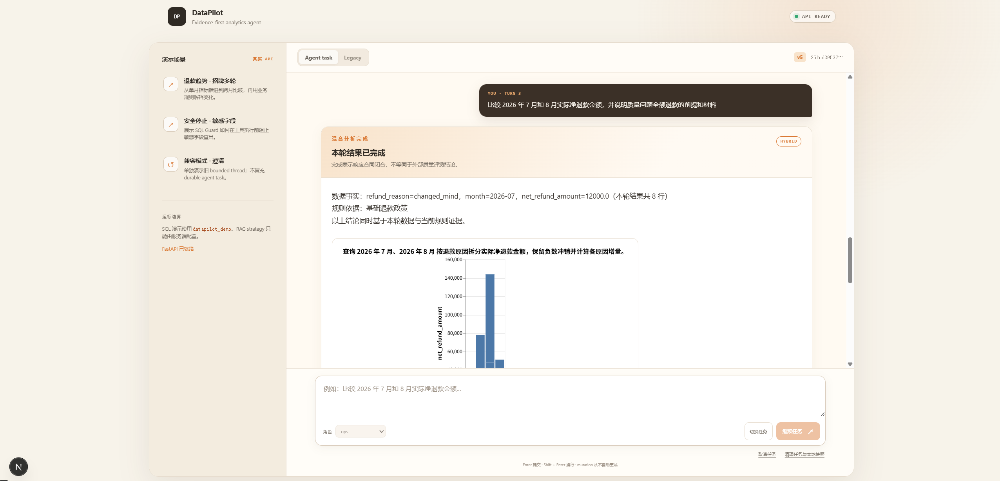
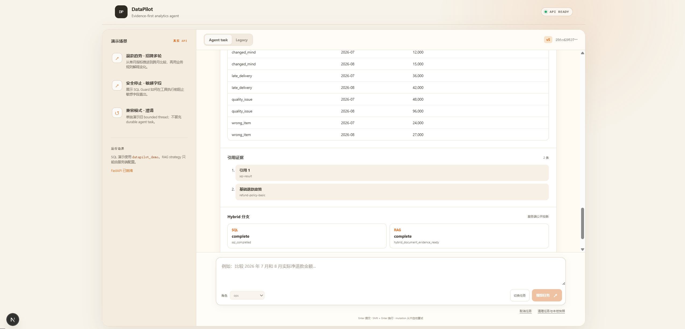

# DataPilot

DataPilot是一个面向企业数据分析场景的Agent系统，支持自然语言查询数据库、知识库问答和SQL/RAG混合分析。本项目实现了受控LLM意图路由、Text-to-SQL、知识库检索、结构化Evidence、查询计划校验、多轮任务、权限控制和持久化任务，并实现了可追溯、可恢复、可评测的分析链路。

本项目提供Next.js工作台、FastAPI接口和本地stdio MCP Adapter，可以展示分析结果、生成的SQL、数据表、引用来源以及Agent的运行过程。

## 核心能力

| 能力 | 实现 |
| --- | --- |
| Agent Harness | 将 Text-to-SQL 与 RAG 封装为受控 Tool；意图路由采用确定性快路、单次 LLM 闭集提议和本地编译，统一完成 SQL、RAG、Hybrid、澄清与安全终止 |
| Text-to-SQL | 从 Schema 混合检索、JoinPath 和 QueryPlan，一直到 SQL fidelity、AST Guard、执行与 Evidence 投影 |
| Agentic RAG | 根据 Observation 执行 query rewrite、相邻证据扩展、Evidence 合并与 re-authorization，并通过父子预算控制检索成本 |
| 持久化任务 | MySQL TaskState、版本化 CAS、single-use claim、Context Compact、跨进程恢复与 state reconciliation |
| 数据治理 | SQL 只读检查、RBAC、敏感字段策略、文档 ACL、authority/revision 校验与出站数据最小化 |
| EvalOps | Response、Trace、Eval 从同一运行事实投影，分层评测路由、计划、Evidence、引用、预算与终止行为 |
| 产品接入 | Next.js 工作台、FastAPI 接口、本地 stdio MCP Adapter |

## 系统架构



## 演示预览

> 以下为真实截图。

1. **自然语言查询数据库：查询结果与明细表**



2. **多轮对话：多轮月份比较与 SQL Evidence**





3. **数据库+知识库混合分析：结果和引用依据**





Web 工作台可以同时展示分析结论、生成的 SQL、数据表和引用来源，并查看任务变化、执行动作、预算、终止原因及上下文等运行详情。

## 关键设计与实现

### 1. 受控 LLM 意图路由

顶层 Router 默认使用 `llm_fallback` 分层模式：安全拒绝、已登记澄清和 canonical SQL/RAG/Hybrid 问法由确定性快路完成，模型调用数为零；只有旧 Router 无法识别的完整问题，才允许一次 retry0 的 LLM 提议。

模型只能在 `sql/rag/hybrid/clarify/unsupported` 闭集中选择，并引用服务端已登记的 Hybrid operator 或澄清类型。最终 `RouteDecision`、分支计划和提示模板均由本地 registry/compiler 生成；模型不能直接提供 SQL、Tool、权限或答案。provider 不可用、响应格式错误或候选越权时，系统回到调用前的保守结果，不会猜测可执行路径。

Router mode、model 和 operator 只能由服务端控制。默认 `HARNESS_ROUTER_MODE=llm_fallback`；如需停用模型 Router，可在启动进程设置 `HARNESS_ROUTER_MODE=deterministic`，无需修改代码。JSONL Trace 只记录 Router identity、来源、attempt、usage、延迟和 fallback 分类，不保存 Prompt 或原始模型响应。

### 2. Evidence 驱动的 SQL、RAG 与 Hybrid

本项目不把工具返回值直接拼成答案，而是先转换为带身份、来源和有效性状态的 Typed Evidence。

```text
Question
  → Evidence Requirement
  → Authorized Tool Execution
  → Typed Evidence
  → Evidence Gate
  → Answer / Citation
```

三类分析路径：

- SQL：处理 GMV、退款率、渠道表现等结构化分析。
- RAG：处理退款规则、客服政策、指标定义等知识问题。
- Hybrid：同时取得数据库事实与业务文档，并在两个 Evidence 分支汇合后生成结论。

SQL Evidence 和 Document Evidence 使用独立合同。任一必要证据缺失、过期或未通过授权时，Controller 不会把不完整结果包装成完整答案。

### 3. Text-to-SQL

Text-to-SQL 的重点不只是生成一条可执行 SQL，而是将开放的自然语言问题逐层收敛为可校验的查询合同。系统先从字段、指标和表关系中检索最小必要上下文，再生成 QueryPlan 和候选 SQL；每一层都保留独立的验证结果和 Trace。

```text
Question
  → Field / Metric / Relation Retrieval
  → SchemaGraph / JoinPath
  → Structured QueryPlan
  → SQL Generation
  → SQL Guard
  → Execution
  → SQL Evidence
```

主要实现包括：

- **Schema 知识层**：将物理字段、业务指标和表关系构造成独立的 Field / Metric / Relation 文档；指标定义保留公式、过滤条件和默认时间字段，表关系由 `relations.yaml` 统一维护。
- **混合 Schema Retrieval**：使用 keyword retrieval 与基于 Milvus + Embedding 的 vector retrieval 召回局部 Schema，支持 weighted 与 RRF 两种 fusion strategy，并保留命中来源、分数和排序信息。
- **局部 SchemaGraph**：根据召回结果裁剪候选表、字段和指标，通过受信关系定义生成 JoinPath，避免模型在全量 Schema 中自行猜测跨表连接。
- **结构化 QueryPlan**：在 SQL 生成前显式声明任务类型、表、字段、指标、过滤条件、Join、聚合、分组、排序、Limit，以及输出列与派生别名绑定。
- **计划验证**：校验 QueryPlan 引用的表、字段、指标和 relation 是否属于局部 SchemaGraph，同时检查敏感字段、输出列顺序和聚合别名绑定。
- **Plan-SQL Fidelity**：对生成 SQL 与 QueryPlan 做一致性校验，防止 SQL 擅自增加表、偏离 JoinPath、改变聚合口径或返回计划外字段。
- **执行前治理**：基于 `sqlglot` AST 拦截写操作、多语句、越权表和敏感字段访问，通过后才进入 MySQL 执行。
- **修复闭环**：对已识别的 SQL 方言错误执行 AST 定向修正；修正结果必须重新经过计划一致性校验、SQL Guard 和数据库执行，不能绕过原安全链路。
- **结果证据化**：将 QueryPlan、SQL、执行结果、表依赖和验证状态统一投影为 SQL Evidence，供 Controller、Trace 和 Eval 使用。

### 4. Agentic RAG

RAG 不止执行一次 Top-K 检索。系统实现了由 Observation 驱动的有界检索子图：

```text
Initial Retrieval
  → Observation
  → Rewrite / Expansion / Stop
  → Evidence Merge
  → Re-authorization
  → Compose
```

子图具备以下能力：

- 根据首次检索结果判断是否需要 query rewrite 或相邻证据扩展。
- 父级 Agent 与 RAG 子图分别记录预算和动作账本。
- 对重复结果进行去重，并在没有新增 Evidence 时停止。
- 合并后的文档重新校验 ACL、authority、revision、content hash 与 anchor。
- Citation 只能引用本轮实际进入生成上下文的 Evidence。
- 业务知识库与 Text-to-SQL Schema corpus 使用独立的 retrieval lifecycle。

这套设计使检索过程可以被解释和评测：能够区分“没有召回”“召回但未采用”“采用后生成遗漏”和“答案正确但引用错误”。

### 5. 有界、多轮、可恢复的 Durable Task

系统将一次分析任务建模为版本化Task，而不是把所有历史消息直接塞回Prompt。

- **状态管理**：使用TaskDelta/TaskState保存连续追问产生的结构化变化。
- **并发与恢复**：通过MySQL条件更新、版本校验和一次性`claim_token`避免重复执行，支持跨进程恢复和断连状态对账。
- **上下文控制**：保留近期必要内容，将较早历史压缩为有界结构化摘要。

### 6. 数据安全与可观测性

SQL 与文档数据分别经过各自的安全链路：

```text
SQL: readonly AST → table RBAC → sensitive-column policy → execute
RAG: caller → document ACL → authority/revision → generation-time recheck
```

Caller 身份由服务端 Resolver 提供，请求中的角色字段不能自行扩大权限。任务 owner、tenant、role、version 和 claim 共同参与状态访问与提交；模型与 Embedding 的出站内容则经过独立用途登记和字段约束。

每次运行会记录可审计的结构化事实，包括：

- Route、Action 与 Tool 调用顺序。
- Evidence 的来源、状态和失效原因。
- Agent 与 RAG 子图的预算消耗。
- Provider 调用次数、token、延迟和 timeout。
- Task lifecycle、Context、termination 与 failure layer。

本地 JSONL Trace 按安全合同保留排障所需的运行事实；发送到 Langfuse 的数据再经过独立 allowlist 投影，只包含稳定 ID、枚举、布尔值和有限数值，不发送问题正文、答案、SQL、结果行、Prompt、文档正文或凭据。

### 7. 评测

项目将 Eval 作为运行系统的一部分，分别维护三类评测合同：

| 评测对象 | 检查内容 |
| --- | --- |
| Text-to-SQL | Schema Context、QueryPlan、SQL、执行结果、安全与业务语义 |
| RAG | Retrieval、Evidence、ACL、Answer、Citation |
| Agent | Router、Action、预算、Hybrid、Clarification、Task lifecycle 与 Trace |

评测系统使用版本化 Scenario、typed assertion、runtime identity、checkpoint、artifact 和 review bundle。一次运行中的 Response、Trace 和 Eval 共享同一事实来源，避免接口显示成功但评测读取到另一套结果。

## 接口

### HTTP API

```http
POST /api/query
Content-Type: application/json

{
  "question": "查询 2026 年 7 月实际净退款金额。",
  "user_role": "ops",
  "task": {
    "action": "start"
  }
}
```

### MCP

本地 stdio MCP Adapter 对外提供 `data_pilot_query` Tool，支持：

- 发起 SQL、RAG 或 Hybrid 查询。
- 查询未知结果任务的服务端状态。
- 按版本清理任务。
- 对返回行数、单元格、Citation 和总输出大小进行有界投影。

MCP Adapter 只负责协议转换和网络合同校验，业务路由、Evidence、安全策略和 TaskState 仍由 FastAPI 后端统一处理。

## 快速开始

以下命令使用 PowerShell 7。完整运行说明见 [`docs/state/runbook.md`](docs/state/runbook.md)，Web 说明见 [`web/README.md`](web/README.md)。

### 1. 安装依赖

```powershell
python -m pip install -e ".[dev]"
npm ci
```

### 2. 配置环境

```powershell
Copy-Item .env.example .env
```

在 `.env` 中配置数据库和模型服务凭据。

Router 默认使用受控 LLM fallback；需要临时回滚为历史确定性路由时，将该值改为 `deterministic`：

```dotenv
HARNESS_ROUTER_MODE=llm_fallback
```

### 3. 准备演示数据库

```powershell
python -m scripts.prepare_m50_demo prepare --confirm-database datapilot_demo
python -m scripts.prepare_m50_demo preflight --confirm-database datapilot_demo
```

### 4. 启动 API 与 Web

```powershell
python scripts/run_m50_demo_api.py --rag-strategy pipeline
```

另开一个终端：

```powershell
Set-Location web
npm run dev -- --hostname 127.0.0.1 --port 3100
```

访问 `http://127.0.0.1:3100`。

### 5. 验证

```powershell
python -m pytest -p no:cacheprovider
npm run typecheck
npm run lint
npm test
npm run test:e2e
npm run build
```

## 项目结构

```text
app/                    FastAPI API、配置、数据库与数据模型
engine/
  harness/              LangGraph Harness、Router 与任务编排
  phase4b/              Agent Loop、TaskState、Context 与持久化边界
  nl2sql/               Text-to-SQL Pipeline
  schema_retrieval/     Schema Retrieval 与 SchemaGraph
  rag/                  Knowledge Retrieval、Evidence 与生成链路
  sql_guard/            SQL 安全检查
  trace/                JSONL / LangFuse 可观测性
eval/                   Scenario、assertion、runner、review 与报告
domain_pack/            Schema、指标、SQL 示例、知识文档与版本化合同
packages/               Web 与 MCP 共用的 TypeScript 网络合同
web/                    Next.js / React 工作台
mcp/                    stdio MCP Adapter
tests/                  自动化测试
```
