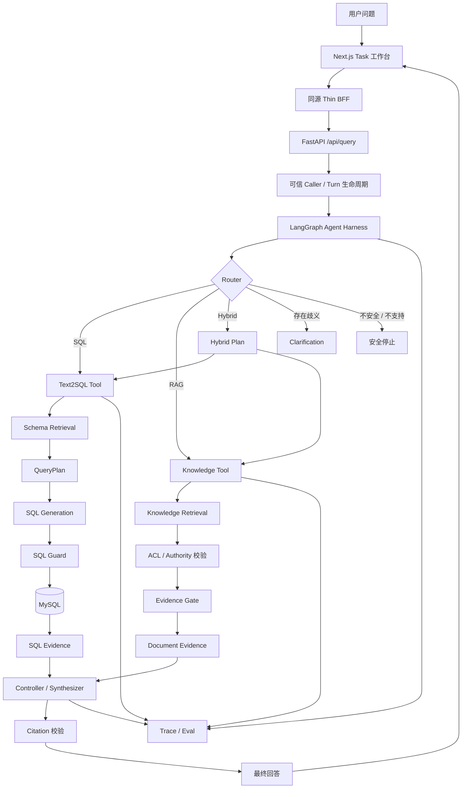

# DataPilot

> **面向企业数据分析场景的可信多 Evidence Data Agent。**通过 LangGraph 编排 **Text2SQL、RAG 与 Hybrid** 多证据链路，在权限边界内获取数据与文档 Evidence，并提供可追踪、可引用、可评测的回答。

DataPilot 不是把数据库、向量库和大模型简单串起来的聊天 Demo。它把一次分析任务建模为有版本、有预算、可恢复的状态流：Agent 先判断结论需要哪些 Evidence，再经过授权取得 SQL 或文档证据；证据不足就澄清、停止或返回部分结果，而不是编造完整答案。

## 演示预览

**截图1：工作台总览**


**截图2：7/8 月退款比较结果与 SQL Evidence**

.png)

.png)

**截图3：Hybrid Evidence、Citation 与 Agent Inspector**

.png)

.png)

## 项目亮点

| 工程重点 | DataPilot 实现 |
| --- | --- |
| 多证据分析 | SQL、Document 与 Hybrid Evidence 使用独立合同，在 Controller 汇合 |
| 可控 Agent | closed-world Action、父子预算、no-progress 检测与确定性终止 |
| 多轮任务 | MySQL durable TaskState、乐观版本、CAS claim、Context/Compact 与重启恢复 |
| 安全边界 | SQL AST 只读检查、RBAC、敏感字段策略、Document ACL 与 generation-time recheck |
| 可解释结果 | Answer、SQL、表格、Citation、Action、Budget、Termination 和 Trace 同屏展示 |
| 可评测工程 | Text2SQL、RAG、Agent Scenario 分账；Response、Trace 与 Eval 从运行事实投影 |
| 前后端闭环 | Next.js/React/TypeScript 工作台 → thin BFF → FastAPI/LangGraph → MySQL/RAG |

## 为什么做 DataPilot

传统 NL2SQL Demo 往往只解决“自然语言 → SQL”，但企业数据分析还需要回答更多问题：

- 这个问题应该查数据库，还是查业务文档？
- SQL 使用了哪些表和指标口径？Join 是否可靠？
- 用户是否有权限访问这些字段或文档？
- 一个结论同时需要数据库数据和业务规则时怎么办？
- 检索证据不足时，Agent 应继续搜索、澄清，还是停止？
- 最终答案能否追溯到真实使用过的 Evidence？
- Agent 的路由、Tool 调用、Evidence、Citation 和终止原因能否被评测和审计？

**DataPilot 的目标不是构建一个“会调用工具的聊天机器人”，而是构建一个按 Evidence 工作的数据分析 Agent。**

当前系统支持三条核心路径：

| Route      | 适用场景                               | Pipeline                                                     |
| ---------- | -------------------------------------- | ------------------------------------------------------------ |
| **SQL**    | GMV、退款率、渠道表现等结构化数据分析  | Schema Retrieval → QueryPlan → SQL Generation → SQL Guard → Execute |
| **RAG**    | 退款规则、客服政策、指标定义等知识问题 | Knowledge Retrieval → ACL → Evidence Gate → Answer → Citation |
| **Hybrid** | 同时需要“数据表现 + 业务规则”的问题    | SQL Evidence + Document Evidence → Controlled Synthesis      |

------

## 系统架构



设计原则是：

> **Router 决定需要什么 Evidence，Tool 负责取得 Evidence，Controller 决定是否足够回答。**

业务逻辑不会为了“画 Graph”被拆成大量浅节点。Text2SQL、Knowledge Retrieval 等仍作为内部完整的 deep Tool，由顶层 LangGraph 负责跨能力状态迁移、预算和停止语义。

------

## 核心能力

### 1. Text2SQL

DataPilot 的 SQL 路径不是直接把完整 Schema 丢给 LLM，而是先缩小问题需要的数据库上下文：

```text
Question
  ↓
Schema Retrieval
  ↓
SchemaGraph / JoinPath
  ↓
Structured QueryPlan
  ↓
Local SQL Prompt
  ↓
SQL Generation
  ↓
SQL Guard
  ↓
Execution
  ↓
SQL Evidence
```

主要能力包括：

- Field / Metric / Relation 三级 Schema Retrieval
- keyword + vector Schema 检索
- `relations.yaml` 驱动的 SchemaGraph 与 JoinPath
- 结构化 QueryPlan 与计划自检
- SQL AST 只读检查
- 表级 RBAC
- 敏感字段访问控制
- SQL / QueryPlan / Result / Trace 联合验证
- MySQL + SQLAlchemy + Alembic
- deterministic seed dataset

Schema Retrieval 默认使用本地 deterministic in-memory backend；Milvus 和远程 embedding adapter 已实现，但只在显式实验中启用。

------

### 2. 可信 RAG

RAG 路径围绕 **Document Evidence** 而不是单纯的向量 Top-K 构建。

Knowledge corpus 与 Text2SQL Schema corpus 是两套独立的 retrieval lifecycle，防止业务知识正文意外进入 SQL Schema prompt。

核心链路：

```text
Question
  ↓
Knowledge Retrieval
  ↓
Authorization / ACL
  ↓
Revision & Authority Validation
  ↓
Evidence Gate
  ↓
Answer Context
  ↓
Generation
  ↓
Claim-to-Evidence Citation
```

Document Evidence 会保留稳定的文档 identity、revision、anchor 与授权状态，使最终 citation 能回到**本轮真实进入生成上下文的 Evidence**，而不是只返回一个文件名。

当 Evidence 不足、失效或无权访问时，系统选择停止或请求澄清，而不是强行生成答案。

当前业务 release 的 22 条条目使用 deterministic lexical runtime；EnterpriseRAG-Bench 外部产品路径使用 semantic runtime。历史对比没有证明 semantic 在相同 benchmark 上稳定胜过 lexical，因此该默认是明确的产品运行合同，不应表述为质量胜出。Pipeline 仍是默认编排，有界 Subgraph 只作为服务端实验策略。

------

### 3. Hybrid Evidence

部分企业分析问题同时需要数据库事实与业务知识，例如：

> “这个月退款率明显升高，根据公司的退款政策，我们应该重点排查什么？”

这种问题不能只靠 SQL，也不能只靠 RAG。

DataPilot 的 Hybrid 路径使用：

```text
Question
       │
       ▼
  Hybrid Plan
    /       \
   /         \
SQL Tool    RAG Tool
   │           │
SQL Evidence Document Evidence
   \           /
    \         /
 Controlled Synthesizer
         │
         ▼
      Answer
```

SQL 与 Document branch 使用独立的 Evidence 类型和安全合同。

当前标准 Hybrid 默认将两个分支都视为必需。任何必要 Evidence 获取失败时，系统不会伪造“完整分析”；只有独立成立且安全的内容才允许作为部分结果返回。

------

### 4. 有界 Agent Loop

DataPilot 没有实现无限 ReAct 循环，而是使用**有预算、可证明终止的状态迁移**。

Phase 4B task family 当前支持：

- start / continue / switch / cancel / clear
- 同一 task 的多轮 requirement / Evidence 推进
- MySQL durable optimistic version 与 single-use claim
- Context/Compact v2 和重启后最近结果摘要复用
- Evidence validity check
- 必要时重新查询 / 重新检索
- ACL、身份或 Evidence 失效后的安全停止
- Tool-call budget 与 no-progress termination

当前 task checkpoint 为：

```text
phase4b-mysql-task-boundary-v1
TTL: 900s
```

它只保存恢复任务所需的有界 TaskState/Context/Compact 与类型化事件，不保存完整 SQL rows、文档正文、Prompt、Thought 或 Graph program counter。旧 Clarification/Follow-up 仍使用独立的 `inprocess-bounded-thread-v2`，不冒充持久化 task。

当前设计明确**不宣称无限对话或外部 Tool exactly-once**；claimed crash 会保守停止，不自动重放 mutation。

------

### 5. 安全与授权

SQL 与 Document 使用不同的安全边界：

```text
SQL
├── readonly AST
├── table-level RBAC
└── sensitive-column policy

RAG
├── caller / role
├── document ACL
├── authority
├── revision validity
└── generation-time authorization recheck
```

本地 `local / demo / test` 环境通过显式 fixture Caller Resolver 提供可信身份 seam。

客户端提交的 `user_role` 不能自行提升权限，只能在 Resolver 已解析的角色范围内选择。

其他环境如果没有 authenticated Caller Resolver，会在 Tool 调用前 fail closed。

> 当前项目尚未接入 JWT / OAuth / SSO 等生产认证系统，因此不能将现有 Caller seam 描述为 production authentication。

------

## Evidence-First 设计

DataPilot 中一个核心抽象是：

```text
Question
   ↓
Evidence Requirement
   ↓
Authorized Tool Execution
   ↓
Typed Evidence
   ↓
Evidence Gate
   ↓
Answer
   ↓
Citation
```

系统不会只根据最终答案判断一次 Agent Run 是否正确。

Eval 与 Trace 会分别检查：

```text
Route
Tool Call
Observation
Evidence
Authorization
Generation Context
Citation
Lifecycle
Termination
Runtime Identity
```

这样可以区分：

- 没有召回正确文档
- 召回了但没有进入生成上下文
- Evidence 正确但生成器没有使用
- 回答正确但 citation 错误
- SQL 正确但 QueryPlan 与结果合同不一致
- Tool 不应该执行却被执行
- Agent 重复调用但没有获得新 Evidence

------

## 评测

DataPilot 将 Eval 作为架构的一部分，而不是项目完成后才补几个测试。

当前主要有三类独立评测合同：

| 评测合同               | 用途                                                         |
| ---------------------- | ------------------------------------------------------------ |
| **Text2SQL Eval**      | QueryPlan、Schema Context、SQL、执行结果、安全与业务语义     |
| **RAG Eval**           | Retrieval、Evidence、ACL、Answer、Citation                   |
| **Agent Harness Eval** | Router、Tool budget、Hybrid、Clarification、Follow-up、Lifecycle、Trace |

Text2SQL 当前标准合同为 `m27-v3`。

当前 catalog 共 28 个 Scenario；已有历史 Core 快照，但尚未为当前 `m27-v3` 指定正式长期基线，因此 README 不声明一个未经登记的“总体正确率”。计划中的有限发布评测只运行冻结 Core selector 一次，并把 provider、执行、安全拒绝和业务 oracle 分层记录。

RAG 另外使用 EnterpriseRAG-Bench external profile 做 retrieval / answer / citation 分析，dev 与 held-out 保持独立。

项目不会使用“最终答案看起来正确”替代结构化 assertion，也不会因为一次 provider timeout 就自动重跑并覆盖失败证据。

------

## 有界 Agentic RAG

DataPilot 已实现 Observation 驱动的有界 RAG Subgraph，并通过统一的 `DocumentEvidenceAcquirer` 与原 Pipeline 隔离：

```text
observe → rewrite / expand → re-authorize Evidence → stop / compose
```

子图具备父子预算、动作闭集、Evidence 增量、去重、no-progress 停止以及 API / Trace / Eval 同源账本。策略由服务端控制：

```text
PHASE4B_RAG_STRATEGY=pipeline|subgraph
```

Pipeline 是稳定默认，Subgraph 是可显式启用的实验策略；两者不会在同一次请求中自动跨策略重跑。历史配对诊断用于决定候选是否晋级，而不是决定代码结构是否存在。

> **复杂度必须由 Eval 证据证明，而不是因为 Agent 框架支持循环就增加循环。**

当前采用 `Pipeline default / Subgraph server-controlled experimental / no auto-fallback`。未来若形成新的默认晋级候选，再用独立且未污染的 sealed 决策 Evidence 评审，不影响当前 Demo 展示完整子图、父子预算和 Trace 的工程能力。

------

## 技术栈

| 分层                | 技术                                               |
| ------------------- | -------------------------------------------------- |
| API                 | FastAPI, Pydantic                                  |
| Agent 编排          | LangGraph                                          |
| 数据库              | MySQL                                              |
| ORM / 数据库迁移    | SQLAlchemy, Alembic                                |
| SQL Parsing / Guard | sqlglot                                            |
| LLM                 | Qwen / DeepSeek adapter                            |
| Schema Retrieval    | deterministic / vector retrieval                   |
| Vector Store        | in-memory 默认，Milvus 实验 adapter                |
| 评测                | Pytest + custom Scenario / typed assertion runners |
| Trace               | JSONL 默认，LangFuse 可选                          |
| Web / Demo          | Next.js 16、React 19、TypeScript 6、Vega-Lite；兼容 Streamlit |
| Python              | 3.11+                                              |

------

## 快速开始

以下命令以 **Windows PowerShell 7** 为准。完整运行纪律、环境变量和排障入口见 [`docs/state/runbook.md`](docs/state/runbook.md)；Web 专项说明见 [`web/README.md`](web/README.md)。

### 1. 安装后端依赖

```powershell
python -m pip install -e ".[dev]"
```

### 2. 配置环境

```powershell
Copy-Item .env.example .env
```

默认模型配置：

```env
LLM_PROVIDER=qwen
QWEN_MODEL=qwen3.7-plus
```

需要真实模型调用时配置对应 API Key。

### 3. 准备隔离演示库

```powershell
python -m scripts.prepare_m50_demo prepare --confirm-database datapilot_demo
python -m scripts.prepare_m50_demo preflight --confirm-database datapilot_demo
```

`preflight` 应确认 migration=`20260827_0005`、7/8 月 oracle=`120000/180000`、synthetic task rows=`0/0`、`ready=true`。`datapilot_demo` 与默认开发库隔离；不要把确认库名替换成 dev/test/prod。

### 4. 启动受保护的演示 API

```powershell
python scripts/run_m50_demo_api.py --rag-strategy pipeline
```

本机访问 Qwen 需要代理时，可显式追加：

```powershell
python scripts/run_m50_demo_api.py --rag-strategy pipeline --proxy http://127.0.0.1:7897
```

API liveness：`http://127.0.0.1:8000/health`。

### 5. 启动 Web 工作台

另开一个 **PowerShell** 终端：

```powershell
Set-Location web
npm ci
npm run dev -- --hostname 127.0.0.1 --port 3100
```

如果使用 Windows CMD，进入目录的命令是 `cd web`，不是 `Set-Location web`。

打开 `http://127.0.0.1:3100`，按上文“招牌演示”的顺序提问。BFF 默认等待 300 秒；mutation 结果未知时不会自动重试，页面会保留现场，并允许显式查询服务端 task status 进行版本对账。

### 6. 运行测试

```powershell
python -m pytest -p no:cacheprovider
```

前端检查在 `web/` 中执行：

```powershell
npm run typecheck
npm run lint
npm test
npm run test:e2e
npm run build
```

这些是维护入口，不要求每次文档或小修都机械执行完整集合；验证范围应与改动风险匹配。

------

## API 示例

```http
POST /api/query
Content-Type: application/json
{
  "question": "查询 2026 年 7 月实际净退款金额。",
  "user_role": "ops",
  "task": {
    "action": "start"
  }
}
```

SQL Route 会经历：

```text
Route
→ Schema Retrieval
→ QueryPlan
→ SQL Generation
→ SQL Guard
→ Execution
→ SQL Evidence
→ Controller
→ Trace
```

对于政策问题则进入 RAG route；需要数据库事实与业务知识共同回答的问题进入受控 Hybrid route。

------

## 项目结构

```text
data-pilot/
├── app/                     # FastAPI 应用
│   ├── api/
│   ├── core/
│   ├── db/
│   ├── models/
│   └── schemas/
│
├── engine/
│   ├── harness/             # LangGraph Harness / Route / 生命周期
│   ├── phase4b/             # TaskState、Decision Loop、durable boundary、Context
│   ├── nl2sql/              # Text2SQL Pipeline
│   ├── schema_retrieval/    # Schema Retrieval / SchemaGraph
│   ├── rag/                 # Knowledge Retrieval / Evidence / 回答链路
│   ├── sql_guard/           # SQL 安全边界
│   ├── tools/               # Deep Tool adapter
│   └── trace/               # Runtime Trace
│
├── domain_pack/
│   ├── phase4b/             # 版本化 Agent 合同与 seed recipe
│   ├── kb_docs/             # Knowledge 原始文档
│   ├── metrics.yaml         # 业务指标定义
│   ├── schema_desc/         # Schema 语义与 relation
│   └── sql_examples/        # SQL 示例
│
├── eval/                    # Eval 合同、case 与报告
├── demo/                    # Legacy Streamlit 兼容演示
├── web/                     # Next.js Task 工作台 + Thin BFF
├── scripts/                 # 维护与 benchmark 脚本
├── tests/                   # 确定性回归测试
└── docs/                    # 文档
```

------

## 工程原则

DataPilot 当前遵循几个核心原则：

**Evidence 优先于生成。**
没有足够 Evidence 就不生成完整结论。

**先授权，再检索和生成。**
权限不是 UI 字段，而是 Evidence 生命周期的一部分。

**Agent 行为必须有界。**
任何恢复、追问和 Tool 调用都有预算和明确停止条件。

**Trace 来自运行事实。**
Response、Trace 和 Eval 尽量从同一运行事实投影，避免多套事实源。

**先 Eval，再增加复杂度。**
新模型、新 Retriever、新 Agent loop 或新基础设施只有在可比较 Eval 中证明收益后才进入默认路径。

------

## 项目目标

DataPilot 最终希望回答的不只是：

> “LLM 能不能生成正确 SQL？”

而是：

> **一个企业 Data Agent 能否知道结论需要什么 Evidence，在权限允许的范围内取得 Evidence，并让最终答案、Citation、Agent 行为和失败原因都可解释、可追踪、可评测？**

这也是这个项目从 NL2SQL Demo 逐步演进到可信 Multi-Evidence Agent 的核心方向。
