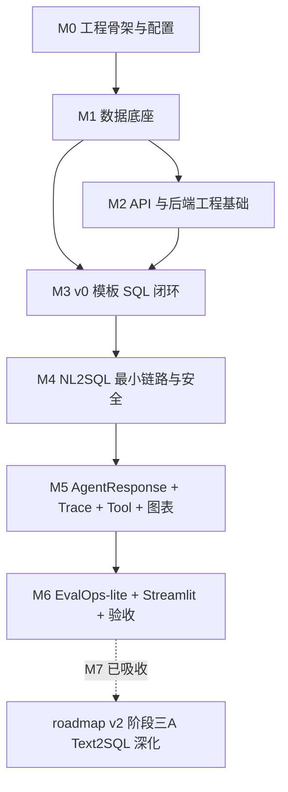

# DataPilot Phase 2 Module Plan

> 阶段二：DataPilot v0 -> v1 + EvalOps-lite  
> 原排期：2026-07-16 至 2026-07-29  
> 核心目标：先用模板 SQL 跑通 v0，再升级到 LLM NL2SQL + SQL Guard + 简单图表 + EvalOps-lite。

## 阶段二总目标

阶段二结束时，DataPilot 至少具备以下能力：

- 7 张电商 / SaaS 运营数据表完成建模、迁移、模拟数据生成。
- FastAPI 提供基础 CRUD、查询、筛选、分页接口。
- 统一日志中间件和全局异常处理器可用。
- 模板 SQL 端到端链路跑通：自然语言问题 -> 模板匹配 -> sqlglot 只读检查 -> 数据库执行 -> 表格结果。
- `eval/cases_plan.md` 完成 32 条评测问题清单（类型构成见 M3 任务清单，文件落地后以该文件为唯一事实源）。
- v1 最小闭环跑通：LLM 生成 SQL -> 安全拦截 -> 执行 -> 自然语言解释 -> 简单图表。
- EvalOps-lite 能读取 YAML 用例、调用 Agent、记录 question / route / sql / answer / pass-fail / error_type。
- Streamlit 演示页能展示问题、答案、SQL、表格、图表。

## 全局约束

- Python 使用 `D:\.Programs\Python\anaconda3\envs\fastapi0614\python.exe`。
- 数据库主路径使用 MySQL 开发库 `datapilot_dev`；SQLite 只作为测试或兜底，不作为阶段二主路径。
- 建表和改表必须通过 Alembic migration 管理，不裸写 DDL 作为主路径。
- `engine/` 不写电商业务硬编码；业务配置放入 `domain_pack/`。
- `/api/query` 从第一次实现开始就使用 Pydantic AgentResponse Schema，不先散落返回普通 dict。
- 每完成一个模块，更新 README、`AI_CONTEXT.md` 技术档案和 `dev-log.md` 日志；验收记录放 `.agent_work/temp/`。
- 所有临时脚本中间产物放到 `./.agent_work/temp/`。
- Agent 运行 Trace 写入 `eval/traces/`；Trace 是评测和复盘会消费的数据，不放临时目录。
- 安全类能力不只靠 prompt，必须经过 sqlglot AST、只读限制、敏感字段策略和 RBAC 规则。
- 阶段二不追求复杂 LangGraph 编排；若卡住，先用普通 Python pipeline 跑通。
- 日志与代码注释规范以项目 CLAUDE.md 的「开发记录要求」「代码风格」章节为准，此处不重复。

## 架构底线与可降级边界

这些约束用来防止“先用临时方案，后面再换正式方案”造成大返工。

### P0：不可降级

- **数据库主路径固定 MySQL**：开发库为 `datapilot_dev`，SQLite 只用于测试或故障兜底。
- **建表和改表必须走 Alembic**：可以简化字段约束，但不能绕开 migration 直接裸写 DDL 作为主路径。
- **SQL 执行必须先过 SQL Guard**：任何模板 SQL 或 LLM SQL 都要先做 AST 解析、只读检查，再进入数据库执行。
- **业务和引擎必须分层**：`engine/` 只放通用流程，电商表说明、KPI、SQL 示例和图表模板放 `domain_pack/`。
- **AgentResponse 必须前置**：M3 第一次实现 `/api/query` 时就定义简化版结构化响应，M5 只做扩展，不推倒重来。
- **评测用例格式要提前稳定**：M3 写 `eval/cases_plan.md` 时同步给出后续 YAML 字段草案，方便 AgentEvalOps 复用。

### P1：可以简化实现，但接口要按最终形态预留

- **普通 Python pipeline 可以先替代 LangGraph**：但状态字段要按未来 graph state 设计，例如 `question`、`route`、`sql`、`tool_calls`、`trace_id`、`error_type`。
- **模板 SQL 可以先替代 LLM NL2SQL**：但模板代码放在 `engine/nl2sql/`，并沉淀到 `domain_pack/sql_examples/` 作为后续 few-shot 示例。
- **Redis 可以先做空实现**：业务代码只能依赖缓存 wrapper，不直接散落调用 Redis client。
- **Trace 可以先写 JSONL**：字段结构按 AgentEvalOps 复用设计，后续迁移到 SQLite 或独立评测平台时只换存储层。
- **LLM provider 不做过度抽象**：阶段二优先支持 DeepSeek 或 SiliconFlow 中一个实际可用模型，另一个后续补。

## 单一事实源

- **阶段二验收**：以本文档的 v0 / v1 验收标准为准；各模块验收门是过程检查，用来保证路上不跑偏。
- **32 条评测问题**：M3 建好 `eval/cases_plan.md` 后，以该文件作为题目构成和用例口径的唯一事实源，其他文档只引用。
- **YAML case 字段**：M3 在 `eval/cases_plan.md` 中定义字段草案；M6 落地 `smoke.yaml` 时只按该草案执行，不在本文档其他位置重复维护字段清单。
- **M4 简单 SQL 正确性**：以 v1 验收标准为准；“执行正确”指 SQL 通过 SQL Guard、可执行、返回字段和关键结果符合对应评测用例预期。
- **AgentResponse**：Phase 2 API 字段以本文档 M3 简化版 AgentResponse 为基准；M5 只能增量扩展字段，不改变已有字段含义。`LEARNING_ROADMAP.md` 中的 AgentResponse 是最终方向示例，不是 Phase 2 字段全集。
- **阶段二验收记录**：写入 `eval/reports/phase2-v1-acceptance.md`；该文件是后续 README、简历和复盘会消费的持久记录，不放临时目录。
- **Phase 2.5 / M7 处理决策**：M7 不再作为独立模块执行，已吸收进 roadmap v2 的阶段三A。原 M7 中有价值的 `trace_steps` 和最小 Eval issue tags 会随阶段三A的新 Text2SQL 链路一起落地；完整 scorer / 失败归因 / 报告平台仍归独立 AgentEvalOps。
- **模块进度**：只以 `AI_CONTEXT.md`「当前状态」为准（学习复盘看 `dev-log.md` 模块日志）；本文档只维护范围、顺序、验收标准和验证命令，不维护模块实时状态。
- **模块 smoke 脚本落位**：可复用 smoke 脚本放 `scripts/`（如 `scripts/smoke_m2_api.py`），一次性输出摘要放 `.agent_work/temp/`；原则出处为 CLAUDE.md「工作约定」。

## 模块推进原则

- 每个模块可以一次连续完成，但必须在验收门停下来验证。
- 如果模块内某个点卡住超过半天，先降级，不阻塞主链路。
- 每个模块代码完成后先调用 `finish-module` 做收工整理，再调用 `accept-module` 做最终门禁；文档格式按 CLAUDE.md「开发记录要求」执行。
- 参考资料按需查，不系统通读。实际查过哪个 reference，记入 `AI_CONTEXT.md` 模块档案「参考资料」。

## 目录与文件规划

| 路径 | 类型 | 阶段二职责 |
|---|---|---|
| `pyproject.toml` | 已建 / 继续维护 | 项目依赖、工具配置、包元数据 |
| `.env.example` | 已建 / 继续维护 | MySQL、Redis、LLM、LangSmith 运行环境变量示例 |
| `alembic.ini` | 新建 | Alembic 配置 |
| `alembic/env.py` | 新建 | Alembic 连接 SQLAlchemy metadata |
| `alembic/versions/` | 新建 | 迁移版本目录 |
| `app/main.py` | 已建 / 继续维护 | FastAPI 入口、路由注册、中间件注册 |
| `app/api/` | 新建 | 基础 REST API 路由 |
| `app/core/config.py` | 已建 / 继续维护 | Pydantic Settings 配置 |
| `app/core/logging.py` | 新建 | 结构化日志配置 |
| `app/core/exceptions.py` | 新建 | 全局异常类型和 FastAPI exception handler |
| `app/db/session.py` | 新建 | SQLAlchemy engine、Session 管理 |
| `app/db/base.py` | 新建 | declarative base 和 metadata 汇总 |
| `app/models/` | 新建 | 7 张表 ORM 模型 |
| `app/schemas/` | 新建 | API 请求 / 响应 Pydantic Schema |
| `scripts/seed_data.py` | 新建 | 模拟数据生成脚本 |
| `engine/sql_guard/` | 新建 | sqlglot AST 校验、只读检查、敏感字段 / RBAC 检查 |
| `engine/nl2sql/` | 新建 | 模板 SQL、schema 描述、LLM prompt、SQL 生成入口 |
| `engine/tools/` | 新建 | SQL 查询 tool 的参数 Schema 和调用记录 |
| `engine/trace/` | 新建 | trace_id、tool_calls、latency、error_type 记录 |
| `domain_pack/schema_desc/` | 新建 | 表和字段的业务描述 |
| `domain_pack/sql_examples/` | 新建 | 模板 SQL 和 few-shot 示例 |
| `domain_pack/kb_docs/` | 新建 | 阶段二先放 RAG 用例依赖的政策文档草稿 |
| `domain_pack/metrics.yaml` | 新建 | refund_rate、gmv、order_count 等 KPI 定义 |
| `domain_pack/chart_templates/` | 新建 | 基础图表模板 |
| `eval/cases_plan.md` | 新建 | 32 条评测问题清单 |
| `eval/cases/smoke.yaml` | 新建 | v1 最小 SQL smoke 用例 |
| `eval/run_eval.py` | 新建 | EvalOps-lite 执行入口 |
| `eval/reports/` | 新建 | 评测输出目录 |
| `eval/traces/` | 新建 | Agent 运行 Trace，JSONL 文件默认不提交 |
| `demo/streamlit_app.py` | 新建 | v1 演示页 |
| `README.md` | 修改 | ER 图、项目结构、启动说明、演示截图位置 |
| `AI_CONTEXT.md` | 已建 / 持续追加 | 技术档案：当前状态、决策理由、验证快照、已知坑 |
| `dev-log.md` | 已建 / 持续追加 | 学习复盘：模块故事、概念解释、面试讲法 |

## 模块总览

模块实时进度只看 `docs/AI_CONTEXT.md`「当前状态」。

| 模块 | 建议顺序 | 模块目标 |
|---|---:|---|
| M0 工程骨架与配置 | 1 | 项目可启动、配置可读、测试可跑 |
| M1 数据底座 | 2 | ORM 模型 + schema 描述 + Alembic + seed 数据 |
| M2 API 与后端工程基础 | 3 | DB session + 分页 CRUD + 日志 + 异常 |
| M3 v0 模板 SQL 闭环 | 4 | 模板 SQL + SQL Guard v0 + 简化 AgentResponse + 32 条问题清单 |
| M4 NL2SQL 最小链路与安全 | 5 | Schema prompt + LLM SQL + SQL Guard + RBAC |
| M5 AgentResponse 扩展、Trace、Tool 与图表 | 6 | 扩展结构化输出 + SQL Tool + Trace + chart_spec |
| M6 EvalOps-lite 与演示收尾 | 7 | smoke 评测 + Streamlit + 阶段二验收 |
| M7 Phase 2.5 Trace 与 Eval 最小硬化 | 不再单独执行 | 合理内容已并入 roadmap v2 阶段三A |

## M0：工程骨架与配置

**目标**：把空仓库变成可启动、可继续扩展的 FastAPI 项目。

| 项 | 内容 |
|---|---|
| 输入 | `AGENTS.md`、`LEARNING_ROADMAP.md`、`REFERENCE_GUIDE.md`、空仓库 |
| 输出 | `pyproject.toml`、`.env.example`、`app/main.py`、`app/core/config.py`、基础目录结构、`dev-log.md` |
| 验收标准 | 项目 Python 能安装依赖；`uvicorn app.main:app` 可启动；`GET /health` 返回 `{"status":"ok"}`；配置测试通过 |

**已完成任务**

- [x] 建立 `app/`、`engine/`、`domain_pack/`、`eval/`、`demo/`、`scripts/` 等基础目录；当前统一临时目录为 `.agent_work/temp/`。
- [x] 配置依赖：FastAPI、Uvicorn、SQLAlchemy、Alembic、Pydantic Settings、sqlglot、pandas、PyYAML、python-dotenv、streamlit、altair、PyMySQL。
- [x] 写 `.env.example`，包含 MySQL、Redis、LLM、DeepSeek、SiliconFlow、LangSmith 示例配置。
- [x] 写 `app/main.py`，注册 `/health`，并提供脱敏后的 `/config` 调试快照。
- [x] 写 `app/core/config.py`，用 Pydantic Settings 读取环境变量。
- [x] 更新 `README.md` 的项目结构和本地启动命令。
- [x] 创建 `dev-log.md`，记录 Day 1 / M0 交付、技术决策、验证结果和面试讲法。

**验证命令**

```powershell
$env:PYTHONDONTWRITEBYTECODE='1'; D:\.Programs\Python\anaconda3\envs\fastapi0614\python.exe -m pytest -p no:cacheprovider
```

**下一步入口**

- 从 M1 开始，不再按日拆分数据模型和迁移，而是一起完成“数据底座”。

## M1：数据底座

**目标**：一次性完成数据模型、业务字段说明、迁移和模拟数据，让后续 API、模板 SQL、评测用例都有可靠数据支撑。

| 项 | 内容 |
|---|---|
| 输入 | 路线图中的 7 张表要求、RBAC 角色定义、电商 / SaaS 运营场景、MySQL 库 `datapilot_dev` |
| 输出 | `app/models/*.py`、`app/db/base.py`、`alembic/`、`scripts/seed_data.py`、`domain_pack/schema_desc/*.md`、README ER 图草稿 |
| 验收标准 | 7 张表 metadata 可加载；`alembic upgrade head` 能在 MySQL 建表；seed 后每张表有可分析数据；至少 3-5 个固定业务事实可被后续评测稳定验证；README 有 ER 图草稿 |
| 参考资料 | 优先查 `REFERENCE_GUIDE.md` 中的 `askdata_agent`：表结构、业务元数据、模拟数据组织方式 |

**已完成任务**

- [x] 定义 7 张 ORM 表：`users`、`products`、`channels`、`orders`、`refunds`、`tickets`、`knowledge_docs`。
- [x] 字段覆盖主键、外键、索引、状态字段、创建 / 更新时间字段。
- [x] `users.role` 覆盖 `admin`、`ops`、`customer_service`、`demo_user`。
- [x] 建 `app/db/base.py`，统一导入所有模型，保证 Alembic 能拿到完整 metadata。
- [x] 给 `domain_pack/schema_desc/` 每张表写业务描述、字段解释、敏感字段标记。
- [x] 初始化 Alembic，并在 `alembic/env.py` 接入 `app.db.base.Base.metadata`。
- [x] 生成首个 migration，人工检查 7 张表、外键、索引、枚举 / 状态字段。
- [x] 写 `scripts/seed_data.py`，生成至少：用户 50、商品 30、渠道 6、订单 500、退款 80、工单 120、知识文档 8。
- [x] 模拟数据覆盖 4 类角色，且包含手机号、邮箱等敏感字段。
- [x] 写 3-5 个固定业务事实，后续评测可稳定验证，例如某月某商品退款率最高。
- [x] 把固定业务事实写进 seed 脚本注释或 README，说明它们是后续 SQL 评测的”标准答案锚点”。
- [x] 在 README 中加入 Mermaid ER 图草稿和迁移 / seed 命令。

**验收门**

- [ ] `python -m pytest` 通过。
- [ ] `alembic upgrade head` 成功。
- [ ] seed 后能查询 7 张表行数，且满足数量要求。
- [ ] 至少 3 个固定业务事实能用 SQL 查出来，且结果稳定。
- [ ] `dev-log.md` 追加 M1 记录，说明表结构设计理由、参考了哪些项目、面试怎么讲。

**模块验证命令**

```powershell
$env:PYTHONDONTWRITEBYTECODE='1'; D:\.Programs\Python\anaconda3\envs\fastapi0614\python.exe -m pytest -p no:cacheprovider
$env:PYTHONDONTWRITEBYTECODE='1'; D:\.Programs\Python\anaconda3\envs\fastapi0614\python.exe -m alembic check
$env:PYTHONDONTWRITEBYTECODE='1'; D:\.Programs\Python\anaconda3\envs\fastapi0614\python.exe -m alembic current
$env:PYTHONDONTWRITEBYTECODE='1'; D:\.Programs\Python\anaconda3\envs\fastapi0614\python.exe -m scripts.seed_data --reset
```

**停止点**

- 如果 Alembic 卡住，不要继续写 API；先降低复杂约束，保留应用层校验，确保 migration 能跑。

## M2：API 与后端工程基础

**目标**：FastAPI 能稳定读取数据，并具备统一分页、日志和异常响应。后续 Agent、评测和演示页都依赖这些接口。

| 项 | 内容 |
|---|---|
| 输入 | M1 数据库、ORM 模型和 seed 数据 |
| 输出 | `app/db/session.py`、`app/api/`、`app/schemas/`、`app/core/logging.py`、`app/core/exceptions.py` |
| 验收标准 | products / orders / refunds / tickets 至少 4 类资源支持列表查询；分页和基础筛选可用；请求日志和异常响应格式稳定 |
| 参考资料 | 如需 API 展示形态，可查 `databao-agent` 或 `langchain_data_agent` 的 README / API 结构；不要照搬复杂 UI |

**建议连续完成的任务**

- [ ] 建 `app/db/session.py`，基于 `settings.database_url` 创建 SQLAlchemy engine 和请求级 Session 依赖。
- [ ] 为 MySQL 设置合理连接参数，例如 `pool_pre_ping=True`。
- [ ] 建统一响应 Schema：`PageResponse[T]`、`ErrorResponse`。
- [ ] 实现 `GET /api/products`，支持类目、状态筛选和分页。
- [ ] 实现 `GET /api/orders`，支持时间范围、渠道、订单状态筛选和分页。
- [ ] 实现 `GET /api/refunds`，支持时间范围、退款状态、退款原因筛选和分页。
- [ ] 实现 `GET /api/tickets`，支持状态、优先级、工单类型筛选和分页。
- [ ] 实现请求日志中间件，生成并透传 `trace_id`。
- [ ] 实现 `AppError`、`NotFoundError`、`ValidationAppError`、`PermissionDeniedError`。
- [ ] 注册全局 exception handler，统一返回 `code`、`message`、`trace_id`、`details`。
- [ ] Redis 只做缓存 wrapper 骨架：Redis 不可用时服务可降级运行，不进入 M2 主验收。
- [ ] README 增加 API、日志与异常响应示例。

**验收门**

- [ ] 4 类资源列表接口都能返回分页结果。
- [ ] 每个接口至少手动验证 2 个查询条件组合。
- [ ] 非法分页或资源不存在时返回统一错误结构。
- [ ] 每次请求记录 method / path / status / latency_ms / trace_id。
- [ ] 更新 `AI_CONTEXT.md` 技术档案，并在 `dev-log.md` 追加 M2 ★ 日志。

**模块验证命令**

```powershell
$env:PYTHONDONTWRITEBYTECODE='1'; D:\.Programs\Python\anaconda3\envs\fastapi0614\python.exe -m pytest -p no:cacheprovider
$env:PYTHONDONTWRITEBYTECODE='1'; D:\.Programs\Python\anaconda3\envs\fastapi0614\python.exe scripts\smoke_m2_api.py
$env:PYTHONDONTWRITEBYTECODE='1'; D:\.Programs\Python\anaconda3\envs\fastapi0614\python.exe -m alembic check
$env:PYTHONDONTWRITEBYTECODE='1'; D:\.Programs\Python\anaconda3\envs\fastapi0614\python.exe -m alembic current
$env:PYTHONDONTWRITEBYTECODE='1'; D:\.Programs\Python\anaconda3\envs\fastapi0614\python.exe -m scripts.seed_data --reset
```

**停止点**

- Redis 不要拖慢主线。连不上就先用空实现，等 v0/v1 主链路稳定后再补。

## M3：v0 模板 SQL 闭环

**目标**：完成 DataPilot v0。不依赖 LLM，也能从自然语言问题匹配模板 SQL，经过 SQL Guard v0 后执行，并返回简化版 AgentResponse。

| 项 | 内容 |
|---|---|
| 输入 | M1 数据库、M2 API / DB session、业务问题草稿、sqlglot |
| 输出 | `engine/nl2sql/templates.py`、`engine/sql_guard/guard.py`、`app/schemas/agent.py`、`app/api/query.py`、`eval/cases_plan.md`、README v0 |
| 验收标准 | 至少 5 个自然语言问题能匹配模板 SQL 并返回简化版 AgentResponse；危险 DDL / DML 被拦截；32 条问题清单和 YAML 字段草案完成第一版 |
| 参考资料 | `askdata_agent` 的 SQL 执行返回格式；`QueryMind` 的 SQL governance 边界 |

**建议连续完成的任务**

- [ ] 先写 `eval/cases_plan.md` 第一版，覆盖 32 条问题：6 简单 SQL、7 聚合、5 多表、5 RAG、3 混合、6 安全攻击。
- [ ] 在 `eval/cases_plan.md` 中同步定义后续 YAML 字段草案：`id`、`task_type`、`question`、`user_role`、`expected_tables`、`expected_columns`、`security_expectation`、`check`。
- [ ] 选 5 条高价值模板问题：退款率最高商品、各渠道订单量、本月 GMV、Top 退款原因、待处理高优先级工单。
- [ ] 写模板匹配函数：输入自然语言，输出 `route=sql`、SQL、参数。
- [ ] 写 `domain_pack/metrics.yaml`，定义 `refund_rate = refund_count / order_count`、`gmv = sum(order_amount)` 等 KPI 口径。
- [ ] 把模板 SQL 同步沉淀到 `domain_pack/sql_examples/basic.yaml`，作为后续 few-shot 示例。
- [ ] 写 sqlglot 只读检查：只允许 `SELECT`，拒绝 `DROP`、`DELETE`、`UPDATE`、`INSERT`、`ALTER`、`TRUNCATE`。
- [ ] 定义简化版 `AgentResponse` Pydantic Schema：`route`、`answer`、`sql`、`columns`、`rows`、`safety_status`、`blocked_reason`、`trace_id`。
- [ ] 实现 `/api/query`：接收 `question`、`user_role`，返回简化版 `AgentResponse`，不直接返回散装 dict。
- [ ] 对 5 条模板问题手动执行，保存输出摘要到 `.agent_work/temp/v0-smoke.md`。
- [ ] 更新 README：ER 图、目录结构、v0 启动步骤、v0 示例问题。

**验收门**

- [ ] `/health` 正常。
- [ ] 至少 5 个模板 SQL 问题通过 `/api/query` 返回简化版 AgentResponse 和表格数据。
- [ ] sqlglot 拦截 `DROP`、`DELETE`、`UPDATE`、`INSERT`、`ALTER`、`TRUNCATE`。
- [ ] `eval/cases_plan.md` 32 条问题清单完整。
- [ ] `eval/cases_plan.md` 包含后续 YAML case 字段草案。
- [ ] README 包含 ER 图、项目结构、v0 启动步骤。
- [ ] 更新 `AI_CONTEXT.md` 技术档案，并在 `dev-log.md` 追加 M3 ★ 日志。

**模块验证命令**

```powershell
$env:PYTHONDONTWRITEBYTECODE='1'; D:\.Programs\Python\anaconda3\envs\fastapi0614\python.exe -m pytest -p no:cacheprovider
$env:PYTHONDONTWRITEBYTECODE='1'; D:\.Programs\Python\anaconda3\envs\fastapi0614\python.exe scripts\smoke_v0.py
$env:PYTHONDONTWRITEBYTECODE='1'; D:\.Programs\Python\anaconda3\envs\fastapi0614\python.exe -m alembic check
$env:PYTHONDONTWRITEBYTECODE='1'; D:\.Programs\Python\anaconda3\envs\fastapi0614\python.exe -m alembic current
```

**停止点**

- 不要在 M3 引入 LLM 自由生成。v0 的价值是先跑通稳定闭环。
- 不要绕过 SQL Guard 临时执行 SQL；如果 guard 解析失败，应返回结构化错误。

## M4：NL2SQL 最小链路与安全

**目标**：从模板 SQL 迈向 LLM SQL 生成，但安全校验必须同步进入主链路。生成 SQL 和拦截危险 SQL 不应分成两个遥远阶段。

| 项 | 内容 |
|---|---|
| 输入 | M3 模板 SQL、schema_desc、metrics、LLM 配置、SQL Guard v0 |
| 输出 | `engine/nl2sql/schema_loader.py`、`engine/nl2sql/prompt.py`、`engine/nl2sql/generator.py`、`engine/sql_guard/policy.py`、`engine/sql_guard/rbac.py` |
| 验收标准 | 至少 6 条简单 SQL 中 5 条生成并执行正确；危险 SQL、敏感字段、越权角色能被结构化拦截 |
| 参考资料 | `askdata_agent` 的局部 Schema 和 prompt builder；`GustoBot` 的 text2sql prompt；`QueryMind` 的 SQL 安全边界 |

**建议连续完成的任务**

- [ ] 写 schema loader，读取表描述、字段敏感标记、KPI 定义。
- [ ] 写 prompt builder，输出系统约束、可用表、字段说明、业务口径、few-shot、用户问题。
- [ ] 为 6 条简单 SQL 问题生成 prompt 快照，保存到 `.agent_work/temp/prompt-snapshots.md`。
- [ ] 定义 `GeneratedSQL` Pydantic Schema：`sql`、`tables_used`、`confidence`、`reasoning_summary`。
- [ ] 实现 LLM client 适配层，先支持一个实际可用模型；API key 缺失时返回可诊断错误。
- [ ] LLM provider 优先 DeepSeek 或 SiliconFlow；阶段二不为了兼容太多厂商做复杂抽象。
- [ ] 实现 SQL 提取：优先解析结构化 JSON，失败时从 fenced code block 提取 SQL。
- [ ] 模板命中优先；模板未命中再走 LLM。
- [ ] 建敏感字段清单：`users.email`、`users.phone`，后续可扩展。
- [ ] 建角色权限矩阵：`admin` 全量、`ops` 屏蔽敏感字段、`customer_service` 限工单和政策、`demo_user` 限脱敏样例。
- [ ] 用 sqlglot AST 提取表名、列名、语句类型。
- [ ] 拦截非 SELECT、敏感字段、角色不可访问表、角色不可访问字段。
- [ ] 复用 M3 的 `AgentResponse`，补齐 LLM 生成路径下的 `safety_status=passed/blocked` 和 `blocked_reason`。
- [ ] 把失败 SQL 加入 `domain_pack/sql_examples/error_cases.yaml`，记录错误原因和修正版本。

**验收门**

- [ ] 6 条简单 SQL 中至少 5 条生成并执行正确；正确性口径以 v1 验收标准为准。
- [ ] 安全攻击用例中的 DDL / DML、敏感字段、越权角色、Prompt Injection 诱导危险 SQL 能被拦截。
- [ ] 所有拦截返回结构化错误，不返回 Python traceback。
- [ ] 更新 `AI_CONTEXT.md` 技术档案，并在 `dev-log.md` 追加 M4 ★ 日志。

**模块验证命令**

```powershell
$env:PYTHONDONTWRITEBYTECODE='1'; D:\.Programs\Python\anaconda3\envs\fastapi0614\python.exe -m pytest -p no:cacheprovider
$env:PYTHONDONTWRITEBYTECODE='1'; D:\.Programs\Python\anaconda3\envs\fastapi0614\python.exe scripts\smoke_m4_nl2sql.py
$env:PYTHONDONTWRITEBYTECODE='1'; D:\.Programs\Python\anaconda3\envs\fastapi0614\python.exe -m alembic check
$env:PYTHONDONTWRITEBYTECODE='1'; D:\.Programs\Python\anaconda3\envs\fastapi0614\python.exe -m alembic current
```

**停止点**

- 如果 LLM 接入不稳定，保留模板 SQL + prompt 快照，LLM 失败时返回明确错误，不阻塞 SQL Guard。

## M5：AgentResponse 扩展、Trace、Tool 与图表

**目标**：让 `/api/query` 的输出稳定，评测和演示页可以直接消费。结构化输出、SQL Tool、Trace 和简单图表应一起收口。

| 项 | 内容 |
|---|---|
| 输入 | M4 安全链路、路线图中的 AgentResponse Schema、常见聚合结果 |
| 输出 | `engine/trace/`、`engine/tools/sql_tool.py`、`engine/tools/chart_tool.py`、`domain_pack/chart_templates/basic.yaml`、扩展版 AgentResponse Schema |
| 验收标准 | 每次查询返回 route、answer、tables_used、docs_used、chart_spec、safety_status、cost、trace_id；聚合类结果能生成基础图表 spec |
| 参考资料 | `databao-agent` 的 Vega-Lite / 图表 spec 思路；`CoreCoder` 的 trace / tool 结构只作概念参考，不照搬 coding agent |

**建议连续完成的任务**

- [ ] 在 M3 简化版 `AgentResponse` 基础上扩展 `CostInfo`、`ToolCallTrace`、`docs_used`、`chart_spec`。
- [ ] 封装 SQL 查询 tool：输入 `sql`、`user_role`、`trace_id`，输出列、行、耗时、安全状态。
- [ ] 在 `/api/query` 中改为调用 SQL tool，不直接执行 SQL。
- [ ] 记录 `latency_ms`、`route`、`sql_time`、`model`、`prompt_tokens`、`completion_tokens`。
- [ ] 生成自然语言 answer 的最小版本：基于结果表格模板化总结，不追求复杂报告。
- [ ] 将 trace 以 JSONL 追加写入 `eval/traces/traces.jsonl`，字段结构按 AgentEvalOps 复用设计，后续只替换存储层。
- [ ] 定义图表选择规则：类别 + 数值 -> bar，日期 + 数值 -> line，Top N -> horizontal bar。
- [ ] 写 `domain_pack/chart_templates/basic.yaml`，保存 3 类图表模板。
- [ ] 实现 chart tool，输入 `columns`、`rows`、`question`，输出 `chart_spec`。
- [ ] `/api/query` 对聚合类结果自动尝试生成 `chart_spec`。
- [ ] README 增加 v1 输出结构示例。

**验收门**

- [ ] AgentResponse 通过 Pydantic 校验，字段完整。
- [ ] 每次请求有 trace_id、latency_ms、route、SQL、tool_calls、error_type。
- [ ] 对渠道订单量、商品退款率、月度 GMV 至少 3 类结果生成 Vega-Lite / Altair 兼容图表 spec。
- [ ] 无法画图时返回 `chart_spec=null`，且不影响答案。
- [ ] 更新 `AI_CONTEXT.md` 技术档案，并在 `dev-log.md` 追加 M5 ★ 日志。

**模块验证命令**

```powershell
$env:PYTHONDONTWRITEBYTECODE='1'; D:\.Programs\Python\anaconda3\envs\fastapi0614\python.exe -m pytest -p no:cacheprovider
$env:PYTHONDONTWRITEBYTECODE='1'; D:\.Programs\Python\anaconda3\envs\fastapi0614\python.exe scripts\smoke_m5_agent_response.py
$env:PYTHONDONTWRITEBYTECODE='1'; D:\.Programs\Python\anaconda3\envs\fastapi0614\python.exe -m alembic check
$env:PYTHONDONTWRITEBYTECODE='1'; D:\.Programs\Python\anaconda3\envs\fastapi0614\python.exe -m alembic current
```

**停止点**

- 图表不要过度设计。若调试超过半天，只支持 bar / line 两类，复杂图表推迟。

## M6：EvalOps-lite 与演示收尾

**目标**：让阶段二成果可评测、可演示、可继续进入 RAG 阶段。先跑 smoke，再做 Streamlit。

| 项 | 内容 |
|---|---|
| 输入 | `eval/cases_plan.md`、M5 `/api/query`、AgentResponse |
| 输出 | `eval/cases/smoke.yaml`、`eval/run_eval.py`、`eval/reports/latest.md`、`demo/streamlit_app.py`、阶段二验收记录 |
| 验收标准 | 6 条 SQL smoke 用例能批量执行并输出 pass / fail / error_type；Streamlit 能展示 answer / SQL / table / chart / trace_id |
| 参考资料 | `QueryMind` 的 evaluation-run；`hello-agents/ch12` 的评估方法论；`databao-agent` 的展示体验 |

**需用户确认的决策点**

- Eval 执行方式：优先通过 FastAPI `/api/query` 调用，还是直接调用本地 pipeline；建议优先走 `/api/query`，更贴近真实演示链路。
- Streamlit 展示范围：只展示 answer / SQL / table / chart / trace，还是额外做复杂筛选和历史记录；建议 M6 只做最小可演示闭环。
- 阶段二验收报告粒度：只记录 6 条 smoke 结果，还是同时整理 v0/v1 全量能力清单；建议写 v0/v1 能力清单，但不扩大自动化评测范围。

**建议连续完成的任务**

- [ ] 从 32 条问题清单中抽 6 条 SQL smoke：2 简单 SQL、2 聚合、1 多表、1 安全。
- [ ] 按 `eval/cases_plan.md` 中的 YAML 字段草案落成 `eval/cases/smoke.yaml`，不在 M6 重复维护字段清单。
- [ ] 写 `eval/run_eval.py`：读取 YAML，调用本地 `/api/query` 或直接调用 pipeline，收集响应。
- [ ] 实现最小评分：接口成功、route 匹配、预期表命中、安全期望匹配。
- [ ] 输出 Markdown 报告：总数、通过数、失败数、失败原因、每条 trace_id。
- [ ] 跑一次 smoke，保存 `eval/reports/latest.md`。
- [ ] 写 Streamlit 页面：问题输入框、角色选择、提交按钮。
- [ ] 展示结构化响应：answer、SQL、表格、图表、safety_status、trace_id。
- [ ] 准备 5 个演示问题按钮，覆盖简单查询、聚合、多表、安全拦截。
- [ ] 更新 README：v1 能力、启动步骤、示例问题、评测命令、已知限制。
- [ ] 写阶段二收尾记录到 `eval/reports/phase2-v1-acceptance.md`，包含通过项、失败项、后续阶段三需要接上的 RAG 输入。

**验收门**

- [ ] EvalOps-lite 跑通 6 条 SQL smoke 用例并输出 pass / fail。
- [ ] Streamlit 页面能展示答案、SQL、表格、图表、Trace。
- [ ] README 说明实际技术栈，不写尚未实现的 LangGraph / RAG / MCP / Skill。
- [ ] 阶段二验收记录完整。
- [ ] 更新 `AI_CONTEXT.md` 技术档案，并在 `dev-log.md` 追加 M6 ★ 日志。

**模块验证命令**

```powershell
$env:PYTHONDONTWRITEBYTECODE='1'; D:\.Programs\Python\anaconda3\envs\fastapi0614\python.exe -m pytest -p no:cacheprovider
$env:PYTHONDONTWRITEBYTECODE='1'; D:\.Programs\Python\anaconda3\envs\fastapi0614\python.exe -m eval.run_eval
```

**停止点**

- 如果 Streamlit 页面耗时，页面只调 `/api/query` 并展示 JSON + 表格，图表可后补。

## M7：Phase 2.5 Trace 与 Eval 最小硬化（已并入阶段三A）

**执行决策**：M7 不再作为独立模块执行。阶段二 M0-M6 已作为 v1 baseline 冻结，下一步直接进入 roadmap v2 的 **阶段三A：DataPilot Text2SQL 深化**。

**为什么不单独做 M7**：

- M7 原本是在“还没系统吸收 AskData 思路”时提出的小硬化包，主要补 trace 决策步骤和 Eval issue tags。
- 阶段三A会重做 Text2SQL 主链路，引入 Schema Retriever、局部 Schema、Join 路径和 QueryPlanStep；如果先在旧 pipeline 上补 M7，随后很快要改一遍。
- M7 的合理内容不丢弃，而是随阶段三A的新链路一起设计，避免重复实现和重复复盘。

**并入阶段三A的内容**：

- `trace_steps`：从旧链路的 `template_match / llm_generation / sql_guard / sql_execution / chart_decision`，升级为阶段三A链路的 `schema_retrieval / schema_context / join_path / query_plan / sql_generation / sql_guard / sql_execution / chart_decision`。
- 最小 Eval issue tags：阶段三A只保留 `missing_table`、`missing_column`、`safety_mismatch`、`unexpected_error`，用于 SQL 主链路回归诊断。
- Trace 安全边界：trace 可保留 SQL、表字段、召回得分和步骤状态，但不能新增用户 email / phone 等敏感字段原值。

**不并入阶段三A的内容**：

- 完整 scorer 分层、SQLite eval result store、checkpoint / resume、HTML 报告、LLM-as-Judge，归阶段四独立 AgentEvalOps。
- 单独 M7 notes、M7 dev-log、M7 finish-module / accept-module，不再执行。
- LangGraph 迁移、RAG 存储选型调整、数据库 migration，不属于原 M7，也不借 M7 名义插入阶段二。

> 后续如果看到旧对话或旧草案提到“做 M7”，按本文档执行：**不新开 M7；直接做阶段三A，并检查 trace_steps 与最小 issue tags 是否被阶段三A覆盖。**

## v0 验收标准

v0 对应 M1-M3 的完成结果。

- [ ] 从空 MySQL 数据库执行 migration 成功。
- [ ] seed 数据生成成功，7 张表行数满足 M1 标准。
- [ ] `products` / `orders` / `refunds` / `tickets` 4 类列表接口支持分页和基础筛选。
- [ ] 请求日志包含 method / path / status / latency_ms / trace_id，异常响应统一为 code / message / trace_id / details。
- [ ] `/health` 正常。
- [ ] 至少 5 个模板 SQL 问题通过 `/api/query` 返回简化版 AgentResponse 和表格数据。
- [ ] sqlglot 拦截 `DROP`、`DELETE`、`UPDATE`、`INSERT`、`ALTER`、`TRUNCATE`。
- [ ] `eval/cases_plan.md` 32 条问题清单完整，并包含后续 YAML case 字段草案。
- [ ] README 包含 ER 图、目录结构、v0 启动步骤。

## v1 验收标准

v1 对应 M4-M6 的完成结果。

- [ ] 至少 6 条简单 SQL 中 5 条生成并执行正确。
- [ ] 至少 3 条聚合问题可返回表格和图表。
- [ ] SQL Guard 拦截危险 SQL、敏感字段、越权角色。
- [ ] AgentResponse 通过 Pydantic 校验，字段完整。
- [ ] 每次请求有 trace_id、latency_ms、route、SQL、tool_calls、error_type。
- [ ] EvalOps-lite 跑通 6 条 SQL smoke 用例并输出 pass / fail。
- [ ] Streamlit 演示页能展示答案、SQL、表格、图表、Trace。
- [ ] README 说明实际技术栈，不写尚未实现的 LangGraph / RAG / MCP / Skill。

## 依赖关系总览



## 风险与兜底

| 风险 | 触发信号 | 兜底方案 | 不影响的验收 |
|---|---|---|---|
| MySQL / Alembic 卡住 | migration 反复生成异常 | 减少高级枚举和复杂约束，先用字符串字段 + 应用层校验 | 数据库可迁移 |
| AgentResponse 设计不完整 | M3 结构化响应字段暂时不够 | 保留简化版字段，M5 只增量扩展，不改已有字段含义 | v0 API、后续评测 |
| eval case 格式不确定 | M3 还不能写完整 YAML 用例 | 先在 `eval/cases_plan.md` 写字段草案和示例，M6 再落成 `smoke.yaml` | 32 条问题清单 |
| 普通 pipeline 后续要换 LangGraph | M4/M5 前 LangGraph 编排卡住 | pipeline 状态字段按未来 graph state 设计，后续只替换编排层 | NL2SQL 主链路 |
| Redis 环境麻烦 | 本地 Redis 起不来或连接不稳定 | Redis wrapper 降级为空实现，缓存能力只保留接口 | v0 / v1 主链路 |
| LLM 接入不稳定 | M4 半天内不能稳定返回 SQL | 保留模板 SQL + few-shot，LLM 失败时返回可诊断错误 | v0、EvalOps-lite、SQL Guard |
| LLM provider 抽象过度 | 为兼容多个厂商拖慢 M4 | 优先接通 DeepSeek 或 SiliconFlow 中一个可用模型，另一个后续补 | NL2SQL 最小链路 |
| Trace 存储后续要迁移 | JSONL 不适合长期查询 | 先固定 trace 字段结构，后续只把存储从 JSONL 换到 SQLite / AgentEvalOps | Trace 可复用 |
| 图表生成耗时 | chart_spec 结构调试超过半天 | 只支持 bar / line 两类，复杂图表推迟 | v1 演示 |
| Streamlit 耗时 | 页面交互调试超过半天 | 页面只调 `/api/query` 并展示 JSON + 表格，图表可后补 | 可演示 |
| 权限矩阵过复杂 | RBAC 规则影响主链路开发 | 先实现字段 / 表级 allowlist，行级权限后续补 | 安全用例核心覆盖 |

## 模块收工检查

- [ ] 新增文件能被 `rg --files` 看到，路径符合目录规划。
- [ ] 核心命令记录在 README、`AI_CONTEXT.md` 或 `.agent_work/temp/` 验收记录中。
- [ ] 如果修改 API 响应结构，同步更新 Pydantic Schema 和 README 示例。
- [ ] 如果发现 seed 数据无法支撑某条评测问题，当场修 seed 或调整该问题，不把问题留到阶段四。
- [ ] 不把未实现能力写成已实现；README 使用“已完成 / 进行中 / 后续计划”分层表述。
- [ ] 如果查了 `references/` 项目，在 `AI_CONTEXT.md` 模块档案「参考资料」写清楚查了什么、借鉴了什么、没有照搬什么。
