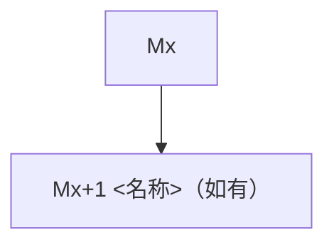

# DataPilot Phase X Development Plan

> 阶段X：XXXX
> 核心目标：XXXX

## 阶段X总目标

```
阶段结束时项目至少具备的能力（可验证的结果列表）。
写法要求：每条用"能…"开头，附带可验证的观察点。
```

## 架构底线与可降级边界

### P0：不可降级

```
格式：<约束> | <验证方式>
```

### P1：可简化，接口保留

```
格式：<简化方案> | <预留接口/字段> | <后续何时补>
```

## 单一事实源

```
所有 "以哪个文件为准" 的声明集中放这里。
示例：
- N 条回归用例口径：以 eval/cases/phase3a-regression.yaml 为准
- 模块进度：以 AI_CONTEXT.md「当前状态」为准
- trace_steps 字段定义：以 engine/trace/ 源码 Pydantic Schema 为准

⚠️ 本文件的所有"示例"标注均为给填作者的提示，执行时以实际内容为准，不以示例值为准。
```

## 模块推进原则

```
例如：- 每个模块可以一次连续完成，但必须在验收门停下来验证。
```

## 目录与文件规划

| 路径 | 类型 | 所属模块 | 职责 |
|---|---|---|---|
| `xxx` | 新建/修改 | Mx | 说明 |

## 模块总览

模块实时进度只看 AI_CONTEXT.md「当前状态」。

| 模块 | 顺序 | 依赖 | 模块目标 | 关键产出 |
|---|---|---|---|---|
| M1 <名称> | 1 | — | <一句话> | <核心文件> |
| M2 <名称> | 2 | M1 | <一句话> | <核心文件> |

## Mx：<模块名称>

| 项 | 内容 |
|---|---|
| 目标 | <一句话> |
| 输入 | <来自哪些模块/文件的产物> |
| 关键产出 | <核心文件路径> |

**需用户确认的决策点**

```
如果发现计划里有"先用简化方案，后续再替换正式方案"的设计，
或者涉及技术选型、数据模型、架构分层、安全策略、评测结构或后续迁移成本等长期影响较大的选择：
先说明可选方案 / 风险 / 后续影响 / 你的建议，等我确认后再决定；
不要自行降级或临时替代。
```

### 参考资料

| 参考文件 | 借鉴点 | 怎么落地 |
|---|---|---|
| <路径> | <一句话> | <DataPilot 用法> |

### 任务清单

```
任务格式：[标签] <动作> → <目标文件:函数名> | 输入源 | 输出契约
标签说明：
  [顺序] = 必须按列表顺序执行
  [并行] = 可与其他 [并行] 任务同时开工
  [可选] = 不阻塞验收门，可跳过
示例：
  [顺序] 定义 QueryPlanStep Pydantic Schema
    → engine/nl2sql/planner.py::QueryPlanStep, QueryPlan
    | 输入：schema_retriever 结果, domain_pack/schema_desc
    | 输出：Pydantic 模型，字段含 tables/columns/filters/aggregations/joins/output_columns
```

- [ ] [顺序] <文件路径::函数名> | <输入源> | <输出契约>
- [ ] [并行] ...
- [ ] [可选] ...

### 验收门

```
汇总清单：检查项 + 验证命令 + 文档更新。此项全部通过才能进入下一模块。
```

- [ ] <检查项>
- [ ] 验证：`<命令>`
- [ ] 更新 AI_CONTEXT.md 技术档案，并在 dev-log.md 追加本模块日志

### 降级与停止点

| 卡住场景 | 触发信号 | 降级方案 | 不影响的验收 |
|---|---|---|---|
| <场景> | <怎么判断> | <怎么做> | <哪些验收不受影响> |

## Mx+1：<模块名称>

```
...
```

## 阶段X验收标准

```
汇总所有模块的验收门，作为最终门禁。按模块逐一勾选。
```

| 模块 | 验收门通过 |
|---|---|
| M8 | □ |
| M9 | □ |

- [ ] 旧链路 vs 新链路对照报告输出
- [ ] N 条回归全部通过（N 以 `eval/cases/phase3a-regression.yaml` 实际用例数为准）

## 依赖关系总览



## 风险与兜底

| 风险 | 影响模块 | 触发信号 | 兜底方案 | 不影响的验收 |
|---|---|---|---|---|
| <风险描述> | Mx | <怎么判断卡住了> | <降级方案> | <哪些验收项不受影响> |

## 模块收工检查

- [ ] 新增文件路径符合目录规划
- [ ] 核心命令记录在 README / AI_CONTEXT.md 或验收记录中
- [ ] 如果修改 API 响应结构，同步更新 Pydantic Schema 和 README 示例
- [ ] 不把未实现能力写成已实现；README 使用"已完成 / 进行中 / 后续计划"分层表述
- [ ] 如果查了 references/ 项目，在 AI_CONTEXT.md 模块档案「参考资料」写清楚
