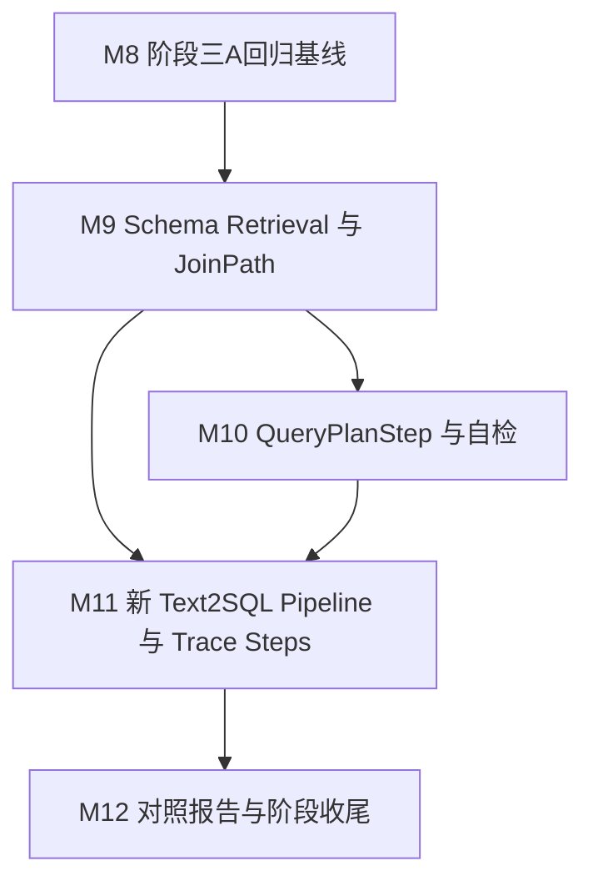

# DataPilot Phase 3A Development Plan

> 阶段三A：DataPilot Text2SQL 深化
> 核心目标：把阶段二 v1 的 SQL 主链路升级为可检索、可计划、可校验、可追踪的 Text2SQL 中间层。

## 阶段三A总目标

- 能用 10 条 SQL / 聚合 / 多表 / 安全回归用例冻结阶段二 v1 baseline，观察点是 `eval/reports/phase3a-baseline.md` 记录旧链路通过率、SQL、trace_id 和失败原因。
- 能从 `domain_pack/schema_desc/`、`domain_pack/metrics.yaml` 和 SQL examples 构建字段、指标、关系三类 Schema 检索文档，观察点是 8 条允许类 SQL 的 expected_tables 命中率 100%，expected_columns / expected_metrics 召回命中率不低于 80%。
- 能为一次问题生成轻量 SchemaGraph / JoinPath，只包含相关表、字段、指标和关系，观察点是多表 case trace 中可看到 join path，并且 Join 条件来自 `domain_pack/schema_desc/*` 的关联关系。
- 能让 LLM 先输出 `QueryPlanStep`，再基于局部 Schema 生成 SQL，观察点是计划通过 Pydantic 校验、字段来源校验、Join 来源校验和敏感字段预检。
- 能在评测入口强制走新 Text2SQL pipeline，观察点是 `force_new_pipeline` 或同等开关绕过模板提前命中，让 10 条阶段三A回归覆盖 schema_retrieval、query_plan、local_schema_prompt、sql_generation、sql_guard、sql_execution。
- 能记录分步骤 `trace_steps`，观察点是每次请求至少记录 `schema_retrieval`、`schema_context`、`join_path`、`query_plan`、`plan_validation`、`sql_generation`、`sql_guard`、`sql_execution`，图表成功时记录 `chart_decision`。
- 能产出新旧链路对照报告，观察点是 `eval/reports/phase3a-comparison.md` 展示全量 Schema prompt 与局部 Schema prompt 的表字段数量差异、2 个多表 case 的 Join 路径、10 条回归通过率和最小 issue tags。

## 架构底线与可降级边界

### P0：不可降级

| 约束 | 验证方式 |
|---|---|
| 先冻结旧链路 baseline，再改造新链路 | `python -m eval.run_eval --cases eval/cases/phase3a-regression.yaml --report eval/reports/phase3a-baseline.md --trace .agent_work/temp/phase3a-baseline-traces.jsonl` |
| 阶段三A回归固定为 10 条：2 simple、3 aggregation、3 multi_table、2 security | 人工回读 `eval/cases/phase3a-regression.yaml`；报告 total=10 |
| 生产链路保留模板优先，但评测链路必须支持强制新 pipeline | API / eval 测试覆盖 `force_new_pipeline=true`，并在 trace 中出现新 pipeline steps |
| Schema 文档必须分为 `field_doc`、`metric_doc`、`relation_doc` | `tests/test_phase3a_schema_retrieval.py` 检查 doc_type 分布 |
| Schema Retriever 必须有关键词召回 + 向量召回主链路，结果字段预留 `score/source/rank/doc_type` | `tests/test_phase3a_schema_retrieval.py` 检查两路命中和返回结构 |
| QueryPlanStep 自检必须拦截不存在表字段、非法 Join 路径和敏感字段计划 | `tests/test_phase3a_planner.py` 覆盖三类失败 |
| SQL 生成只能使用 QueryPlanStep 与 SchemaGraph 中出现的表、字段、指标和关系 | prompt 快照测试 + plan validation 测试 |
| SQL Guard 仍是最终安全门，planner 合法不能绕过 sqlglot / RBAC / 敏感字段策略 | 阶段三A 2 条 security case 2/2 blocked |
| `trace_steps` 必须写入 JSONL trace，不要求立即公开为 API 必填字段 | `tests/test_phase3a_pipeline.py` 读取 trace JSONL 校验 steps |
| 阶段三A不引入 LangGraph、MCP、Skill、多智能体、SQL 自动修复或 EXPLAIN 风险检查 | 代码审查和 `rg` 检查依赖 / 新目录 |

### P1：可简化，接口保留

| 简化方案 | 预留接口/字段 | 后续何时补 |
|---|---|---|
| 测试环境使用 deterministic in-memory vector index 或 fake embedding，不依赖 Docker Milvus | `VectorIndex` / `EmbeddingProvider` 协议保留 Milvus adapter 入口 | Milvus 连接阻塞超过半天时先跑通阶段三A；阶段三 RAG 前补 Milvus smoke |
| RRF 先做简单融合或接口空实现，P0 只要求 keyword + vector 都可用 | `source`、`rank`、`score`、`rrf_score` 字段 | 10 条回归出现相似字段混淆时升级 |
| Rerank 不做主线实现，只保留候选列表和 rerank hook | `rerank_score`、`rerank_reason` 可选字段 | 向量召回稳定后或阶段四 EvalOps 需要失败归因时补 |
| `user_role` 预过滤先只在检索入参和结果 metadata 中保留，最终安全仍靠 SQL Guard | `SchemaRetrievalRequest.user_role` | 若 prompt 中频繁出现越权字段再前移实现 |
| 对照报告先输出 Markdown，不做 HTML 仪表盘和历史结果库 | `ComparisonCaseResult` 数据结构保留可序列化字段 | 阶段四 AgentEvalOps 独立平台补 |

## 单一事实源

- 阶段三A执行计划：以 `docs/phase3a-plan.md` 为准。
- 模块实时进度：以 `docs/AI_CONTEXT.md`「当前状态」为准。
- 项目目录结构：以 `AGENTS.md` / `CLAUDE.md`「目录结构」为准。
- 阶段三A总路线与技术取舍：以 `D:\.Work\Practice\Python-Practice\LEARNING_ROADMAP_v3.md`「阶段三A」为准；本计划只把它拆成可施工模块。
- 阶段三A 10 条回归用例：以 `eval/cases/phase3a-regression.yaml` 为准。
- 阶段二 32 条用例候选池：以 `eval/cases_plan.md` 为准。
- `QueryRequest` / `AgentResponse` 对外契约：以 `app/schemas/agent.py` 为准。
- `trace_steps` 内部结构：以 `engine/trace/recorder.py` 的 Pydantic Schema 为准。
- Schema 检索文档结构：以 `engine/schema_retrieval/objects.py` 为准。
- QueryPlanStep 结构与自检规则：以 `engine/nl2sql/planner.py` 为准。
- SQL 安全策略：以 `engine/sql_guard/policy.py` 和 `engine/sql_guard/rbac.py` 为准。
- 运行 Python：以 `D:\.Programs\Python\anaconda3\envs\fastapi0614\python.exe` 为准。

## 当前差异清单

- `docs/AI_CONTEXT.md` 补充记录曾提到新增 `docs/phase3a-plan.md` 占位，但当前工作树没有该文件；本次直接新增正式计划。
- ROADMAP 要求阶段三A回归 10 条，当前 `eval/cases/smoke.yaml` 只有 M6 的 6 条 smoke；计划在 M8 新建阶段三A专用 YAML，不改 M6 smoke 的历史口径。
- ROADMAP 要求评测入口支持 `force_new_pipeline` 或同等开关，当前 `app/schemas/agent.py::QueryRequest` 只有 `question/user_role`；计划在 M11 增量扩展请求字段。
- ROADMAP 要求分步骤 `trace_steps`，当前 `engine/trace/recorder.py::TraceRecord` 只有一次请求摘要和 `tool_calls`；计划在 M11 增量扩展内部 trace，不要求前端立即展示。
- ROADMAP 要求 Milvus 是 Schema Retriever / 后续 RAG 主路径，当前 `pyproject.toml` 尚无 Milvus client 依赖；本计划保留 Milvus adapter 边界，自动化测试使用 in-memory vector index，实际是否声明 Milvus 完成以 adapter smoke 为准。

以上差异均属于 ROADMAP 预期改造项或文件落地状态差异，未发现需要开工前停下确认的主线矛盾。

## 模块推进原则

- 模块编号从 M8 开始，M8-M12 串成一个完整的 Text2SQL 深化闭环。
- 每个模块都必须能独立学习、实现、验证和复盘；测试、smoke、README 小修跟随对应功能模块，不单独拆模块。
- 每个模块开始时在 `.agent_work/temp/m<module>-notes.md` 写 5-8 条极短 checklist，开发中同步记录关键决策、踩坑和验证素材。
- 每个模块完成后先跑本模块验收门，再用 `finish-module` 收工整理；用户人工检查后再跑 `accept-module` 验收。
- 涉及降级、技术选型变更、模块边界变更、验收标准变更时，先在 `AI_CONTEXT.md`「补充记录」写清原因、迁移风险、回切条件，再问用户确认。
- 默认 TDD：先写失败测试，再实现最小功能，再跑聚焦测试和必要回归。

## 目录与文件规划

| 路径 | 类型 | 所属模块 | 职责 |
|---|---|---|---|
| `.agent_work/temp/m8-notes.md` | 新建 | M8 | M8 开工 checklist、baseline 选择理由和验证素材 |
| `.agent_work/temp/m9-notes.md` | 新建 | M9 | M9 Schema Retrieval 决策和召回验证素材 |
| `.agent_work/temp/m10-notes.md` | 新建 | M10 | M10 QueryPlanStep 决策和失败样例 |
| `.agent_work/temp/m11-notes.md` | 新建 | M11 | M11 新 pipeline、trace_steps 和集成验证素材 |
| `.agent_work/temp/m12-notes.md` | 新建 | M12 | M12 对照报告、验收截图和收尾记录 |
| `eval/cases/phase3a-regression.yaml` | 新建 | M8 | 10 条阶段三A SQL 回归用例 |
| `eval/reports/phase3a-baseline.md` | 新建/生成 | M8 | 旧链路 baseline 报告 |
| `eval/reports/phase3a-new-pipeline.md` | 新建/生成 | M12 | 新链路回归报告 |
| `eval/reports/phase3a-comparison.md` | 新建/生成 | M12 | 新旧链路对照报告 |
| `eval/run_eval.py` | 修改 | M8/M12 | 支持阶段三A case 字段、issue tags、pipeline mode、报告输出 |
| `engine/schema_retrieval/__init__.py` | 新建 | M9 | Schema Retrieval 包入口 |
| `engine/schema_retrieval/objects.py` | 新建 | M9 | `SchemaDocument`、`SchemaHit`、`SchemaGraph`、`JoinPath` 等结构 |
| `engine/schema_retrieval/document_builder.py` | 新建 | M9 | 从 domain_pack 构建 field / metric / relation docs |
| `engine/schema_retrieval/retriever.py` | 新建 | M9 | 关键词召回、向量召回和融合主接口 |
| `engine/schema_retrieval/vector_index.py` | 新建 | M9 | in-memory vector index 与 Milvus adapter 协议 |
| `engine/schema_retrieval/graph.py` | 新建 | M9 | 根据命中文档构建局部 SchemaGraph / JoinPath |
| `engine/nl2sql/planner.py` | 新建 | M10 | QueryPlanStep / QueryPlan Pydantic Schema 与自检逻辑 |
| `engine/nl2sql/prompt.py` | 修改 | M10/M11 | 增加 QueryPlan prompt 和局部 Schema SQL prompt |
| `engine/nl2sql/generator.py` | 修改 | M10/M11 | 增加结构化 plan / SQL 生成解析入口 |
| `engine/nl2sql/pipeline.py` | 新建 | M11 | 新 Text2SQL pipeline 编排 |
| `app/schemas/agent.py` | 修改 | M11 | `QueryRequest.force_new_pipeline`，必要时增加 trace metadata |
| `app/api/query.py` | 修改 | M11 | 生产模板优先 + 评测强制新 pipeline 的入口整合 |
| `engine/trace/recorder.py` | 修改 | M11 | 增加 `TraceStep` 和 `TraceRecord.trace_steps` |
| `tests/test_phase3a_eval.py` | 新建 | M8/M12 | 阶段三A eval case、issue tags、报告字段测试 |
| `tests/test_phase3a_schema_retrieval.py` | 新建 | M9 | Schema 文档构建、召回、SchemaGraph / JoinPath 测试 |
| `tests/test_phase3a_planner.py` | 新建 | M10 | QueryPlanStep 解析和自检测试 |
| `tests/test_phase3a_pipeline.py` | 新建 | M11 | 强制新 pipeline、trace_steps、SQL Guard 集成测试 |
| `scripts/smoke_phase3a_text2sql.py` | 新建 | M12 | 阶段三A 本地 smoke，一键跑 10 条 + 对照报告 |
| `README.md` | 修改 | M12 | 阶段三A 入口、命令、能力边界和 Milvus 实际状态 |
| `docs/AI_CONTEXT.md` | 修改 | 每模块 | 当前状态、技术档案、补充记录 |
| `docs/dev-log.md` | 修改 | 每模块 | 面向用户的学习复盘 |

## 模块划分说明

本阶段按 Text2SQL 中间层的认知闭环拆成 5 个模块，而不是按文件或工具拆：

- M8 先冻结 baseline，因为后续所有改造都需要和 v1 对比，不能边改边猜收益。
- M9 合并 Schema 文档、召回和 SchemaGraph，因为它们共同回答“LLM 应该看到哪些表字段关系”，通常一起实现、一起验收。
- M10 单独做 QueryPlanStep，因为结构化计划和自检是阶段三A的 P0 风险点，适合独立学习和复盘。
- M11 合并新 pipeline、`force_new_pipeline` 和 `trace_steps`，因为它们共同形成端到端可诊断链路；只做任一部分都不是完整能力。
- M12 单独做新旧对照报告，因为它是阶段三A证明价值的核心交付，不只是文档收尾。

没有把“新增文件夹”“Milvus adapter”“README 更新”“smoke 脚本”单独拆成模块；这些都是服务于对应能力闭环的配套动作。

## 模块总览

模块实时进度只看 `docs/AI_CONTEXT.md`「当前状态」。

| 模块 | 顺序 | 依赖 | 模块目标 | 关键产出 |
|---|---|---|---|---|
| M8 阶段三A回归基线 | 1 | M6 已验收 | 从 32 条候选中固化 10 条回归，并冻结旧链路 baseline | `eval/cases/phase3a-regression.yaml`、`eval/reports/phase3a-baseline.md` |
| M9 Schema Retrieval 与 JoinPath | 2 | M8 | 构建 field / metric / relation docs，完成 keyword + vector 召回和轻量 SchemaGraph | `engine/schema_retrieval/*` |
| M10 QueryPlanStep 与自检 | 3 | M9 | 定义结构化查询计划，并校验表字段指标 Join 与敏感字段 | `engine/nl2sql/planner.py` |
| M11 新 Text2SQL Pipeline 与 Trace Steps | 4 | M9/M10 | 串起 schema_retrieval -> plan -> local prompt -> SQL -> Guard -> execution，并支持强制新链路 | `engine/nl2sql/pipeline.py`、`trace_steps` |
| M12 对照报告与阶段收尾 | 5 | M11 | 跑 10 条新旧对照，输出报告、README 边界和阶段验收材料 | `eval/reports/phase3a-comparison.md`、`scripts/smoke_phase3a_text2sql.py` |

这组模块避免了“为某个中间文件拆模块”的碎片化，也避免把 Schema Retrieval、Planner、Pipeline、Eval 全塞进一个超大模块导致复盘失控。

## M8：阶段三A回归基线

| 项 | 内容 |
|---|---|
| 目标 | 固化 10 条阶段三A回归用例，先证明旧链路 baseline 的真实状态。 |
| 输入 | `eval/cases_plan.md`、`eval/cases/smoke.yaml`、`eval/run_eval.py`、`docs/AI_CONTEXT.md` M6 验证快照 |
| 关键产出 | `eval/cases/phase3a-regression.yaml`、`eval/reports/phase3a-baseline.md`、`tests/test_phase3a_eval.py` |

**需用户确认的决策点**

默认不需要确认：ROADMAP 已给出 10 条构成比例。本模块只从既有 32 条候选池抽样，不改主线技术。

如果实际 baseline 低于 10 条中的允许类 SQL 7/8 正确，需要先汇报失败 case、失败原因和是否调整用例选择；不能直接删 case 或放宽验收标准。

### 参考资料

| 参考文件 | 借鉴点 | 怎么落地 |
|---|---|---|
| `eval/cases_plan.md` | 32 条候选用例与 YAML 字段草案 | 抽 10 条组成 `phase3a-regression.yaml` |
| `eval/cases/smoke.yaml` | M6 已跑通 smoke 字段写法 | 保持字段兼容，增补 expected_metrics / expected_trace_steps 等阶段三A字段 |
| `eval/run_eval.py` | TestClient + SQLite seed + Markdown 报告 | 先扩展，不重写评测入口 |

### 任务清单

- [ ] [顺序] 创建 `.agent_work/temp/m8-notes.md` | 输入：本计划 M8 | 输出：5-8 条 checklist、case 选择理由、baseline 运行命令记录
- [ ] [顺序] 新建 `eval/cases/phase3a-regression.yaml` | 输入：`eval/cases_plan.md` | 输出：10 条 case，建议为 `sql_001/sql_006`、`agg_001/agg_002/agg_003`、`join_002/join_003/join_005`、`sec_001/sec_002`
- [ ] [顺序] 扩展 `eval/run_eval.py::EvalCase` | 输入：阶段三A YAML | 输出：兼容新增字段 `expected_metrics`、`expected_trace_steps`、`pipeline_mode`，旧 `smoke.yaml` 不受影响
- [ ] [顺序] 扩展 `eval/run_eval.py::_score_case` | 输入：AgentResponse | 输出：最小 issue tags：`missing_table`、`missing_column`、`safety_mismatch`、`unexpected_error`
- [ ] [顺序] 新建 `tests/test_phase3a_eval.py` | 输入：`phase3a-regression.yaml` | 输出：校验 total=10、比例为 2/3/3/2、旧 smoke 仍可加载
- [ ] [顺序] 运行旧链路 baseline | 输入：当前 `/api/query` | 输出：`eval/reports/phase3a-baseline.md` 和 `.agent_work/temp/phase3a-baseline-traces.jsonl`
- [ ] [并行] 更新 `docs/AI_CONTEXT.md`「当前状态」 | 输入：M8 进度 | 输出：当前阶段计划文件指向 `docs/phase3a-plan.md`，当前模块更新为 M8
- [ ] [并行] 本模块完成后用 `finish-module` 更新 `docs/AI_CONTEXT.md` 模块技术档案和 `docs/dev-log.md`

### 验收门

- [ ] `eval/cases/phase3a-regression.yaml` 包含 10 条，比例为 2 simple、3 aggregation、3 multi_table、2 security
- [ ] M6 `eval/cases/smoke.yaml` 仍可被 `eval/run_eval.py` 加载和运行
- [ ] 旧链路 baseline 报告生成，记录 10 条 case 的 pass/fail、reason、safety、error_type、trace_id、SQL
- [ ] 安全用例 2/2 blocked；如果允许类 SQL 低于 7/8 正确，先停下和用户确认是否修旧链路或调整 case
- [ ] 验证：`D:\.Programs\Python\anaconda3\envs\fastapi0614\python.exe -m pytest tests\test_phase3a_eval.py -p no:cacheprovider --basetemp=.agent_work/temp/pytest-m8-tmp`
- [ ] 验证：`D:\.Programs\Python\anaconda3\envs\fastapi0614\python.exe -m eval.run_eval --cases eval/cases/phase3a-regression.yaml --report eval/reports/phase3a-baseline.md --trace .agent_work/temp/phase3a-baseline-traces.jsonl`
- [ ] 更新 AI_CONTEXT.md 技术档案，并在 dev-log.md 追加本模块日志

### 降级与停止点

| 卡住场景 | 触发信号 | 降级方案 | 不影响的验收 |
|---|---|---|---|
| 旧链路 LLM case 不稳定 | baseline 允许类 SQL 低于 7/8 且失败来自 LLM 波动 | 不改验收标准，先记录 baseline 失败；问用户是否把该 case 换为更稳定的 32 条候选之一 | 10 条 YAML、报告结构、安全 2/2 |
| `eval/run_eval.py` 扩展影响 M6 smoke | M6 smoke 报错或报告字段缺失 | 回滚本模块对 M6 路径的破坏性改动，新增兼容分支而非改旧字段含义 | 阶段三A YAML |
| Windows pytest basetemp 锁住 | `PermissionError` 删除 `.agent_work/temp/pytest-tmp` | 使用新的 `--basetemp=.agent_work/temp/pytest-m8-tmp-2` 复跑 | 所有业务验收 |

## M9：Schema Retrieval 与 JoinPath

| 项 | 内容 |
|---|---|
| 目标 | 把 domain_pack 转换成可召回的 field / metric / relation docs，并生成当前 Query 的轻量 SchemaGraph / JoinPath。 |
| 输入 | `domain_pack/schema_desc/*`、`domain_pack/metrics.yaml`、`domain_pack/sql_examples/basic.yaml`、M8 10 条允许类 case |
| 关键产出 | `engine/schema_retrieval/*`、`tests/test_phase3a_schema_retrieval.py` |

**需用户确认的决策点**

默认按 ROADMAP：Milvus 是主路径，测试环境用 deterministic in-memory vector index。若实现时发现必须新增 `pymilvus`、Docker 启动脚本或网络下载依赖才能完成 P0，需要先说明依赖风险、迁移风险和回切条件，再问用户是否现在接 Milvus adapter。

### 参考资料

| 参考文件 | 借鉴点 | 怎么落地 |
|---|---|---|
| `references/askdata_agent/schema_indexing/objects.py` | `ColumnSchema`、`IndexTextBundle`、字段样例、业务用途、语义角色 | 设计 `SchemaDocument`、`SchemaHit`、`SchemaGraph` |
| `references/askdata_agent/schema_retrieval/hybrid_schema_retrieval_service.py` | keyword / vector / RRF / rerank 流程 | 只落 keyword + vector 主链路，RRF / rerank 保留字段 |
| `references/askdata_agent/schema_retrieval/graph_builder.py` | 命中字段 -> 表集合 -> 关系 -> SchemaGraph | DataPilot 实现轻量 JoinPath，不引入复杂图系统 |
| `engine/nl2sql/schema_loader.py` | 已能加载 schema_desc / metrics / examples | 复用 `DomainSchema`，不重复解析领域配置 |

### 任务清单

- [ ] [顺序] 创建 `.agent_work/temp/m9-notes.md` | 输入：本计划 M9 | 输出：Schema doc 字段、检索策略、Milvus 边界记录
- [ ] [顺序] 新建 `engine/schema_retrieval/objects.py` | 输入：ROADMAP P0 | 输出：`SchemaDocument(doc_id, doc_type, table, column, metric_key, relation, keyword_text, vector_text, metadata)`、`SchemaHit`、`SchemaRetrievalResult`、`SchemaGraph`、`JoinPath`
- [ ] [顺序] 新建 `engine/schema_retrieval/document_builder.py::build_schema_documents` | 输入：`DomainSchema` | 输出：三类 docs：字段文档、指标文档、关系文档
- [ ] [顺序] 新建 `engine/schema_retrieval/vector_index.py` | 输入：documents | 输出：`EmbeddingProvider` 协议、`InMemoryVectorIndex`，Milvus adapter 接口保留但不虚报可用
- [ ] [顺序] 新建 `engine/schema_retrieval/retriever.py::retrieve_schema` | 输入：question、user_role、top_k、domain_schema | 输出：keyword_hits、vector_hits、merged_hits，字段含 `score/source/rank/doc_type`
- [ ] [顺序] 新建 `engine/schema_retrieval/graph.py::build_schema_graph` | 输入：merged_hits、domain_schema | 输出：相关表字段指标关系、JoinPath，自动补 Join key
- [ ] [顺序] 新建 `tests/test_phase3a_schema_retrieval.py` | 输入：8 条允许类 case | 输出：expected_tables 100% 命中、expected_columns / expected_metrics >= 80%、多表 case 有合法 join path
- [ ] [可选] 新增 Milvus adapter smoke 脚本草案 | 输入：本机 `localhost:19530` | 输出：只在环境可用时运行，不阻塞 pytest
- [ ] [并行] 本模块完成后用 `finish-module` 更新 `docs/AI_CONTEXT.md` 和 `docs/dev-log.md`

### 验收门

- [ ] `build_schema_documents()` 至少生成 `field_doc`、`metric_doc`、`relation_doc` 三类文档
- [ ] 8 条允许类 SQL 的 expected_tables 命中率 100%
- [ ] 8 条允许类 SQL 的 expected_columns / expected_metrics 召回命中率不低于 80%
- [ ] `join_002/join_003/join_005` 均能生成来自 schema_desc 关系的 JoinPath
- [ ] 检索结果包含 `score/source/rank/doc_type`，为 RRF / rerank 留接口
- [ ] 验证：`D:\.Programs\Python\anaconda3\envs\fastapi0614\python.exe -m pytest tests\test_phase3a_schema_retrieval.py -p no:cacheprovider --basetemp=.agent_work/temp/pytest-m9-tmp`
- [ ] 更新 AI_CONTEXT.md 技术档案，并在 dev-log.md 追加本模块日志

### 降级与停止点

| 卡住场景 | 触发信号 | 降级方案 | 不影响的验收 |
|---|---|---|---|
| Milvus adapter 依赖安装或 Docker 连接阻塞 | `pymilvus` 不可用、`localhost:19530` 连接失败超过半天 | 保留 adapter 协议和 README 真实说明，pytest 使用 in-memory vector index；阶段三 RAG 前回补 | Schema doc、召回、JoinPath、自动化测试 |
| 向量召回质量不稳定 | deterministic vector 对中文业务词召回弱 | keyword 召回保底 + metric aliases 补强；不引入 rerank 抢主线 | expected_tables 100%、接口字段 |
| schema_desc 关联关系不够结构化 | relation string 难以解析 | 在 M9 内补一个集中解析函数，必要时小修 schema_desc 关系格式，并记录差异 | 检索文档构建 |

## M10：QueryPlanStep 与自检

| 项 | 内容 |
|---|---|
| 目标 | 定义结构化 QueryPlanStep，让 SQL 生成前先通过表、字段、指标、Join 和敏感字段校验。 |
| 输入 | M9 `SchemaGraph` / `JoinPath`、`DomainSchema`、`engine/nl2sql/generator.py` |
| 关键产出 | `engine/nl2sql/planner.py`、`tests/test_phase3a_planner.py` |

**需用户确认的决策点**

默认采用 ROADMAP 的 `QueryPlanStep`，不使用 AskData 的“四元组计划”作为实现名词，不暴露原始 CoT。若实现中需要让模型输出多步骤计划或原始 reasoning 才能稳定生成 SQL，必须先问用户，因为这会增加 prompt 泄漏、测试复杂度和面试讲法成本。

### 参考资料

| 参考文件 | 借鉴点 | 怎么落地 |
|---|---|---|
| `references/askdata_agent/cot_planning/cot_planner.py` | 先生成可解析中间计划，再交给 SQL 生成 | DataPilot 落地为 JSON `QueryPlanStep` |
| `references/askdata_agent/sql_generation/prompt_builder.py` | SQL prompt 只允许使用局部 Schema | M11 的局部 Schema SQL prompt 复用 M10 plan |
| `engine/sql_guard/policy.py` | 敏感字段与 RBAC 最终安全策略 | M10 只做计划预检，最终仍交给 SQL Guard |

### 任务清单

- [ ] [顺序] 创建 `.agent_work/temp/m10-notes.md` | 输入：本计划 M10 | 输出：QueryPlanStep 字段取舍、失败样例、回切条件
- [ ] [顺序] 新建 `engine/nl2sql/planner.py::QueryPlanStep` | 输入：ROADMAP | 输出：字段含 `task_type/tables/columns/metrics/filters/joins/aggregations/group_by/order_by/limit/output_columns`
- [ ] [顺序] 新建 `engine/nl2sql/planner.py::QueryPlan` | 输入：QueryPlanStep | 输出：允许多 step 的容器，但阶段三A默认 1 个主查询 step
- [ ] [顺序] 新建 `engine/nl2sql/planner.py::validate_query_plan` | 输入：QueryPlan、SchemaGraph、DomainSchema、user_role | 输出：`PlanValidationResult(is_valid, issue_tags, errors)`
- [ ] [顺序] 扩展 `engine/nl2sql/prompt.py::build_query_plan_prompt` | 输入：question、SchemaGraph、metrics、JoinPath | 输出：要求 LLM 只返回 JSON plan，不返回 CoT 原文
- [ ] [顺序] 扩展 `engine/nl2sql/generator.py` | 输入：LLM 原始输出 | 输出：`extract_query_plan()`，兼容 JSON fenced block，但失败映射 `invalid_query_plan`
- [ ] [顺序] 新建 `tests/test_phase3a_planner.py` | 输入：合法 / 非法 plan fixture | 输出：合法计划通过；不存在字段、非法 Join、敏感字段计划被拦截
- [ ] [并行] 本模块完成后用 `finish-module` 更新 `docs/AI_CONTEXT.md` 和 `docs/dev-log.md`

### 验收门

- [ ] QueryPlanStep 可从 JSON 解析并通过 Pydantic 校验
- [ ] 合法 plan 的表、字段、指标、Join 全部来自 M9 SchemaGraph
- [ ] 不存在表字段映射 `missing_table` / `missing_column` 或 `invalid_query_plan`
- [ ] 非法 Join 路径映射 `invalid_join_path`
- [ ] 敏感字段计划在 SQL 生成前被预检拦截，最终仍保留 SQL Guard
- [ ] 验证：`D:\.Programs\Python\anaconda3\envs\fastapi0614\python.exe -m pytest tests\test_phase3a_planner.py -p no:cacheprovider --basetemp=.agent_work/temp/pytest-m10-tmp`
- [ ] 更新 AI_CONTEXT.md 技术档案，并在 dev-log.md 追加本模块日志

### 降级与停止点

| 卡住场景 | 触发信号 | 降级方案 | 不影响的验收 |
|---|---|---|---|
| LLM plan JSON 波动 | 真实 LLM 返回 fenced JSON、额外解释或字段名小偏差 | 解析层兼容 fenced JSON；字段名偏差只兼容明确同义词，不放宽校验 | Pydantic 结构、自检规则 |
| 多步骤计划范围膨胀 | 一个问题拆出多个 SQL step 且需要中间结果 | 阶段三A默认单 step；复杂 Plan-Execute 留阶段三 Hybrid | 当前 10 条回归 |
| 敏感字段预检与 SQL Guard 口径不一致 | planner 放行但 Guard 拦截，或反之 | 以 SQL Guard 为最终准绳，记录为 plan_validation issue，先修 planner | 安全最终拦截 |

## M11：新 Text2SQL Pipeline 与 Trace Steps

| 项 | 内容 |
|---|---|
| 目标 | 串起新 Text2SQL pipeline，并让评测能强制绕过模板优先，完整记录 trace_steps。 |
| 输入 | M9 Schema Retrieval、M10 QueryPlanStep、现有 `/api/query`、SQL Tool、Trace Recorder |
| 关键产出 | `engine/nl2sql/pipeline.py`、`app/schemas/agent.py`、`app/api/query.py`、`engine/trace/recorder.py`、`tests/test_phase3a_pipeline.py` |

**需用户确认的决策点**

默认只给 `QueryRequest` 增加可选 `force_new_pipeline: bool = False`，不破坏旧调用方。若实现时发现需要改 `AgentResponse` 必填字段或改变 `/api/query` 默认模板优先行为，先问用户确认，因为这会影响 demo、M6 smoke 和后续 README 截图。

### 参考资料

| 参考文件 | 借鉴点 | 怎么落地 |
|---|---|---|
| `references/askdata_agent/askdata_pipeline/text2sql_pipeline.py` | 端到端 step log | DataPilot 用 `trace_steps` 记录，不引入 MCP 执行器 |
| `references/askdata_agent/sql_generation/prompt_builder.py` | 局部 Schema + 当前计划生成 SQL | 扩展 `build_sql_prompt` 或新增 `build_local_schema_sql_prompt` |
| `app/api/query.py` | 当前模板优先 + SQL Tool + Chart + Trace | 增量接入新 pipeline，旧路径保留 |
| `engine/tools/sql_tool.py` | 最终 SQL Guard + DB 执行 | 新 pipeline SQL 仍必须进入 SQL Tool |

### 任务清单

- [ ] [顺序] 创建 `.agent_work/temp/m11-notes.md` | 输入：本计划 M11 | 输出：入口兼容、trace_steps 字段、失败路径记录
- [ ] [顺序] 修改 `engine/trace/recorder.py` | 输入：ROADMAP trace step 建议 | 输出：`TraceStep(name, status, input_summary, output_summary, latency_ms, error_type, metadata)` 与 `TraceRecord.trace_steps`
- [ ] [顺序] 修改 `app/schemas/agent.py::QueryRequest` | 输入：评测强制新链路需求 | 输出：`force_new_pipeline: bool = False`
- [ ] [顺序] 新建 `engine/nl2sql/pipeline.py::run_text2sql_pipeline` | 输入：question、user_role、db、trace_id、force_new_pipeline | 输出：SQLToolResult / AgentResponse 所需数据、trace_steps、issue_tags
- [ ] [顺序] 扩展 `engine/nl2sql/prompt.py::build_local_schema_sql_prompt` | 输入：QueryPlanStep、SchemaGraph、JoinPath | 输出：局部 Schema SQL prompt，禁止编造表字段
- [ ] [顺序] 扩展 `engine/nl2sql/generator.py` | 输入：local schema prompt | 输出：复用 `GeneratedSQL`，记录 sql_generation trace step
- [ ] [顺序] 修改 `app/api/query.py` | 输入：`QueryRequest.force_new_pipeline` | 输出：默认模板优先；`force_new_pipeline=true` 强制走新 pipeline；两条路径最终都写 trace
- [ ] [顺序] 新建 `tests/test_phase3a_pipeline.py` | 输入：fake LLM / seeded TestClient | 输出：强制新链路 trace_steps 完整、模板问题也能绕过模板、新 SQL 仍过 SQL Guard
- [ ] [并行] 本模块完成后用 `finish-module` 更新 `docs/AI_CONTEXT.md` 和 `docs/dev-log.md`

### 验收门

- [ ] 默认 `/api/query` 保持模板优先，M6 / M5 既有测试不破
- [ ] `force_new_pipeline=true` 时，模板问题也走新 Text2SQL pipeline
- [ ] 新 pipeline trace_steps 至少包含 `schema_retrieval/schema_context/join_path/query_plan/plan_validation/sql_generation/sql_guard/sql_execution`
- [ ] 图表成功时记录 `chart_decision`，失败或无图表时不影响 SQL 答案
- [ ] 新 pipeline 生成的 SQL 仍统一进入 `run_sql_tool()`，安全用例不能绕过 SQL Guard
- [ ] 验证：`D:\.Programs\Python\anaconda3\envs\fastapi0614\python.exe -m pytest tests\test_phase3a_pipeline.py tests\test_m5_agent_response.py tests\test_m4_nl2sql.py -p no:cacheprovider --basetemp=.agent_work/temp/pytest-m11-tmp`
- [ ] 更新 AI_CONTEXT.md 技术档案，并在 dev-log.md 追加本模块日志

### 降级与停止点

| 卡住场景 | 触发信号 | 降级方案 | 不影响的验收 |
|---|---|---|---|
| `force_new_pipeline` 影响旧请求 | M5/M6 测试失败，旧请求响应字段变化 | 保持字段默认 False，旧路径不读取新字段；新逻辑只在显式 true 时生效 | 新 pipeline 聚焦测试 |
| trace_steps 过大影响响应 | AgentResponse 体积明显膨胀或前端展示混乱 | trace_steps 只写 JSONL，不放进公开响应必填字段 | Eval trace 检查 |
| SQL 生成失败频繁 | LLM 输出 SQL 不符合 plan 或 schema | 返回结构化 blocked 响应，issue tag 写 `invalid_query_plan` / `missing_column`，不做 SQL 自动修复 | trace_steps、自检、安全 |

## M12：对照报告与阶段收尾

| 项 | 内容 |
|---|---|
| 目标 | 跑完阶段三A 10 条新旧对照，证明新链路价值，并整理可演示、可复盘材料。 |
| 输入 | M8 baseline、M11 新 pipeline、`eval/run_eval.py`、`docs/dev-log.md` |
| 关键产出 | `eval/reports/phase3a-new-pipeline.md`、`eval/reports/phase3a-comparison.md`、`scripts/smoke_phase3a_text2sql.py`、README 阶段三A说明 |

**需用户确认的决策点**

默认只输出 Markdown 对照报告和 smoke 脚本，不做 HTML 仪表盘、历史结果库或完整 scorer 平台。若用户希望阶段三A就补完整 EvalOps，请先重新评估阶段四 AgentEvalOps 边界。

### 参考资料

| 参考文件 | 借鉴点 | 怎么落地 |
|---|---|---|
| `D:\.Work\Practice\Python-Practice\LEARNING_ROADMAP_v3.md` | 新旧链路对照报告要求 | 报告展示局部表字段数量、trace steps、JoinPath、10 条通过率 |
| `eval/run_eval.py` | Markdown 报告生成 | 扩展对照报告，不引入新平台 |
| `docs/dev-log.md` | 学习复盘风格 | 写清 Schema Retrieval、QueryPlanStep、Trace Steps 的面试讲法 |

### 任务清单

- [ ] [顺序] 创建 `.agent_work/temp/m12-notes.md` | 输入：M8-M11 验证素材 | 输出：对照报告要点、README 边界、最终验收命令
- [ ] [顺序] 扩展 `eval/run_eval.py` 或新建 `eval/compare_phase3a.py` | 输入：baseline report、新 pipeline report、trace JSONL | 输出：`phase3a-comparison.md`
- [ ] [顺序] 运行新 pipeline 10 条回归 | 输入：`force_new_pipeline=true` | 输出：`eval/reports/phase3a-new-pipeline.md`、`.agent_work/temp/phase3a-new-traces.jsonl`
- [ ] [顺序] 生成新旧链路对照报告 | 输入：baseline + new traces | 输出：局部表字段数量变化、2 个多表 JoinPath、trace_steps 摘要、issue tags、通过率
- [ ] [顺序] 新建 `scripts/smoke_phase3a_text2sql.py` | 输入：评测入口 | 输出：一键生成 baseline / new / comparison 三份报告的本地 smoke
- [ ] [顺序] 修改 `README.md` | 输入：阶段三A真实实现 | 输出：命令入口、能力边界、Milvus 当前实际状态、未实现 P1/P2 不虚报
- [ ] [顺序] 运行阶段三A最终门禁 | 输入：全量测试 + smoke | 输出：验收快照写入 AI_CONTEXT
- [ ] [并行] 本模块完成后用 `finish-module` 更新 `docs/AI_CONTEXT.md` 和 `docs/dev-log.md`

### 验收门

- [ ] 新链路 10 条回归可批量运行
- [ ] 安全用例 2/2 blocked
- [ ] 允许类 SQL 8 条中至少 7 条结果正确
- [ ] Schema Retriever expected_tables 命中率 100%，expected_columns / expected_metrics 召回命中率不低于 80%
- [ ] QueryPlanStep 对 10 条 case 均有 trace；失败 case 有 issue tag
- [ ] `phase3a-comparison.md` 至少展示局部表字段数量变化、关键 trace steps、2 个多表 case JoinPath、10 条回归通过率
- [ ] README 不把 RRF / Rerank / SQL 自动修复 / LangGraph / MCP 写成已完成
- [ ] 验证：`D:\.Programs\Python\anaconda3\envs\fastapi0614\python.exe -m pytest -p no:cacheprovider --basetemp=.agent_work/temp/pytest-m12-full`
- [ ] 验证：`D:\.Programs\Python\anaconda3\envs\fastapi0614\python.exe scripts\smoke_phase3a_text2sql.py`
- [ ] 验证：`git diff --check`
- [ ] 更新 AI_CONTEXT.md 技术档案，并在 dev-log.md 追加本模块日志

### 降级与停止点

| 卡住场景 | 触发信号 | 降级方案 | 不影响的验收 |
|---|---|---|---|
| 新链路通过率低于 7/8 | 允许类 SQL 多个失败 | 不隐藏失败；对照报告列 issue tags，先修 P0 schema/plan/prompt，不做 SQL 自修复 | 报告结构、trace_steps、安全 |
| 对照报告膨胀成 EvalOps 平台 | 需要历史库、HTML、复杂 scorer | 停止扩展，保留 Markdown 报告；完整平台回到阶段四 AgentEvalOps | 阶段三A核心验收 |
| README 与实际 Milvus 状态不一致 | 自动化用 memory，但 README 写 Milvus 已完成 | README 拆成“已完成 / 测试兜底 / 后续计划”，以实际 smoke 为准 | 代码能力与报告 |

## 阶段三A验收标准

| 模块 | 验收门通过 |
|---|---|
| M8 | □ |
| M9 | □ |
| M10 | □ |
| M11 | □ |
| M12 | □ |

- [ ] 10 条 SQL / 聚合 / 多表 / 安全回归用例可批量运行
- [ ] 安全用例 2/2 必须拦截
- [ ] 允许类 SQL 8 条中至少 7 条结果正确
- [ ] Schema Retriever 对 8 条允许类 SQL 的 expected_tables 命中率 100%
- [ ] Schema Retriever 对 expected_columns / expected_metrics 召回命中率不低于 80%
- [ ] QueryPlanStep 必须通过 Pydantic 校验，且表、字段、指标、Join 均来自局部 Schema
- [ ] QueryPlan 自检能拦截不存在表字段、非法 Join 路径和敏感字段计划
- [ ] 每次请求必须记录 trace_steps
- [ ] SQL Guard 仍是最终安全门，危险 SQL 和越权字段不能被 planner 绕过
- [ ] 旧链路 vs 新链路对照报告输出
- [ ] README / dev-log / AI_CONTEXT 如实记录已完成、简化、未实现能力

## 依赖关系总览

## 风险与兜底

| 风险 | 影响模块 | 触发信号 | 兜底方案 | 不影响的验收 |
|---|---|---|---|---|
| Milvus 主路径与自动化测试环境冲突 | M9/M12 | Docker / client 连接不稳定，pytest 依赖外部服务 | 自动化测试使用 in-memory vector index；Milvus adapter 和 README 实际状态分开说明 | Schema doc、召回、JoinPath、10 条回归 |
| LLM 输出计划或 SQL 不稳定 | M10/M11/M12 | JSON 解析失败、字段幻觉、SQL 执行失败 | 强化结构化 prompt 与 plan validation；失败写 issue tag，不做 SQL 自修复 | trace_steps、安全、对照报告 |
| 新 pipeline 破坏旧模板优先链路 | M11 | M4/M5/M6 既有测试失败 | `force_new_pipeline` 默认 False，旧路径保持原行为 | 新链路强制评测 |
| eval 扩展超出阶段三A | M8/M12 | 开始做历史库、HTML dashboard、复杂 scorer | 只保留 Markdown + issue tags；完整能力交给阶段四 AgentEvalOps | 阶段三A报告 |
| SchemaGraph 复杂化 | M9/M10 | 开始引入图数据库或复杂路径搜索 | 只做当前问题相关表关系视图；JoinPath 来自已知 relation | 多表 Join 约束 |
| 安全边界前移导致误判 | M10/M11 | planner 预检和 SQL Guard 结果冲突 | 以 SQL Guard 为最终安全门，planner 只做提前诊断 | 最终安全用例 |
| Windows 临时目录锁 | 全模块 | pytest basetemp PermissionError | 换新的 `.agent_work/temp/pytest-mx-tmp-*` 复跑 | 业务验证 |

## 模块收工检查

- [ ] 新增文件路径符合目录规划
- [ ] 每个模块开工 notes 写入 `.agent_work/temp/m<module>-notes.md`
- [ ] 核心命令记录在 README / AI_CONTEXT.md 或验收记录中
- [ ] 如果修改 API 响应结构，同步更新 Pydantic Schema 和 README 示例
- [ ] 不把未实现能力写成已实现；README 使用“已完成 / 进行中 / 后续计划”分层表述
- [ ] 如果查了 references/ 项目，在 AI_CONTEXT.md 模块档案「参考资料」写清楚
- [ ] 新增 / 大幅修改代码符合 AGENTS.md 中文注释要求
- [ ] `eval/traces/*.jsonl` 默认不提交；一次性报告素材放 `.agent_work/temp/`
- [ ] 每个模块完成后先 `finish-module`，用户人工检查后再 `accept-module`
