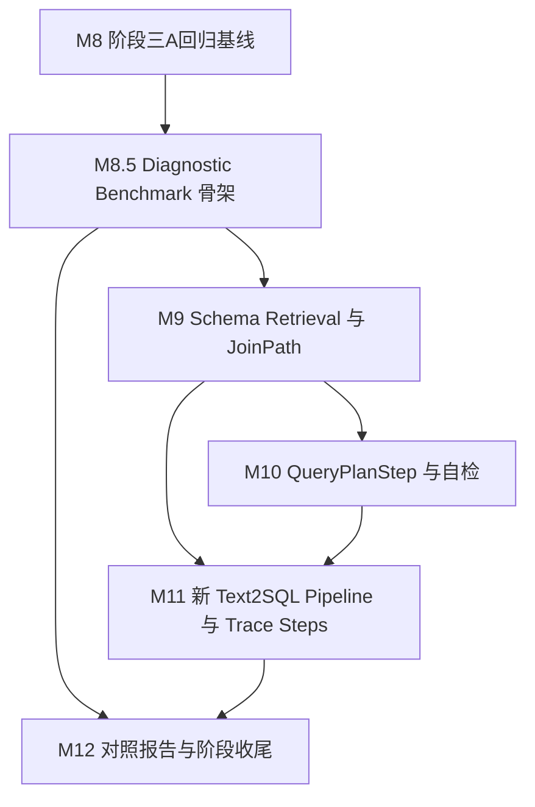

# DataPilot Phase 3A Development Plan

> 阶段三A：DataPilot Text2SQL 深化
> 核心目标：把阶段二 v1 的 SQL 主链路升级为可检索、可计划、可校验、可追踪的 Text2SQL 中间层。

## 开工前置说明：Phase 2.7 数据库升级已完成

阶段三A正式开工前，已经完成 Phase 2.7 数据库底座升级，并通过 accept-module（2026-07-22，报告 `accept-Phase2.7-20260722.md`）。随后 Phase 2.7.1 又补齐了数据库 polish 迁移。数据库当前事实以 `docs/database-current-state.md`、migration `20260722_0002` 和 polish migration `20260722_0003` 为准；归档设计背景以 `docs/archive/database-upgrade-plan-v5.md` 为参考。升级结果是把阶段二 v1 的 7 表数据底座扩展为 13 张业务分析表 + 1 张桥接表（14 张物理表），补入订单头 / 订单明细、优惠券多对多、类目层级、行为日志、SCD 价格历史、宽表快照和可控数据质量彩蛋。

这意味着本文档仍保留 Phase 3A 的主线设计，但 **M8-M12 的具体输入默认基于升级后的新库**。调整如下：

- `eval/cases/phase3a-regression.yaml` 已落地为 10 条新库正式回归硬门，用于 v1 baseline vs 新 Text2SQL pipeline 对照；M8 只校验和冻结 baseline，不再回到旧 7 表 schema 重新选题。
- `eval/cases/database-upgrade-challenge.yaml` 是 16 条数据库复杂度 challenge，是 10 条正式 regression 的 superset：10 条 formal 全部能在 challenge 中找到同问题，额外 6 条覆盖已支付订单、退款率最高商品、渠道订单量、渠道 GMV、递归类目和 SCD 历史售价。后续每个模块同步运行 10 条 formal 和 16 条 challenge；10 条是主硬门，16 条是扩展诊断门。
- M8 baseline 直接在升级后的新库上跑旧链路，不再做旧库 vs 新库对照。
- M9 的 `relation_doc` / JoinPath 应优先从 `domain_pack/schema_desc/relations.yaml` 生成，而不是只解析各表 Markdown 中的自然语言关系。
- M10/M11 的 QueryPlanStep、局部 Schema prompt 和 trace_steps 需要覆盖新库里的订单明细、多对多 JOIN、金额口径、宽表选择、递归类目、SCD 时间窗口等场景。
- 数据库升级阶段只验结构、seed、固定事实、基础 challenge 和安全；Phase 3A 中 challenge 继续陪跑，但 `schema_retrieval`、`join_path`、`query_plan` 等完整 trace_steps 仍属于 M11/M12 验收。

**Plan-and-Execute 边界补充**：Phase 3A 仍是 **single-step Text2SQL pipeline**，不实现多 SQL Agent、不实现 SQL+RAG 迭代分析，也不让模型根据中间结果继续发起新查询。但 M10/M11 的结构设计不能写死为“永远只有一条 SQL”：`QueryPlan` 用 `steps: list[QueryPlanStep]` 表达计划，`TraceStep` 预留 `step_index / step_type / parent_step_id`，`eval` 保留 `pipeline_mode / expected_trace_steps`。本阶段验收要求 `steps` 中最多一个可执行 `sql_query` step；多 SQL / SQL+RAG 的 Plan-and-Execute 留到后续 Hybrid / Data Analysis Agent 阶段扩展。

启动 M8 时直接使用升级后的 14 表新库；后续本文档只围绕新库 case、baseline 和 Text2SQL 中间层细节同步，不再回到旧 7 表底座。

## 阶段三A总目标

- 能用 10 条 SQL / 聚合 / 多表 / 安全正式回归用例冻结阶段二 v1 baseline，观察点是 `eval/reports/phase3a-baseline.md` 记录旧链路通过率、SQL、trace_id 和失败原因。
- 能同步运行 16 条 challenge superset，观察点是 `eval/reports/phase3a-challenge-baseline.md` 和后续 challenge 报告记录扩展通过率、manual review 标记、issue tags 和困难诊断素材。
- 能在 M8.5 形成 32 条 diagnostic benchmark 骨架，观察点是 `eval/cases/phase3a-diagnostic-benchmark.yaml` 只维护新增 16 条，runner 通过 `--cases + --extra-cases` 与 challenge 16 条组合运行。
- M9-M11 要逐步消费 32 条 diagnostic 的 capability 标签：M9 至少输出 `schema_retrieval` / `join_path` 相关诊断摘要，M10 聚焦 `query_plan`，M11 聚焦 `local_schema_prompt` / `trace_steps` / 新 pipeline 集成；M12 再做完整新旧对照，不把 M8.5 新增 case 放到最后才第一次看。
- 能从 `domain_pack/schema_desc/`、`domain_pack/metrics.yaml` 和 SQL examples 构建字段、指标、关系三类 Schema 检索文档，观察点是 8 条允许类 SQL 的 expected_tables 命中率 100%，expected_columns / expected_metrics 召回命中率不低于 80%。
- 能为一次问题生成轻量 SchemaGraph / JoinPath，只包含相关表、字段、指标和关系，观察点是多表 case trace 中可看到 join path，并且 Join 条件来自 `domain_pack/schema_desc/*` 的关联关系。
- 能让 LLM 先输出 `QueryPlan(steps=[QueryPlanStep])`，再基于局部 Schema 生成 SQL，观察点是计划通过 Pydantic 校验、字段来源校验、Join 来源校验和敏感字段预检；Phase 3A 只允许一个可执行 `sql_query` step。
- 能在评测入口强制走新 Text2SQL pipeline，观察点是 `force_new_pipeline` 或同等开关绕过模板提前命中，让 10 条正式回归和 16 条 challenge 覆盖 schema_retrieval、query_plan、local_schema_prompt、sql_generation、sql_guard、sql_execution。
- 能记录分步骤 `trace_steps`，观察点是每次请求至少记录 `schema_retrieval`、`schema_context`、`join_path`、`query_plan`、`plan_validation`、`sql_generation`、`sql_guard`、`sql_execution`，图表成功时记录 `chart_decision`。
- 能产出新旧链路对照报告，观察点是 `eval/reports/phase3a-comparison.md` 展示全量 Schema prompt 与局部 Schema prompt 的表字段数量差异、2 个多表 case 的 Join 路径、10 条正式回归通过率、16 条 challenge 诊断摘要、32 条 diagnostic capability 摘要和最小 issue tags。

## 架构底线与可降级边界

### P0：不可降级

| 约束 | 验证方式 |
|---|---|
| 先冻结旧链路 baseline，再改造新链路 | `python -m eval.run_eval --cases eval/cases/phase3a-regression.yaml --report eval/reports/phase3a-baseline.md --trace .agent_work/temp/phase3a-baseline-traces.jsonl` |
| 阶段三A回归固定为 10 条：2 simple、3 aggregation、3 multi_table、2 security | 人工回读 `eval/cases/phase3a-regression.yaml`；报告 total=10 |
| 16 条 challenge 作为 10 条 formal 的 superset 每模块陪跑 | 人工回读 `eval/cases/database-upgrade-challenge.yaml`；报告 total=16；10 条 formal question 均包含在 challenge 中 |
| 32 条 diagnostic benchmark 只在 M8.5 / M12 作为深度诊断集 | `eval.run_eval --cases ... --extra-cases ...` 报告 total=32；`phase3a-diagnostic-benchmark.yaml` 只含新增 16 条 |
| 生产链路保留模板优先，但评测链路必须支持强制新 pipeline | API / eval 测试覆盖 `force_new_pipeline=true`，并在 trace 中出现新 pipeline steps |
| Schema 文档必须分为 `field_doc`、`metric_doc`、`relation_doc` | `tests/test_phase3a_schema_retrieval.py` 检查 doc_type 分布 |
| Schema Retriever 必须有关键词召回 + 向量召回主链路，结果字段预留 `score/source/rank/doc_type` | `tests/test_phase3a_schema_retrieval.py` 检查两路命中和返回结构 |
| QueryPlanStep 自检必须拦截不存在表字段、非法 Join 路径和敏感字段计划 | `tests/test_phase3a_planner.py` 覆盖三类失败 |
| QueryPlan / TraceStep 结构必须预留多步骤扩展，但 Phase 3A 执行只允许一个 `sql_query` step | `tests/test_phase3a_planner.py` 覆盖多 step 被标记为后续能力；`tests/test_phase3a_pipeline.py` 检查 trace step metadata |
| SQL 生成只能使用 QueryPlanStep 与 SchemaGraph 中出现的表、字段、指标和关系 | prompt 快照测试 + plan validation 测试 |
| SQL Guard 仍是最终安全门，planner 合法不能绕过 sqlglot / RBAC / 敏感字段策略 | 阶段三A 2 条 security case 2/2 blocked |
| `trace_steps` 必须写入 JSONL trace，不要求立即公开为 API 必填字段 | `tests/test_phase3a_pipeline.py` 读取 trace JSONL 校验 steps |
| 阶段三A不引入 LangGraph、MCP、Skill、多智能体、SQL 自动修复、EXPLAIN 风险检查，也不把 DB-GPT / AWEL / Sandbox 作为运行时底座 | 代码审查和 `rg` 检查依赖 / 新目录；DB-GPT 只作为设计参考，不新增 `dbgpt-*` 依赖 |

### P1：可简化，接口保留

| 简化方案 | 预留接口/字段 | 后续何时补 |
|---|---|---|
| 测试环境使用 deterministic in-memory vector index 或 fake embedding，不依赖 Docker Milvus | `VectorIndex` / `EmbeddingProvider` 协议保留 Milvus adapter 入口 | Milvus 连接阻塞超过半天时先跑通阶段三A；阶段三 RAG 前补 Milvus smoke |
| RRF 先做简单融合或接口空实现，P0 只要求 keyword + vector 都可用 | `source`、`rank`、`score`、`rrf_score` 字段 | 10 条回归出现相似字段混淆时升级 |
| Rerank 不做主线实现，只保留候选列表和 rerank hook | `rerank_score`、`rerank_reason` 可选字段 | 向量召回稳定后或阶段四 EvalOps 需要失败归因时补 |
| Schema Linking 不做 M9 主线 LLM 二次筛选，只保留后续 hook 位置 | `retrieve_schema()` 输出保留 `merged_hits`，`build_schema_graph()` 前可插入可选 filter | 局部 Schema prompt 噪音明显影响 M10/M11 时再评估；Phase 3A 先靠召回融合 + plan validation |
| `user_role` 预过滤先只在检索入参和结果 metadata 中保留，最终安全仍靠 SQL Guard | `SchemaRetrievalRequest.user_role` | 若 prompt 中频繁出现越权字段再前移实现 |
| 对照报告先输出 Markdown，不做 HTML 仪表盘和历史结果库 | `ComparisonCaseResult` 数据结构保留可序列化字段 | 阶段四 AgentEvalOps 独立平台补 |

### P2：锦上添花，不阻塞模块验收

| 增强点 | 预留接口/字段 | 后续何时补 |
|---|---|---|
| 聚合函数 × 列类型语义校验 | `SchemaDocument.metadata.data_type` 可选；`validate_query_plan()` 若拿得到类型，则拦截 `SUM/AVG` 作用于非数值字段 | M10 主校验稳定后补，不因为 schema_desc 暂缺类型信息阻塞验收 |
| QueryPlan 人类可读解释 | `QueryPlan.to_human_explanation()` 或等价 helper；用于 trace、报告和面试讲法 | M10/M12 需要更清晰计划解释时补；展示方式仍以 M11 `chart_decision` 为最终决策 |

## 单一事实源

- 阶段三A执行计划：以 `docs/phase3a-plan.md` 为准。
- 数据库当前事实：以 `docs/database-current-state.md`、migration `20260722_0002` 和 polish migration `20260722_0003` 为准，覆盖 14 表清单、固定 seed 事实、指标口径、RBAC 和后续写 plan 注意事项。
- 数据库升级设计背景：以 `docs/archive/database-upgrade-plan-v5.md` 为归档参考，只查设计理由、取舍背景和 challenge 分层，不作为当前精确 DDL 事实源。
- DB-GPT 参考项目取舍：以 `docs/reference-dbgpt-analysis.md` 为准；阶段三A只借鉴 Schema Retriever、Action schema、DAG 化 trace 和评测抽象，不基于 DB-GPT 重开、不引入 AWEL / Skill / Sandbox 运行时。
- 模块实时进度：以 `docs/AI_CONTEXT.md`「当前状态」为准。
- 项目目录结构：以 `AGENTS.md` / `CLAUDE.md`「目录结构」为准。
- 阶段三A总路线与技术取舍：以 `D:\.Work\Practice\Python-Practice\LEARNING_ROADMAP_v3.md`「阶段三A」为准；本计划只把它拆成可施工模块。
- 阶段三A 10 条正式回归用例：以 `eval/cases/phase3a-regression.yaml` 为准，是 M8-M12 主硬门。
- 阶段三A 16 条 challenge 用例：以 `eval/cases/database-upgrade-challenge.yaml` 为准，是 10 条 formal 的 superset，每模块同步运行并生成诊断摘要。
- 阶段三A 32 条 diagnostic benchmark：以 `eval/cases/database-upgrade-challenge.yaml` + `eval/cases/phase3a-diagnostic-benchmark.yaml` 的 runner 组合结果为准；前者是 16 条 challenge 唯一源，后者只维护新增 16 条。
- 阶段二 32 条用例候选池：以 `eval/cases_plan.md` 为历史参考，不作为 M8 新库 regression 的重新抽样来源。
- `QueryRequest` / `AgentResponse` 对外契约：以 `app/schemas/agent.py` 为准。
- `trace_steps` 内部结构：以 `engine/trace/recorder.py` 的 Pydantic Schema 为准，必须预留 `step_index / step_type / parent_step_id` 以支持后续多步骤分析链路。
- Schema 检索文档结构：以 `engine/schema_retrieval/objects.py` 为准。
- QueryPlan / QueryPlanStep 结构与自检规则：以 `engine/nl2sql/planner.py` 为准；结构允许 `steps` 列表，Phase 3A 只允许一个可执行 `sql_query` step。
- SQL 安全策略：以 `engine/sql_guard/policy.py` 和 `engine/sql_guard/rbac.py` 为准。
- 运行 Python：以 `D:\.Programs\Python\anaconda3\envs\fastapi0614\python.exe` 为准。

## 当前差异清单

- ROADMAP 要求阶段三A正式回归 10 条，当前 `eval/cases/phase3a-regression.yaml` 已由 Phase 2.7 落地；M8 校验 10 条新库 formal case 并生成旧链路 baseline，不再新建 YAML。16 条 `database-upgrade-challenge.yaml` 作为 superset 陪跑诊断报告。M6 的 `eval/cases/smoke.yaml` 仍保留 6 条 smoke 历史口径。
- `docs/phase3a-diagnostic-benchmark-proposal-v5.md` 已收敛 32 条诊断 benchmark 方案；本计划新增 M8.5 把它落成评测骨架和旧链路诊断 baseline，但不提前实现 M9-M11 的 Schema Retrieval、QueryPlan 或 trace_steps 新链路能力。
- ROADMAP 要求评测入口支持 `force_new_pipeline` 或同等开关，当前 `app/schemas/agent.py::QueryRequest` 只有 `question/user_role`；计划在 M11 增量扩展请求字段。
- ROADMAP 要求分步骤 `trace_steps`，当前 `engine/trace/recorder.py::TraceRecord` 只有一次请求摘要和 `tool_calls`；计划在 M11 增量扩展内部 trace，不要求前端立即展示。
- ROADMAP 长期会进入 RAG / Hybrid / Agent 编排，Phase 3A 不实现多 SQL Agent，但 `QueryPlan`、`TraceStep` 和 `EvalCase.pipeline_mode` 不能写死为单 SQL；M10/M11 以校验限制保证本阶段仍是 single-step。
- ROADMAP 要求 Milvus 是 Schema Retriever / 后续 RAG 主路径，当前 `pyproject.toml` 尚无 Milvus client 依赖；本计划保留 Milvus adapter 边界，自动化测试使用 in-memory vector index，实际是否声明 Milvus 完成以 adapter smoke 为准。

以上差异均属于 ROADMAP 预期改造项或文件落地状态差异，未发现需要开工前停下确认的主线矛盾。

## 模块推进原则

- 模块编号从 M8 开始，M8-M12 串成一个完整的 Text2SQL 深化闭环；M8.5 是 M8 和 M9 之间的轻量评测底座增强，不改变后续主线编号。
- 每个模块都必须能独立学习、实现、验证和复盘；测试、smoke、README 小修跟随对应功能模块，不单独拆模块。
- 每个模块开始时在 `.agent_work/temp/m<module>-notes.md` 写 5-8 条极短 checklist，开发中同步记录关键决策、踩坑和验证素材。
- 每个模块完成后先跑本模块验收门，再用 `finish-module` 收工整理；用户人工检查后再跑 `accept-module` 验收。
- 涉及降级、技术选型变更、模块边界变更、验收标准变更时，先在 `AI_CONTEXT.md`「补充记录」写清原因、迁移风险、回切条件，再问用户确认。
- 默认 TDD：先写失败测试，再实现最小功能，再跑聚焦测试和必要回归。

## 目录与文件规划

| 路径 | 类型 | 所属模块 | 职责 |
|---|---|---|---|
| `.agent_work/temp/m8-notes.md` | 新建 | M8 | M8 开工 checklist、baseline 选择理由和验证素材 |
| `.agent_work/temp/m8.5-notes.md` | 新建 | M8.5 | M8.5 诊断 benchmark 字段取舍、runner 扩展和旧链路 baseline 记录 |
| `.agent_work/temp/m9-notes.md` | 新建 | M9 | M9 Schema Retrieval 决策和召回验证素材 |
| `.agent_work/temp/m10-notes.md` | 新建 | M10 | M10 QueryPlanStep 决策和失败样例 |
| `.agent_work/temp/m11-notes.md` | 新建 | M11 | M11 新 pipeline、trace_steps 和集成验证素材 |
| `.agent_work/temp/m12-notes.md` | 新建 | M12 | M12 对照报告、验收截图和收尾记录 |
| `eval/cases/phase3a-regression.yaml` | 已有/校验 | M8 | 10 条阶段三A新库 SQL 回归用例，M8 只做校验和必要小修 |
| `eval/cases/database-upgrade-challenge.yaml` | 已有/校验 | M8-M12 | 16 条 challenge superset，每模块同步运行并记录诊断摘要；M8.5 作为 32 条 diagnostic 的前 16 条唯一源 |
| `eval/cases/phase3a-diagnostic-benchmark.yaml` | 新建 | M8.5 | 只维护 v5 新增 16 条 capability-focused case，不复制 challenge 16 条 |
| `eval/reports/phase3a-baseline.md` | 新建/生成 | M8 | 旧链路 baseline 报告 |
| `eval/reports/phase3a-challenge-baseline.md` | 新建/生成 | M8 | 旧链路 challenge baseline 报告 |
| `eval/reports/phase3a-diagnostic-baseline.md` | 新建/生成 | M8.5 | 旧链路跑 32 条 diagnostic benchmark 的诊断 baseline 报告 |
| `eval/reports/phase3a-new-pipeline.md` | 新建/生成 | M12 | 新链路回归报告 |
| `eval/reports/phase3a-challenge-new-pipeline.md` | 新建/生成 | M12 | 新链路 challenge 诊断报告 |
| `eval/reports/phase3a-diagnostic-new-pipeline.md` | 新建/生成 | M12 | 新链路 32 条 diagnostic 诊断报告 |
| `eval/reports/phase3a-comparison.md` | 新建/生成 | M12 | 新旧链路对照报告 |
| `eval/run_eval.py` | 修改 | M8/M8.5/M12 | 支持阶段三A case 字段、issue tags、pipeline mode、`--extra-cases`、报告输出 |
| `engine/schema_retrieval/__init__.py` | 新建 | M9 | Schema Retrieval 包入口 |
| `engine/schema_retrieval/objects.py` | 新建 | M9 | `SchemaDocument`、`SchemaHit`、`SchemaGraph`、`JoinPath` 等结构 |
| `engine/schema_retrieval/document_builder.py` | 新建 | M9 | 从 domain_pack 构建 field / metric / relation docs |
| `engine/schema_retrieval/retriever.py` | 新建 | M9 | 关键词召回、向量召回和融合主接口 |
| `engine/schema_retrieval/vector_index.py` | 新建 | M9 | in-memory vector index 与 Milvus adapter 协议 |
| `engine/schema_retrieval/graph.py` | 新建 | M9 | 根据命中文档构建局部 SchemaGraph / JoinPath |
| `engine/nl2sql/planner.py` | 新建 | M10 | QueryPlanStep / QueryPlan Pydantic Schema 与自检逻辑；结构允许多 step，Phase 3A 只执行一个 `sql_query` step |
| `engine/nl2sql/prompt.py` | 修改 | M10/M11 | 增加 QueryPlan prompt 和局部 Schema SQL prompt |
| `engine/nl2sql/generator.py` | 修改 | M10/M11 | 增加结构化 plan / SQL 生成解析入口 |
| `engine/nl2sql/pipeline.py` | 新建 | M11 | 新 Text2SQL pipeline 编排 |
| `app/schemas/agent.py` | 修改 | M11 | `QueryRequest.force_new_pipeline`，必要时增加 trace metadata |
| `app/api/query.py` | 修改 | M11 | 生产模板优先 + 评测强制新 pipeline 的入口整合 |
| `engine/trace/recorder.py` | 修改 | M11 | 增加 `TraceStep` 和 `TraceRecord.trace_steps`，预留 `step_index / step_type / parent_step_id` |
| `tests/test_phase3a_eval.py` | 新建 | M8/M8.5/M12 | 阶段三A eval case、issue tags、报告字段和 diagnostic 合并测试 |
| `tests/test_phase3a_schema_retrieval.py` | 新建 | M9 | Schema 文档构建、召回、SchemaGraph / JoinPath 测试 |
| `tests/test_phase3a_planner.py` | 新建 | M10 | QueryPlanStep 解析和自检测试 |
| `tests/test_phase3a_pipeline.py` | 新建 | M11 | 强制新 pipeline、trace_steps、SQL Guard 集成测试 |
| `scripts/smoke_phase3a_text2sql.py` | 新建 | M12 | 阶段三A 本地 smoke，一键跑 10 条 formal、16 条 challenge、32 条 diagnostic 和对照报告 |
| `README.md` | 修改 | M12 | 阶段三A 入口、命令、能力边界和 Milvus 实际状态 |
| `docs/AI_CONTEXT.md` | 修改 | 每模块 | 当前状态、技术档案、补充记录 |
| `docs/dev-log.md` | 修改 | 每模块 | 面向用户的学习复盘 |

## 模块划分说明

本阶段按 Text2SQL 中间层的认知闭环拆成 5 个主模块，加 1 个轻量 M8.5 评测底座模块，而不是按文件或工具拆：

- M8 先冻结 baseline，因为后续所有改造都需要和 v1 对比，不能边改边猜收益。
- M8.5 把 `docs/phase3a-diagnostic-benchmark-proposal-v5.md` 落成 32 条诊断 benchmark 骨架和旧链路 baseline，只扩展评测 runner，不实现新 Text2SQL pipeline。
- M9 合并 Schema 文档、召回和 SchemaGraph，因为它们共同回答“LLM 应该看到哪些表字段关系”，通常一起实现、一起验收。
- M10 单独做 QueryPlan / QueryPlanStep，因为结构化计划和自检是阶段三A的 P0 风险点，适合独立学习和复盘；本阶段只执行单个 `sql_query` step，但容器不写死为单 SQL。
- M11 合并新 pipeline、`force_new_pipeline` 和 `trace_steps`，因为它们共同形成端到端可诊断链路；只做任一部分都不是完整能力。
- M12 单独做新旧对照报告，因为它是阶段三A证明价值的核心交付，不只是文档收尾。

没有把“新增文件夹”“Milvus adapter”“README 更新”“smoke 脚本”单独拆成模块；这些都是服务于对应能力闭环的配套动作。

## 模块总览

模块实时进度只看 `docs/AI_CONTEXT.md`「当前状态」。

| 模块 | 顺序 | 依赖 | 模块目标 | 关键产出 |
|---|---|---|---|---|
| M8 阶段三A回归基线 | 1 | Phase 2.7 已验收 | 校验现有 10 条 formal regression 和 16 条 challenge，并冻结旧链路 baseline | `eval/cases/phase3a-regression.yaml`、`eval/reports/phase3a-baseline.md`、`eval/reports/phase3a-challenge-baseline.md` |
| M8.5 Diagnostic Benchmark 骨架与旧链路诊断基线 | 1.5 | M8 | 按 proposal v5 落地新增 16 条诊断 case、runner 多文件组合和旧链路 32 条 baseline | `eval/cases/phase3a-diagnostic-benchmark.yaml`、`eval/reports/phase3a-diagnostic-baseline.md` |
| M9 Schema Retrieval 与 JoinPath | 2 | M8.5 | 构建 field / metric / relation docs，完成 keyword + vector 召回和轻量 SchemaGraph | `engine/schema_retrieval/*` |
| M10 QueryPlanStep 与自检 | 3 | M9 | 定义可扩展结构化查询计划，并校验表字段指标 Join 与敏感字段；Phase 3A 执行单个 `sql_query` step | `engine/nl2sql/planner.py` |
| M11 新 Text2SQL Pipeline 与 Trace Steps | 4 | M9/M10 | 串起 schema_retrieval -> plan -> local prompt -> SQL -> Guard -> execution，并支持强制新链路 | `engine/nl2sql/pipeline.py`、`trace_steps` |
| M12 对照报告与阶段收尾 | 5 | M11/M8.5 | 跑 10 条 formal、16 条 challenge 和 32 条 diagnostic 新旧对照，输出报告、README 边界和阶段验收材料 | `eval/reports/phase3a-comparison.md`、`scripts/smoke_phase3a_text2sql.py` |

这组模块避免了“为某个中间文件拆模块”的碎片化，也避免把 Schema Retrieval、Planner、Pipeline、Eval 全塞进一个超大模块导致复盘失控。

## M8：阶段三A回归基线

| 项 | 内容 |
|---|---|
| 目标 | 校验现有 10 条 formal regression 和 16 条 challenge，先证明旧链路 baseline 的真实状态。 |
| 输入 | `eval/cases/phase3a-regression.yaml`、`eval/cases/database-upgrade-challenge.yaml`、`docs/database-current-state.md`、`domain_pack/schema_desc/relations.yaml`、`domain_pack/metrics.yaml`、`eval/cases/smoke.yaml`、`eval/run_eval.py`、`docs/AI_CONTEXT.md` Phase 2.7 / 2.7.1 验收快照 |
| 关键产出 | `eval/cases/phase3a-regression.yaml`、`eval/reports/phase3a-baseline.md`、`eval/reports/phase3a-challenge-baseline.md`、`tests/test_phase3a_eval.py` |

**需用户确认的决策点**

默认不需要确认：Phase 2.7 已按新库落地 10 条 formal regression 和 16 条 challenge。10 条 formal 是主硬门；16 条 challenge 是 formal 的 superset，作为每模块同步运行的扩展诊断门。本模块只校验现有 case、补齐 M8 baseline 所需字段和报告，不改主线技术。

如果实际 baseline 低于 10 条中的允许类 SQL 7/8 正确，需要先汇报失败 case、失败原因和是否调整用例选择；不能直接删 case 或放宽验收标准。

### 参考资料

| 参考文件 | 借鉴点 | 怎么落地 |
|---|---|---|
| `eval/cases/phase3a-regression.yaml` | 已落地的 10 条新库正式回归输入 | 校验字段、比例和 baseline 运行兼容性 |
| `eval/cases/database-upgrade-challenge.yaml` | 已落地的 16 条 challenge superset | 校验 10 条 formal 全部包含在 challenge 中，困难题保留 manual review 语义 |
| `docs/database-current-state.md` | Phase 2.7 后 14 表、固定事实、指标口径和写 plan 注意事项 | 校验 M8 case 是否仍贴合新库底座 |
| `eval/cases/smoke.yaml` | M6 已跑通 smoke 字段写法 | 保持字段兼容，增补 expected_metrics / expected_trace_steps 等阶段三A字段 |
| `eval/run_eval.py` | TestClient + SQLite seed + Markdown 报告 | 先扩展，不重写评测入口 |

### 任务清单

- [ ] [顺序] 创建 `.agent_work/temp/m8-notes.md` | 输入：本计划 M8 | 输出：5-8 条 checklist、case 校验理由、baseline 运行命令记录
- [ ] [顺序] 校验并必要小修 `eval/cases/phase3a-regression.yaml` | 输入：现有 10 条新库 case、`docs/database-current-state.md` | 输出：比例仍为 2 simple、3 aggregation、3 multi_table、2 security；字段满足 M8 baseline 报告需要
- [ ] [顺序] 校验并必要小修 `eval/cases/database-upgrade-challenge.yaml` | 输入：现有 16 条 challenge | 输出：比例为 3 simple、4 core_metric、4 multi_table、3 difficult_diagnosis、2 security；10 条 formal question 全部包含在 challenge 中
- [ ] [顺序] 扩展 `eval/run_eval.py::EvalCase` | 输入：阶段三A YAML | 输出：兼容新增字段 `expected_metrics`、`expected_trace_steps`、`pipeline_mode`，旧 `smoke.yaml` 不受影响
- [ ] [顺序] 扩展 `eval/run_eval.py::_score_case` | 输入：AgentResponse | 输出：最小 issue tags：`missing_table`、`missing_column`、`safety_mismatch`、`unexpected_error`；`manual` case 通过结构检查后标记 `review_required=yes`
- [ ] [顺序] 新建 `tests/test_phase3a_eval.py` | 输入：`phase3a-regression.yaml`、`database-upgrade-challenge.yaml` | 输出：校验 formal total=10、challenge total=16、formal 是 challenge 子集、旧 smoke 仍可加载
- [ ] [顺序] 运行旧链路 baseline | 输入：当前 `/api/query` | 输出：`eval/reports/phase3a-baseline.md` 和 `.agent_work/temp/phase3a-baseline-traces.jsonl`
- [ ] [顺序] 运行旧链路 challenge baseline | 输入：当前 `/api/query` | 输出：`eval/reports/phase3a-challenge-baseline.md` 和 `.agent_work/temp/phase3a-challenge-baseline-traces.jsonl`
- [ ] [并行] 更新 `docs/AI_CONTEXT.md`「当前状态」 | 输入：M8 进度 | 输出：当前阶段计划文件指向 `docs/phase3a-plan.md`，当前模块更新为 M8
- [ ] [并行] 本模块完成后用 `finish-module` 更新 `docs/AI_CONTEXT.md` 模块技术档案和 `docs/dev-log.md`

### 验收门

- [ ] `eval/cases/phase3a-regression.yaml` 包含 10 条，比例为 2 simple、3 aggregation、3 multi_table、2 security
- [ ] `eval/cases/database-upgrade-challenge.yaml` 包含 16 条，比例为 3 simple、4 core_metric、4 multi_table、3 difficult_diagnosis、2 security，且包含 10 条 formal question
- [ ] M6 `eval/cases/smoke.yaml` 仍可被 `eval/run_eval.py` 加载和运行
- [ ] 旧链路 baseline 报告生成，记录 10 条 case 的 pass/fail、reason、safety、error_type、trace_id、SQL
- [ ] 旧链路 challenge baseline 报告生成，记录 16 条 case 的 pass/fail、reason、review_required、issue_tags、safety、error_type、trace_id、SQL
- [ ] 安全用例 2/2 blocked；如果允许类 SQL 低于 7/8 正确，先停下和用户确认是否修旧链路或调整 case
- [ ] 验证：`D:\.Programs\Python\anaconda3\envs\fastapi0614\python.exe -m pytest tests\test_phase3a_eval.py -p no:cacheprovider --basetemp=.agent_work/temp/pytest-m8-tmp`
- [ ] 验证：`D:\.Programs\Python\anaconda3\envs\fastapi0614\python.exe -m eval.run_eval --cases eval/cases/phase3a-regression.yaml --report eval/reports/phase3a-baseline.md --trace .agent_work/temp/phase3a-baseline-traces.jsonl`
- [ ] 验证：`D:\.Programs\Python\anaconda3\envs\fastapi0614\python.exe -m eval.run_eval --cases eval/cases/database-upgrade-challenge.yaml --report eval/reports/phase3a-challenge-baseline.md --trace .agent_work/temp/phase3a-challenge-baseline-traces.jsonl`
- [ ] 更新 AI_CONTEXT.md 技术档案，并在 dev-log.md 追加本模块日志

### 降级与停止点

| 卡住场景 | 触发信号 | 降级方案 | 不影响的验收 |
|---|---|---|---|
| 旧链路 LLM case 不稳定 | baseline 允许类 SQL 低于 7/8 且失败来自 LLM 波动 | 不改验收标准，先记录 baseline 失败；如需换 case，必须基于 14 表新库提出同等难度替换理由并问用户确认 | 10 条 YAML、报告结构、安全 2/2 |
| `eval/run_eval.py` 扩展影响 M6 smoke | M6 smoke 报错或报告字段缺失 | 回滚本模块对 M6 路径的破坏性改动，新增兼容分支而非改旧字段含义 | 阶段三A YAML |
| Windows pytest basetemp 锁住 | `PermissionError` 删除 `.agent_work/temp/pytest-tmp` | 使用新的 `--basetemp=.agent_work/temp/pytest-m8-tmp-2` 复跑 | 所有业务验收 |

## M8.5：Diagnostic Benchmark 骨架与旧链路诊断基线

| 项 | 内容 |
|---|---|
| 目标 | 按 `docs/phase3a-diagnostic-benchmark-proposal-v5.md` 落地 32 条 diagnostic benchmark 的最小可运行骨架，并用旧链路生成一次真实诊断 baseline。 |
| 输入 | `docs/phase3a-diagnostic-benchmark-proposal-v5.md`、`eval/cases/database-upgrade-challenge.yaml`、`eval/run_eval.py`、`tests/test_phase3a_eval.py`、M8 baseline 报告 |
| 关键产出 | `eval/cases/phase3a-diagnostic-benchmark.yaml`、`eval/reports/phase3a-diagnostic-baseline.md`、`tests/test_phase3a_eval.py` 增量测试 |

**需用户确认的决策点**

默认按 proposal v5 执行：不复制 16 条 challenge，`database-upgrade-challenge.yaml` 继续作为 challenge 唯一源；`phase3a-diagnostic-benchmark.yaml` 只维护新增 16 条 capability-focused case；runner 用 `--cases + --extra-cases` 合并成 32 条。M8.5 只做评测骨架和旧链路 baseline，不提前实现 M9 Schema Retrieval、M10 QueryPlanStep、M11 trace_steps 或新 pipeline。

如果实现时发现某条新增 case 依赖当前 seed 中不存在的稳定事实，优先把它标为 `phase3a_blocking=false` 或 `check.type=manual`，不要为了凑通过率修改业务 seed；若必须换题，需要先说明替换理由并问用户确认。

### 参考资料

| 参考文件 | 借鉴点 | 怎么落地 |
|---|---|---|
| `docs/phase3a-diagnostic-benchmark-proposal-v5.md` | 32 条结构、能力标签、check 类型、统计口径 | 作为 M8.5 唯一方案来源；plan 只落执行边界 |
| `eval/cases/database-upgrade-challenge.yaml` | 16 条 challenge 唯一源 | runner 合并读取，不复制到 diagnostic YAML |
| `eval/run_eval.py` | M8 已有 case loader、issue tags、Markdown 报告 | 增量支持 `--extra-cases`、`--pipeline-mode` 覆盖和 skipped 口径 |
| `tests/test_phase3a_eval.py` | M8 eval 行为测试 | 增加 diagnostic YAML 字段、合并、跳过规则和报告字段测试 |

### 任务清单

- [ ] [顺序] 创建 `.agent_work/temp/m8.5-notes.md` | 输入：本计划 M8.5 和 proposal v5 | 输出：新增 16 条 case 字段取舍、不能自动测的原因、baseline 命令记录
- [ ] [顺序] 新建 `eval/cases/phase3a-diagnostic-benchmark.yaml` | 输入：proposal v5 新增 16 条 capability-focused case | 输出：只包含新增 16 条，不复制 `database-upgrade-challenge.yaml` 的 16 条
- [ ] [顺序] 扩展 `eval/run_eval.py` case loader | 输入：`--cases`、`--extra-cases` | 输出：按顺序合并多份 YAML，校验 case id 全局唯一，并在结果中保留 `source_file`
- [ ] [顺序] 扩展 `eval/run_eval.py` pipeline mode | 输入：case 内 `pipeline_mode`、runner 参数 `--pipeline-mode` | 输出：报告同时记录 `configured_pipeline_mode` 和 `actual_pipeline_mode`
- [ ] [顺序] 扩展 skipped 评分规则 | 输入：旧链路 baseline 下的新 pipeline 专属 check | 输出：`expected_plan`、`expected_trace_steps`、`expected_schema_context` 等旧链路不可验证项标记 `skipped_due_to_pipeline_mode`，不计入自动通过率分母
- [ ] [顺序] 增加 diagnostic 报告字段 | 输入：EvalResult | 输出：报告含 `source_file`、`phase3a_capabilities`、`phase3a_blocking`、`case_properties`、`skipped_due_to_pipeline_mode`
- [ ] [顺序] 增加一致性检查测试 | 输入：`db_multi_003` 与 `db_plan_001` 等 linked case | 输出：共享问题 case 标注 `linked_case_id`，GMV 等指标口径不漂移；多答案 case 能记录实际命中的 alternative
- [ ] [顺序] 运行旧链路 32 条 diagnostic baseline | 输入：challenge 16 + extra 16 | 输出：`eval/reports/phase3a-diagnostic-baseline.md` 和 `.agent_work/temp/phase3a-diagnostic-baseline-traces.jsonl`
- [ ] [并行] 本模块完成后用 `finish-module` 更新 `docs/AI_CONTEXT.md` 和 `docs/dev-log.md`

### 验收门

- [ ] `eval/cases/phase3a-diagnostic-benchmark.yaml` 只包含 16 条新增 case，不复制 challenge 16 条
- [ ] `--cases eval/cases/database-upgrade-challenge.yaml --extra-cases eval/cases/phase3a-diagnostic-benchmark.yaml` 合并后 total=32，case id 全局唯一
- [ ] 新增 16 条 case 均包含 `phase3a_capabilities`、`phase3a_blocking`、`pipeline_mode` 和结构化 `check`
- [ ] 旧链路 baseline 下，新 pipeline 专属 check 统一标记 `skipped_due_to_pipeline_mode`，不伪装成失败，也不伪装成通过
- [ ] `local_schema_prompt` 相关 case 使用 block / warn 分层：缺关键表字段为 block，`max_tables` 超标或无关表噪音为 warn
- [ ] 多答案 case 使用 `expected_tables_alternatives` 并记录实际选择路径；共享问题 case 使用 `linked_case_id` 并防止指标口径漂移
- [ ] 报告展示 32 条 diagnostic 的 pass/fail/skipped/review_required、source_file、capability 覆盖和 blocking/non-blocking 统计
- [ ] M8 formal baseline 和 challenge baseline 文件不被重写为新口径；M8.5 另写 `phase3a-diagnostic-baseline.md`
- [ ] 验证：`D:\.Programs\Python\anaconda3\envs\fastapi0614\python.exe -m pytest tests\test_phase3a_eval.py -p no:cacheprovider --basetemp=.agent_work/temp/pytest-m8_5-tmp`
- [ ] 验证：`D:\.Programs\Python\anaconda3\envs\fastapi0614\python.exe -m eval.run_eval --pipeline-mode baseline --cases eval/cases/database-upgrade-challenge.yaml --extra-cases eval/cases/phase3a-diagnostic-benchmark.yaml --report eval/reports/phase3a-diagnostic-baseline.md --trace .agent_work/temp/phase3a-diagnostic-baseline-traces.jsonl`
- [ ] 更新 AI_CONTEXT.md 技术档案，并在 dev-log.md 追加本模块日志

### 降级与停止点

| 卡住场景 | 触发信号 | 降级方案 | 不影响的验收 |
|---|---|---|---|
| 旧链路不支持 plan / trace / local schema 检查 | baseline 中大量新 check 无法评分 | 统一标记 `skipped_due_to_pipeline_mode`，保留诊断字段，等 M11/M12 新链路再真正评分 | 32 条 case 组合、报告结构、旧链路结果层 baseline |
| 新增 case 缺稳定 seed 事实 | 无法写出可靠 expected result 或 SQL 口径 | 标记 `phase3a_blocking=false` 或 `manual`，把稳定性问题写入 notes；不为评测改 seed | runner 合并、baseline 报告 |
| runner 扩展变成完整 EvalOps 平台 | 开始做历史库、HTML dashboard、复杂 scorer | 停止扩展，只保留多文件合并、pipeline mode、skip 和 Markdown 报告 | M8.5 目标 |
| 多答案 / linked case 判断复杂 | `expected_tables_alternatives` 或 `linked_case_id` 评分实现膨胀 | M8.5 先报告实际命中路径和 warning，严格质量对照留到 M12 | baseline 可运行、诊断信息不丢 |

## M9：Schema Retrieval 与 JoinPath

| 项 | 内容 |
|---|---|
| 目标 | 把 domain_pack 转换成可召回的 field / metric / relation docs，并生成当前 Query 的轻量 SchemaGraph / JoinPath。 |
| 输入 | `domain_pack/schema_desc/*`、`domain_pack/metrics.yaml`、`domain_pack/sql_examples/basic.yaml`、M8 10 条 formal case、16 条 challenge case 和 M8.5 diagnostic 诊断字段 |
| 关键产出 | `engine/schema_retrieval/*`、`tests/test_phase3a_schema_retrieval.py` |

**需用户确认的决策点**

默认按 ROADMAP：Milvus 是主路径，测试环境用 deterministic in-memory vector index。若实现时发现必须新增 `pymilvus`、Docker 启动脚本或网络下载依赖才能完成 P0，需要先说明依赖风险、迁移风险和回切条件，再问用户是否现在接 Milvus adapter。

### 参考资料

| 参考文件 | 借鉴点 | 怎么落地 |
|---|---|---|
| `references/askdata_agent/schema_indexing/objects.py` | `ColumnSchema`、`IndexTextBundle`、字段样例、业务用途、语义角色 | 设计 `SchemaDocument`、`SchemaHit`、`SchemaGraph` |
| `references/askdata_agent/schema_retrieval/hybrid_schema_retrieval_service.py` | keyword / vector / RRF / rerank 流程 | 只落 keyword + vector 主链路，RRF / rerank 保留字段 |
| `references/askdata_agent/schema_retrieval/graph_builder.py` | 命中字段 -> 表集合 -> 关系 -> SchemaGraph | DataPilot 实现轻量 JoinPath，不引入复杂图系统 |
| `references/DB-GPT/packages/dbgpt-ext/src/dbgpt_ext/rag/assembler/db_schema.py` | `DBSchemaAssembler` 从 connector 构造 schema chunks 并持久化到向量库 | 借鉴“构建文档 -> 写入索引 -> retriever 读取”的分层；DataPilot 仍从 `domain_pack` 构建 field / metric / relation docs，不直接抽 DDL |
| `references/DB-GPT/packages/dbgpt-ext/src/dbgpt_ext/rag/retriever/db_schema.py` | `DBSchemaRetriever` 的表级召回 + 字段级补充、metadata filter 和大表字段拆分 | M9 可按 `doc_type/table/column/metric/relation` 做二次过滤；只借结构，不引入 DB-GPT vector store 依赖 |
| `references/DB-GPT/examples/rag/simple_dbschema_retriever_example.py` | schema assembler / retriever 的最小可运行示例 | 用作阅读路线和测试用例设计参考，不照搬示例里的临时 SQLite / Chroma 配置 |
| `engine/nl2sql/schema_loader.py` | 已能加载 schema_desc / metrics / examples | 复用 `DomainSchema`，不重复解析领域配置 |

### 任务清单

- [ ] [顺序] 创建 `.agent_work/temp/m9-notes.md` | 输入：本计划 M9 | 输出：Schema doc 字段、检索策略、Milvus 边界记录
- [ ] [顺序] 新建 `engine/schema_retrieval/objects.py` | 输入：ROADMAP P0 | 输出：`SchemaDocument(doc_id, doc_type, table, column, metric_key, relation, keyword_text, vector_text, metadata)`、`SchemaHit`、`SchemaRetrievalResult`、`SchemaGraph`、`JoinPath`
- [ ] [顺序] 新建 `engine/schema_retrieval/document_builder.py::build_schema_documents` | 输入：`DomainSchema` | 输出：三类 docs：字段文档、指标文档、关系文档；`keyword_text` 必须包含英文表/字段名、schema_desc 中文描述和常见业务别名
- [ ] [顺序] 明确 `SchemaDocument.metadata` 最小字段 | 输入：field / metric / relation docs | 输出：至少含 `doc_type`、`table_name`，字段文档含 `column_name`，可选保留 `data_type`；为大表字段拆分、表级召回后字段级过滤和后续聚合类型校验预留入口
- [ ] [顺序] 新建 `engine/schema_retrieval/vector_index.py` | 输入：documents | 输出：`EmbeddingProvider` 协议、deterministic fake embedding、`InMemoryVectorIndex`，Milvus adapter 接口保留但不虚报可用；生产候选优先中文/多语开源 embedding（如 BGE / text2vec 系列），M9 不接真实模型
- [ ] [顺序] 新建 `engine/schema_retrieval/retriever.py::retrieve_schema` | 输入：question、user_role、top_k、domain_schema | 输出：keyword_hits、vector_hits、merged_hits，字段含 `score/source/rank/doc_type`
- [ ] [顺序] 新建 `engine/schema_retrieval/graph.py::build_schema_graph` | 输入：merged_hits、domain_schema | 输出：相关表字段指标关系、JoinPath，自动补 Join key
- [ ] [顺序] 校验 `relations.yaml` 覆盖度 | 输入：10 条 formal、16 条 challenge 和 32 条 diagnostic 中 multi_table / `join_path` 相关 case 的 `expected_tables` | 输出：必要表组合都能从 `domain_pack/schema_desc/relations.yaml` 找到 JoinPath；缺关系时优先补 `relations.yaml`，不让模型猜 Join
- [ ] [顺序] 新建 `tests/test_phase3a_schema_retrieval.py` | 输入：8 条允许类 case | 输出：expected_tables 100% 命中、expected_columns / expected_metrics >= 80%、多表 case 有合法 join path
- [ ] [顺序] 同步记录 challenge 召回表现 | 输入：16 条 challenge | 输出：challenge expected_tables / expected_columns / expected_metrics 命中摘要，困难题可标记 manual review
- [ ] [顺序] 同步记录 diagnostic 召回表现 | 输入：32 条 diagnostic 中带 `schema_retrieval` / `join_path` capability 的 case | 输出：按 capability 汇总 expected_tables / expected_columns / expected_metrics / JoinPath 命中摘要；不属于 M9 的 `query_plan` / `trace_steps` 检查只保留 skipped 或待后续模块处理
- [ ] [可选] 新增 Milvus adapter smoke 脚本草案 | 输入：本机 `localhost:19530` | 输出：只在环境可用时运行，不阻塞 pytest
- [ ] [并行] 本模块完成后用 `finish-module` 更新 `docs/AI_CONTEXT.md` 和 `docs/dev-log.md`

### 验收门

- [ ] `build_schema_documents()` 至少生成 `field_doc`、`metric_doc`、`relation_doc` 三类文档
- [ ] `SchemaDocument.keyword_text` 能命中中文业务说法，如“订单表 / 渠道 GMV / 退款商品”；别名来源优先取 `domain_pack/schema_desc/*` 和 `metrics.yaml`，不新增独立别名文件
- [ ] `SchemaDocument.metadata` 至少包含 `doc_type/table_name`，字段文档额外包含 `column_name`
- [ ] 8 条允许类 SQL 的 expected_tables 命中率 100%
- [ ] 8 条允许类 SQL 的 expected_columns / expected_metrics 召回命中率不低于 80%
- [ ] 16 条 challenge 同步跑召回诊断并记录 issue tags；困难题不在 M9 早期作为硬阻塞
- [ ] 32 条 diagnostic 中带 `schema_retrieval` / `join_path` capability 的 case 有 M9 召回诊断摘要；不要求 M9 提前通过 QueryPlan / local schema prompt / trace_steps 专属 check
- [ ] `p3a_multi_001/p3a_multi_002/p3a_multi_003` 均能生成来自 schema_desc 关系的 JoinPath
- [ ] 10 条 formal、16 条 challenge 和 32 条 diagnostic 中 multi_table / `join_path` 相关 case 的 `expected_tables` 组合均已被 `relations.yaml` 覆盖；缺失关系必须在 M9 暴露并修正
- [ ] 检索结果包含 `score/source/rank/doc_type`，为 RRF / rerank 留接口
- [ ] 验证：`D:\.Programs\Python\anaconda3\envs\fastapi0614\python.exe -m pytest tests\test_phase3a_schema_retrieval.py -p no:cacheprovider --basetemp=.agent_work/temp/pytest-m9-tmp`
- [ ] 更新 AI_CONTEXT.md 技术档案，并在 dev-log.md 追加本模块日志

### 降级与停止点

| 卡住场景 | 触发信号 | 降级方案 | 不影响的验收 |
|---|---|---|---|
| Milvus adapter 依赖安装或 Docker 连接阻塞 | `pymilvus` 不可用、`localhost:19530` 连接失败超过半天 | 保留 adapter 协议和 README 真实说明，pytest 使用 in-memory vector index；阶段三 RAG 前回补 | Schema doc、召回、JoinPath、自动化测试 |
| 向量召回质量不稳定 | deterministic vector 对中文业务词召回弱 | keyword 召回保底 + metric aliases 补强；不引入 rerank 抢主线 | expected_tables 100%、接口字段 |
| schema_desc 关联关系不够结构化 | relation string 难以解析 | 在 M9 内补一个集中解析函数，必要时小修 schema_desc 关系格式，并记录差异 | 检索文档构建 |

## M10：QueryPlanStep 与自检

| 项 | 内容 |
|---|---|
| 目标 | 定义结构化 QueryPlan / QueryPlanStep，让 SQL 生成前先通过表、字段、指标、Join 和敏感字段校验；结构预留多步骤，但 Phase 3A 只执行一个 `sql_query` step。 |
| 输入 | M9 `SchemaGraph` / `JoinPath`、`DomainSchema`、`engine/nl2sql/generator.py` |
| 关键产出 | `engine/nl2sql/planner.py`、`tests/test_phase3a_planner.py` |

**需用户确认的决策点**

默认采用 ROADMAP 的 `QueryPlanStep`，不使用 AskData 的“四元组计划”作为实现名词，不暴露原始 CoT。`QueryPlan` 使用 `steps` 容器预留未来多 SQL / SQL+RAG 分析链路，但 M10-M12 只允许一个可执行 `sql_query` step。若实现中需要让模型真正输出多步骤执行计划、基于中间结果继续追问数据库，或暴露原始 reasoning 才能稳定生成 SQL，必须先问用户，因为这会增加 prompt 泄漏、测试复杂度和面试讲法成本。

`QueryPlanStep` 不包含 `thoughts` / CoT 字段：Phase 3A 的可校验性依赖结构化字段（表、字段、指标、Join、过滤条件），不是自由文本推理；`purpose` 字段负责表达每步意图摘要；不暴露原始 CoT 也能降低 prompt 泄漏和调试噪音。若后续需要排查模型稳定性，只把 `raw_llm_output` 写入内部 trace 或 notes，不进入 prompt 和公开响应。

`QueryPlanStep` 暂不把 `display_type` 作为执行字段；展示策略最终归 M11 `chart_decision`，因为真实展示方式应结合 SQL 结果行列形态再判断。若后续确需提前表达模型展示偏好，只能使用可选 `preferred_display_type`，且不得覆盖 `chart_decision` 的最终决策。

### 参考资料

| 参考文件 | 借鉴点 | 怎么落地 |
|---|---|---|
| `references/askdata_agent/cot_planning/cot_planner.py` | 先生成可解析中间计划，再交给 SQL 生成 | DataPilot 落地为 JSON `QueryPlanStep` |
| `references/askdata_agent/sql_generation/prompt_builder.py` | SQL prompt 只允许使用局部 Schema | M11 的局部 Schema SQL prompt 复用 M10 plan |
| `references/DB-GPT/packages/dbgpt-core/src/dbgpt/agent/core/action/base.py` | `Action.ai_out_schema` 由 Pydantic 模型反推 JSON 输出示例；`ActionOutput` 记录执行结果和 observation | `build_query_plan_prompt` 可由 `QueryPlanStep` 字段生成 schema 示例；validation 结果保留 issue tags / errors，不引入通用 Action 框架 |
| `references/DB-GPT/packages/dbgpt-app/src/dbgpt_app/scene/chat_db/auto_execute/prompt.py` | Text2SQL prompt 要求返回 `sql/display_type/direct_response` JSON | 只借“结构化输出 + 展示意图”思路；M10/M11 不让模型绕过 SQL Tool 直接执行 |
| `engine/sql_guard/policy.py` | 敏感字段与 RBAC 最终安全策略 | M10 只做计划预检，最终仍交给 SQL Guard |

### 任务清单

- [ ] [顺序] 创建 `.agent_work/temp/m10-notes.md` | 输入：本计划 M10 | 输出：QueryPlanStep 字段取舍、失败样例、回切条件
- [ ] [顺序] 新建 `engine/nl2sql/planner.py::QueryPlanStep` | 输入：ROADMAP | 输出：字段含 `step_id/step_index/step_type/purpose/depends_on/task_type/tables/columns/metrics/filters/joins/aggregations/group_by/order_by/limit/output_columns`
- [ ] [顺序] 新建 `engine/nl2sql/planner.py::QueryPlan` | 输入：QueryPlanStep | 输出：`steps: list[QueryPlanStep]` 容器；Phase 3A 校验最多 1 个 `step_type=sql_query` 可执行步骤
- [ ] [顺序] 新建 `engine/nl2sql/planner.py::validate_query_plan` | 输入：QueryPlan、SchemaGraph、DomainSchema、user_role | 输出：`PlanValidationResult(is_valid, issue_tags, errors)`
- [ ] [顺序] 新建 `engine/nl2sql/planner.py::query_plan_prompt_schema` 或 `QueryPlanStep.to_prompt_schema()` | 输入：Pydantic 字段与 `Field(description=...)` | 输出：自动生成 JSON 格式说明注入 prompt，避免手写示例和 Pydantic Schema 漂移
- [ ] [顺序] 扩展 `engine/nl2sql/prompt.py::build_query_plan_prompt` | 输入：question、SchemaGraph、metrics、JoinPath | 输出：要求 LLM 只返回 JSON plan，不返回 CoT 原文
- [ ] [顺序] 扩展 `engine/nl2sql/generator.py` | 输入：LLM 原始输出 | 输出：`extract_query_plan()`，兼容 JSON fenced block，但失败映射 `invalid_query_plan`
- [ ] [可选] 增强聚合函数类型校验 | 输入：`QueryPlanStep.aggregations` 与 `SchemaDocument.metadata.data_type` | 输出：若类型信息存在，`SUM/AVG` 只能作用于数值字段，非法时映射 `invalid_aggregation_column`
- [ ] [可选] 增加 `QueryPlan.to_human_explanation()` | 输入：QueryPlan、SchemaGraph、JoinPath | 输出：把结构化计划转成可读解释，用于 trace / report / dev-log；不承担展示决策
- [ ] [顺序] 新建 `tests/test_phase3a_planner.py` | 输入：合法 / 非法 plan fixture | 输出：合法计划通过；不存在字段、非法 Join、敏感字段计划被拦截
- [ ] [并行] 本模块完成后用 `finish-module` 更新 `docs/AI_CONTEXT.md` 和 `docs/dev-log.md`

### 验收门

- [ ] QueryPlanStep 可从 JSON 解析并通过 Pydantic 校验
- [ ] QueryPlan 可承载 `steps` 列表，但 Phase 3A 多个可执行 `sql_query` step 必须映射 `unsupported_multi_step_plan`
- [ ] 合法 plan 的表、字段、指标、Join 全部来自 M9 SchemaGraph
- [ ] 不存在表字段映射 `missing_table` / `missing_column` 或 `invalid_query_plan`
- [ ] 非法 Join 路径映射 `invalid_join_path`
- [ ] 敏感字段计划在 SQL 生成前被预检拦截，最终仍保留 SQL Guard
- [ ] 验证：`D:\.Programs\Python\anaconda3\envs\fastapi0614\python.exe -m pytest tests\test_phase3a_planner.py -p no:cacheprovider --basetemp=.agent_work/temp/pytest-m10-tmp`
- [ ] 更新 AI_CONTEXT.md 技术档案，并在 dev-log.md 追加本模块日志

### 降级与停止点

| 卡住场景 | 触发信号 | 降级方案 | 不影响的验收 |
|---|---|---|---|
| LLM plan JSON 波动 | 真实 LLM 返回 fenced JSON、额外解释或字段名小偏差 | 解析层兼容 fenced JSON；字段名偏差只兼容明确同义词，不放宽校验 | Pydantic 结构、自检规则 |
| Plan JSON 完全无法解析 | 没有可提取 JSON、JSON 结构不符合 `QueryPlan` 或字段缺失严重 | 直接返回 `PlanValidationResult(is_valid=False, issue_tags=["invalid_query_plan"])` 并 blocked；不降级回旧链路、不做 SQL 自动修复，避免掩盖新链路质量问题 | 对照报告真实性、trace_steps |
| 多步骤计划范围膨胀 | 一个问题拆出多个 SQL step 且需要中间结果 | 保留 `QueryPlan.steps` / `TraceStep.parent_step_id` 结构，但 M10/M11 以 `unsupported_multi_step_plan` 拦截真实多步执行；复杂 Plan-and-Execute 留阶段三 Hybrid / Data Analysis Agent | 当前 10 条回归 |
| 敏感字段预检与 SQL Guard 口径不一致 | planner 放行但 Guard 拦截，或反之 | 以 SQL Guard 为最终准绳，记录为 plan_validation issue，先修 planner | 安全最终拦截 |

## M11：新 Text2SQL Pipeline 与 Trace Steps

| 项 | 内容 |
|---|---|
| 目标 | 串起 single-step Text2SQL pipeline，并让评测能强制绕过模板优先，完整记录 trace_steps；trace 结构预留后续 Plan-and-Execute 多步骤链路。 |
| 输入 | M9 Schema Retrieval、M10 QueryPlanStep、现有 `/api/query`、SQL Tool、Trace Recorder |
| 关键产出 | `engine/nl2sql/pipeline.py`、`app/schemas/agent.py`、`app/api/query.py`、`engine/trace/recorder.py`、`tests/test_phase3a_pipeline.py` |

**需用户确认的决策点**

默认只给 `QueryRequest` 增加可选 `force_new_pipeline: bool = False`，不破坏旧调用方。`eval` 内部的 `pipeline_mode` 继续使用字符串字段，当前只允许 `baseline` / `new_text2sql`，后续可扩展 `plan_execute`；M11 不新增公开多步骤 Agent 模式。若实现时发现需要改 `AgentResponse` 必填字段、改变 `/api/query` 默认模板优先行为，或让 API 根据中间 SQL 结果继续发起新 SQL，先问用户确认，因为这会影响 demo、M6 smoke 和后续 README 截图。

`pipeline_mode` 是评测侧配置，`force_new_pipeline` 是 API 侧开关，二者必须在 `eval.run_eval` 中显式联动：当 case 或 runner 参数解析后的 `configured_pipeline_mode=new_text2sql` 时，runner 必须自动构造 `QueryRequest(force_new_pipeline=true)`；当 mode 为 `baseline` 时不设置该开关。报告继续记录 `configured_pipeline_mode` 和 `actual_pipeline_mode`，并用 trace_steps 校验实际链路，避免“报告写新链路、API 走旧链路”的失真。

### 参考资料

| 参考文件 | 借鉴点 | 怎么落地 |
|---|---|---|
| `references/askdata_agent/askdata_pipeline/text2sql_pipeline.py` | 端到端 step log | DataPilot 用 `trace_steps` 记录，不引入 MCP 执行器 |
| `references/askdata_agent/sql_generation/prompt_builder.py` | 局部 Schema + 当前计划生成 SQL | 扩展 `build_sql_prompt` 或新增 `build_local_schema_sql_prompt` |
| `references/DB-GPT/packages/dbgpt-core/src/dbgpt/core/awel/dag/base.py` | AWEL `DAG` / `DAGContext` 的 node、上下游、task output、共享上下文设计 | 只借 trace 结构和未来 DAG 化表达；M11 仍是普通 Python pipeline，不引入 AWEL |
| `references/DB-GPT/examples/awel/simple_nl_schema_sql_chart_example.py` | `schema_linking -> prompt_join -> sql_gen -> sql_exec -> chart` 的数据分析 DAG | 用来校验 DataPilot trace_steps 是否覆盖同等阶段；SQL 执行仍统一进入 `run_sql_tool()` |
| `references/DB-GPT/packages/dbgpt-app/src/dbgpt_app/scene/base_chat.py` | 分段 trace、prompt composition、stream/non-stream 调用边界 | 只借分段 trace 命名和失败记录思路，不引入 DB-GPT scene 基类 |
| `app/api/query.py` | 当前模板优先 + SQL Tool + Chart + Trace | 增量接入新 pipeline，旧路径保留 |
| `engine/tools/sql_tool.py` | 最终 SQL Guard + DB 执行 | 新 pipeline SQL 仍必须进入 SQL Tool |

### 任务清单

- [ ] [顺序] 创建 `.agent_work/temp/m11-notes.md` | 输入：本计划 M11 | 输出：入口兼容、trace_steps 字段、失败路径记录
- [ ] [顺序] 修改 `engine/trace/recorder.py` | 输入：ROADMAP trace step 建议 | 输出：`TraceStep(name, step_index, step_type, status, input_summary, output_summary, latency_ms, error_type, metadata, parent_step_id)` 与 `TraceRecord.trace_steps`；SQL 执行元观察（如 `row_count/column_count/latency_ms`）优先放入 `metadata`，不新增自由文本 `observations` 顶层字段
- [ ] [顺序] 修改 `app/schemas/agent.py::QueryRequest` | 输入：评测强制新链路需求 | 输出：`force_new_pipeline: bool = False`
- [ ] [顺序] 新建 `engine/nl2sql/pipeline.py::run_text2sql_pipeline` | 输入：question、user_role、db、trace_id、force_new_pipeline | 输出：单个 SQLToolResult / AgentResponse 所需数据、trace_steps、issue_tags；遇到多 `sql_query` step 返回 `unsupported_multi_step_plan`
- [ ] [顺序] 扩展 `engine/nl2sql/prompt.py::build_local_schema_sql_prompt` | 输入：QueryPlanStep、SchemaGraph、JoinPath | 输出：局部 Schema SQL prompt，禁止编造表字段
- [ ] [顺序] 扩展 `engine/nl2sql/generator.py` | 输入：local schema prompt | 输出：复用 `GeneratedSQL`，记录 sql_generation trace step
- [ ] [顺序] 修改 `app/api/query.py` | 输入：`QueryRequest.force_new_pipeline` | 输出：默认模板优先；`force_new_pipeline=true` 强制走新 pipeline；两条路径最终都写 trace
- [ ] [顺序] 修改 `eval/run_eval.py` 的 pipeline mode 映射 | 输入：`configured_pipeline_mode` | 输出：`new_text2sql` 自动以 `force_new_pipeline=true` 调 API，`baseline` 保持旧链路；报告记录 `actual_pipeline_mode`
- [ ] [顺序] 新建 `tests/test_phase3a_pipeline.py` | 输入：fake LLM / seeded TestClient | 输出：强制新链路 trace_steps 完整、模板问题也能绕过模板、新 SQL 仍过 SQL Guard
- [ ] [并行] 本模块完成后用 `finish-module` 更新 `docs/AI_CONTEXT.md` 和 `docs/dev-log.md`

### 验收门

- [ ] 默认 `/api/query` 保持模板优先，M6 / M5 既有测试不破
- [ ] `force_new_pipeline=true` 时，模板问题也走新 Text2SQL pipeline
- [ ] `pipeline_mode=new_text2sql` 的 eval case 必须自动以 `force_new_pipeline=true` 调 API；报告中的 `actual_pipeline_mode` 和 trace_steps 必须证明实际走新链路
- [ ] 新 pipeline trace_steps 至少包含 `schema_retrieval/schema_context/join_path/query_plan/plan_validation/sql_generation/sql_guard/sql_execution`
- [ ] trace_steps 每步包含 `step_index` 和 `step_type`；当前 SQL 执行 step 的 `step_type=sql_query`，未来多 SQL / RAG step 可在不改 JSONL 顶层结构的情况下追加
- [ ] SQL 执行 step 的 `metadata` 区分执行元信息和业务摘要：`metadata` 记录行数、列数、耗时等诊断观察，`output_summary` 记录给人看的业务结果摘要
- [ ] 图表成功时记录 `chart_decision`，失败或无图表时不影响 SQL 答案
- [ ] 新 pipeline 生成的 SQL 仍统一进入 `run_sql_tool()`，安全用例不能绕过 SQL Guard
- [ ] 验证：`D:\.Programs\Python\anaconda3\envs\fastapi0614\python.exe -m pytest tests\test_phase3a_pipeline.py tests\test_m5_agent_response.py tests\test_m4_nl2sql.py -p no:cacheprovider --basetemp=.agent_work/temp/pytest-m11-tmp`
- [ ] 更新 AI_CONTEXT.md 技术档案，并在 dev-log.md 追加本模块日志

### 降级与停止点

| 卡住场景 | 触发信号 | 降级方案 | 不影响的验收 |
|---|---|---|---|
| `force_new_pipeline` 影响旧请求 | M5/M6 测试失败，旧请求响应字段变化 | 保持字段默认 False，旧路径不读取新字段；新逻辑只在显式 true 时生效 | 新 pipeline 聚焦测试 |
| trace_steps 过大影响响应 | AgentResponse 体积明显膨胀或前端展示混乱 | trace_steps 只写 JSONL，不放进公开响应必填字段 | Eval trace 检查 |
| Schema Retrieval 命中不足 | `merged_hits` 为空、缺少必要表字段，或无法构建最小 SchemaGraph / JoinPath | 返回 blocked，issue tag 写 `insufficient_schema_context`；不降级全量 schema prompt，避免新链路失败被旧链路能力掩盖 | 对照报告真实性、SQL Guard、安全用例 |
| pipeline mode 提前膨胀 | 开始在 M11 暴露 `plan_execute` 或多 SQL Agent 模式 | `pipeline_mode` 仅保留枚举预留；公开 API 仍只有默认链路和 `force_new_pipeline` 评测开关 | M11 single-step Text2SQL |
| SQL 生成失败频繁 | LLM 输出 SQL 不符合 plan 或 schema | 返回结构化 blocked 响应，issue tag 写 `invalid_query_plan` / `missing_column`，不做 SQL 自动修复 | trace_steps、自检、安全 |

## M12：对照报告与阶段收尾

| 项 | 内容 |
|---|---|
| 目标 | 跑完阶段三A 10 条 formal、16 条 challenge 和 32 条 diagnostic 新旧对照，证明新链路价值，并整理可演示、可复盘材料。 |
| 输入 | M8 formal / challenge baseline、M8.5 diagnostic baseline、M11 新 pipeline、`eval/run_eval.py`、`docs/dev-log.md` |
| 关键产出 | `eval/reports/phase3a-new-pipeline.md`、`eval/reports/phase3a-challenge-new-pipeline.md`、`eval/reports/phase3a-diagnostic-new-pipeline.md`、`eval/reports/phase3a-comparison.md`、`scripts/smoke_phase3a_text2sql.py`、README 阶段三A说明 |

**需用户确认的决策点**

默认只输出 Markdown 对照报告和 smoke 脚本，不做 HTML 仪表盘、历史结果库或完整 scorer 平台。若用户希望阶段三A就补完整 EvalOps，请先重新评估阶段四 AgentEvalOps 边界。

### 参考资料

| 参考文件 | 借鉴点 | 怎么落地 |
|---|---|---|
| `D:\.Work\Practice\Python-Practice\LEARNING_ROADMAP_v3.md` | 新旧链路对照报告要求 | 报告展示局部表字段数量、trace steps、JoinPath、10 条 formal 通过率和 16 条 challenge 诊断摘要 |
| `docs/phase3a-diagnostic-benchmark-proposal-v5.md` | 32 条 diagnostic benchmark 报告口径 | M12 输出 capability / improvement / blocking / skipped / manual 多维摘要 |
| `docs/reference-dbgpt-analysis.md` | DB-GPT vs DataPilot 的取舍结论和 M9-M12 借鉴路线 | M12 README / dev-log 明确“借鉴成熟平台结构，但 DataPilot 未基于 DB-GPT 重开” |
| `references/DB-GPT/packages/dbgpt-serve/src/dbgpt_serve/evaluate/api/schemas.py` | evaluate request 的 `scene_key / datasets / metrics / context` 抽象 | 阶段三A仍只做 Markdown；后续 AgentEvalOps 独立化时再服务化 |
| `references/DB-GPT/examples/client/client_evaluation.py` | RAG recall / app answer 的评测调用示例 | 作为阶段四 AgentEvalOps adapter 参考，M12 不提前做 DB-GPT client |
| `eval/run_eval.py` | Markdown 报告生成 | 扩展对照报告，不引入新平台 |
| `docs/dev-log.md` | 学习复盘风格 | 写清 Schema Retrieval、QueryPlanStep、Trace Steps 的面试讲法 |

### 任务清单

- [ ] [顺序] 创建 `.agent_work/temp/m12-notes.md` | 输入：M8-M11 验证素材 | 输出：对照报告要点、README 边界、最终验收命令
- [ ] [顺序] 扩展 `eval/run_eval.py` 或新建 `eval/compare_phase3a.py` | 输入：baseline report、新 pipeline report、trace JSONL | 输出：`phase3a-comparison.md`
- [ ] [顺序] 运行新 pipeline 10 条回归 | 输入：`force_new_pipeline=true` | 输出：`eval/reports/phase3a-new-pipeline.md`、`.agent_work/temp/phase3a-new-traces.jsonl`
- [ ] [顺序] 运行新 pipeline 16 条 challenge | 输入：`force_new_pipeline=true` | 输出：`eval/reports/phase3a-challenge-new-pipeline.md`、`.agent_work/temp/phase3a-challenge-new-traces.jsonl`
- [ ] [顺序] 运行新 pipeline 32 条 diagnostic | 输入：`force_new_pipeline=true`、challenge 16 + diagnostic extra 16 | 输出：`eval/reports/phase3a-diagnostic-new-pipeline.md`、`.agent_work/temp/phase3a-diagnostic-new-traces.jsonl`
- [ ] [顺序] 生成新旧链路对照报告 | 输入：formal / challenge / diagnostic baseline 与 new traces | 输出：局部表字段数量变化、2 个多表 JoinPath、trace_steps 摘要、issue tags、通过率、capability / improvement 摘要
- [ ] [顺序] 新建 `scripts/smoke_phase3a_text2sql.py` | 输入：评测入口 | 输出：一键生成 formal baseline / challenge baseline / diagnostic baseline / formal new / challenge new / diagnostic new / comparison 报告的本地 smoke
- [ ] [顺序] 修改 `README.md` | 输入：阶段三A真实实现 | 输出：命令入口、能力边界、Milvus 当前实际状态、未实现 P1/P2 不虚报
- [ ] [顺序] 运行阶段三A最终门禁 | 输入：全量测试 + smoke | 输出：验收快照写入 AI_CONTEXT
- [ ] [并行] 本模块完成后用 `finish-module` 更新 `docs/AI_CONTEXT.md` 和 `docs/dev-log.md`

### 验收门

- [ ] 新链路 10 条回归可批量运行
- [ ] 新链路 16 条 challenge 可批量运行，并记录 manual review 和 issue tags
- [ ] 新链路 32 条 diagnostic 可批量运行，并按 capability、improvement、blocking/non-blocking、manual/skipped 统计
- [ ] formal 安全用例 2/2 blocked；diagnostic security 4 条在报告中单独统计，不能被 formal 2/2 的主硬门口径掩盖
- [ ] 允许类 SQL 8 条中至少 7 条结果正确
- [ ] Schema Retriever expected_tables 命中率 100%，expected_columns / expected_metrics 召回命中率不低于 80%
- [ ] QueryPlanStep 对 10 条 formal case 均有 trace；16 条 challenge 有诊断摘要；失败 case 有 issue tag
- [ ] `phase3a-comparison.md` 至少展示局部表字段数量变化、关键 trace steps、2 个多表 case JoinPath、10 条 formal 回归通过率、16 条 challenge 摘要和 32 条 diagnostic capability 摘要
- [ ] README 不把 RRF / Rerank / SQL 自动修复 / LangGraph / MCP 写成已完成
- [ ] 验证：`D:\.Programs\Python\anaconda3\envs\fastapi0614\python.exe -m pytest -p no:cacheprovider --basetemp=.agent_work/temp/pytest-m12-full`
- [ ] 验证：`D:\.Programs\Python\anaconda3\envs\fastapi0614\python.exe scripts\smoke_phase3a_text2sql.py`
- [ ] 验证：`git diff --check`
- [ ] 更新 AI_CONTEXT.md 技术档案，并在 dev-log.md 追加本模块日志

### 降级与停止点

| 卡住场景 | 触发信号 | 降级方案 | 不影响的验收 |
|---|---|---|---|
| 新链路通过率低于 7/8 | 允许类 SQL 多个失败 | 不隐藏失败；对照报告列 issue tags，先修 P0 schema/plan/prompt，不做 SQL 自修复 | 报告结构、trace_steps、安全 |
| 对照报告膨胀成 EvalOps 平台 | 需要历史库、HTML、复杂 scorer | 停止扩展，保留 Markdown 报告；完整平台回到阶段四 AgentEvalOps | 阶段三A核心验收 |
| README 与实际 Milvus 状态不一致 | 自动化用 memory，但 README 写 Milvus 已完成 | README 拆成“已完成 / 测试兜底 / 后续计划”，以实际 smoke 为准 | 代码能力与报告 |

## 阶段三A验收标准

| 模块 | 验收门通过 |
|---|---|
| M8 | □ |
| M8.5 | □ |
| M9 | □ |
| M10 | □ |
| M11 | □ |
| M12 | □ |

- [ ] 10 条 SQL / 聚合 / 多表 / 安全 formal 回归用例可批量运行
- [ ] 16 条 challenge superset 可批量运行，且包含 10 条 formal question
- [ ] 32 条 diagnostic benchmark 可通过 challenge 16 + extra 16 合并运行；旧链路不支持的新 pipeline 专属 check 必须标记 skipped，不计入自动通过率分母
- [ ] 安全用例 2/2 必须拦截
- [ ] 允许类 SQL 8 条中至少 7 条结果正确
- [ ] Schema Retriever 对 8 条允许类 SQL 的 expected_tables 命中率 100%
- [ ] Schema Retriever 对 expected_columns / expected_metrics 召回命中率不低于 80%
- [ ] QueryPlan / QueryPlanStep 必须通过 Pydantic 校验，且表、字段、指标、Join 均来自局部 Schema
- [ ] QueryPlan 自检能拦截不存在表字段、非法 Join 路径、敏感字段计划和 Phase 3A 不支持的多 `sql_query` step
- [ ] 每次请求必须记录 trace_steps，且每步包含 `step_index`、`step_type` 和可选 `parent_step_id`
- [ ] SQL Guard 仍是最终安全门，危险 SQL 和越权字段不能被 planner 绕过
- [ ] 旧链路 vs 新链路对照报告输出
- [ ] challenge 诊断报告输出，困难题有 manual review / issue tag，不把早期诊断失败伪装成 formal 通过
- [ ] diagnostic 诊断报告输出，包含 capability / improvement / blocking / skipped / manual 摘要，不把 proposal 中的示例数字写成真实结果
- [ ] README / dev-log / AI_CONTEXT 如实记录已完成、简化、未实现能力

## 依赖关系总览

## 风险与兜底

| 风险 | 影响模块 | 触发信号 | 兜底方案 | 不影响的验收 |
|---|---|---|---|---|
| Milvus 主路径与自动化测试环境冲突 | M9/M12 | Docker / client 连接不稳定，pytest 依赖外部服务 | 自动化测试使用 in-memory vector index；Milvus adapter 和 README 实际状态分开说明 | Schema doc、召回、JoinPath、10 条 formal 和 16 条 challenge 报告 |
| LLM 输出计划或 SQL 不稳定 | M10/M11/M12 | JSON 解析失败、字段幻觉、SQL 执行失败 | 强化结构化 prompt 与 plan validation；失败写 issue tag，不做 SQL 自修复 | trace_steps、安全、对照报告 |
| 新 pipeline 破坏旧模板优先链路 | M11 | M4/M5/M6 既有测试失败 | `force_new_pipeline` 默认 False，旧路径保持原行为 | 新链路强制评测 |
| eval 扩展超出阶段三A | M8/M8.5/M12 | 开始做历史库、HTML dashboard、复杂 scorer | 只保留 Markdown + issue tags / skipped / capability 摘要；完整能力交给阶段四 AgentEvalOps | 阶段三A报告 |
| SchemaGraph 复杂化 | M9/M10 | 开始引入图数据库或复杂路径搜索 | 只做当前问题相关表关系视图；JoinPath 来自已知 relation | 多表 Join 约束 |
| DB-GPT 借鉴变成平台迁移 | M9-M12 | 开始新增 `dbgpt-*` 依赖、AWEL DAG 运行时、Skill Manager、Sandbox 服务或多数据源平台代码 | 停止扩展，回到 `docs/reference-dbgpt-analysis.md` 的结论：只借鉴结构；阶段三A坚持 DataPilot 自研轻量 pipeline | Schema Retrieval、QueryPlan、trace_steps、对照报告 |
| 安全边界前移导致误判 | M10/M11 | planner 预检和 SQL Guard 结果冲突 | 以 SQL Guard 为最终安全门，planner 只做提前诊断 | 最终安全用例 |
| Windows 临时目录锁 | 全模块 | pytest basetemp PermissionError | 换新的 `.agent_work/temp/pytest-mx-tmp-*` 复跑 | 业务验证 |

## 模块收工检查

- [ ] 新增文件路径符合目录规划
- [ ] 每个模块开工 notes 写入 `.agent_work/temp/m<module>-notes.md`
- [ ] 核心命令记录在 README / AI_CONTEXT.md 或验收记录中
- [ ] 如果修改 API 响应结构，同步更新 Pydantic Schema 和 README 示例
- [ ] 不把未实现能力写成已实现；README 使用“已完成 / 进行中 / 后续计划”分层表述
- [ ] 如果查了 references/ 项目，在 AI_CONTEXT.md 模块档案「参考资料」写清楚
- [ ] 新增 / 大幅修改代码符合 AGENTS.md 中文注释要求
- [ ] `eval/traces/*.jsonl` 默认不提交；一次性报告素材放 `.agent_work/temp/`
- [ ] 每个模块完成后先 `finish-module`，用户人工检查后再 `accept-module`
