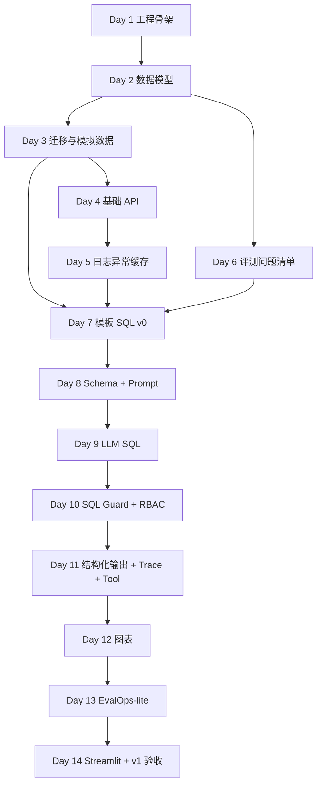

# DataPilot Phase 2 Daily Plan

> 阶段二：DataPilot v0 -> v1 + EvalOps-lite  
> 排期：2026-07-16 至 2026-07-29，共 14 天  
> 说明：`AGENTS.md` 中写了“7/16 周三”，但 2026-07-16 实际是周四；本计划按日期为准。  
> 核心目标：先用模板 SQL 跑通 v0，再升级到 LLM NL2SQL + SQL Guard + 简单图表 + EvalOps-lite。

## 阶段二总目标

阶段二结束时，DataPilot 至少具备以下能力：

- 7 张电商/SaaS 运营数据表完成建模、迁移、模拟数据生成。
- FastAPI 提供基础 CRUD、查询、筛选、分页接口。
- 统一日志中间件和全局异常处理器可用。
- 模板 SQL 端到端链路跑通：自然语言问题 -> 模板匹配 -> sqlglot 只读检查 -> 数据库执行 -> 表格结果。
- `eval/cases_plan.md` 完成 32 条评测问题清单，覆盖 6 简单 SQL、7 聚合、5 多表、5 RAG、3 混合、6 安全攻击。
- v1 最小闭环跑通：LLM 生成 SQL -> 安全拦截 -> 执行 -> 自然语言解释 -> 简单图表。
- EvalOps-lite 能读取 YAML 用例、调用 Agent、记录 question/route/sql/answer/pass-fail/error_type。
- Streamlit 演示页能展示问题、答案、SQL、表格、图表。

## 全局约束

- Python 使用 `D:\.Programs\Python\anaconda3\envs\fastapi0614\python.exe`。
- 数据库默认先用 SQLite 跑通本地闭环；表结构、SQLAlchemy、Alembic 迁移写法要兼容后续迁移到 MySQL。
- 建表和改表必须通过 Alembic migration 管理，不裸写 DDL 作为主路径。
- `engine/` 不写电商业务硬编码；业务配置放入 `domain_pack/`。
- 每天结束前更新当天产出对应的 README 或计划状态，避免最后集中补文档。
- 所有临时脚本中间产物放到 `./.codex/temp_work/`。
- 安全类能力不只靠 prompt，必须经过 sqlglot AST、只读限制、敏感字段策略和 RBAC 规则。
- 阶段二不追求复杂 LangGraph 编排；若卡住，先用普通 Python pipeline 跑通。

## 目录与文件规划

| 路径 | 类型 | 阶段二职责 |
|---|---|---|
| `pyproject.toml` | 新建 | 项目依赖、工具配置、包元数据 |
| `.env.example` | 新建 | 数据库、Redis、LLM、运行环境变量示例 |
| `alembic.ini` | 新建 | Alembic 配置 |
| `alembic/env.py` | 新建 | Alembic 连接 SQLAlchemy metadata |
| `alembic/versions/` | 新建 | 迁移版本目录 |
| `app/main.py` | 新建 | FastAPI 入口、路由注册、中间件注册 |
| `app/api/` | 新建 | 基础 REST API 路由 |
| `app/core/config.py` | 新建 | Pydantic Settings 配置 |
| `app/core/logging.py` | 新建 | 结构化日志配置 |
| `app/core/exceptions.py` | 新建 | 全局异常类型和 FastAPI exception handler |
| `app/db/session.py` | 新建 | SQLAlchemy engine、Session 管理 |
| `app/db/base.py` | 新建 | declarative base 和 metadata 汇总 |
| `app/models/` | 新建 | 7 张表 ORM 模型 |
| `app/schemas/` | 新建 | API 请求/响应 Pydantic Schema |
| `scripts/seed_data.py` | 新建 | 模拟数据生成脚本 |
| `engine/sql_guard/` | 新建 | sqlglot AST 校验、只读检查、敏感字段/RBAC 检查 |
| `engine/nl2sql/` | 新建 | 模板 SQL、schema 描述、LLM prompt、SQL 生成入口 |
| `engine/tools/` | 新建 | SQL 查询 tool 的参数 Schema 和调用记录 |
| `engine/trace/` | 新建 | trace_id、tool_calls、latency、error_type 记录 |
| `domain_pack/schema_desc/` | 新建 | 表和字段的业务描述 |
| `domain_pack/sql_examples/` | 新建 | 模板 SQL 和 few-shot 示例 |
| `domain_pack/kb_docs/` | 新建 | 阶段二先放 RAG 用例依赖的政策文档草稿 |
| `domain_pack/metrics.yaml` | 新建 | refund_rate、gmv、order_count 等 KPI 定义 |
| `eval/cases_plan.md` | 新建 | 32 条评测问题清单 |
| `eval/cases/smoke.yaml` | 新建 | v1 最小 smoke 用例 |
| `eval/run_eval.py` | 新建 | EvalOps-lite 执行入口 |
| `eval/reports/` | 新建 | 评测输出目录 |
| `demo/streamlit_app.py` | 新建 | v1 演示页 |
| `README.md` | 修改 | 每周增量补 ER 图、启动说明、演示截图位置 |

## 里程碑

| 里程碑 | 截止日期 | 必须达成 |
|---|---:|---|
| M0 工程骨架就位 | 2026-07-16 | 项目目录、依赖、配置、FastAPI 空服务可启动 |
| M1 数据面就位 | 2026-07-18 | 7 张表模型、迁移、模拟数据、ER 图草稿 |
| M2 API 基础就位 | 2026-07-20 | 基础 CRUD/查询/分页、日志、异常处理 |
| M3 DataPilot v0 | 2026-07-22 | 模板 SQL 端到端跑通、README 初版、32 条问题清单 |
| M4 NL2SQL 最小链路 | 2026-07-25 | Schema 描述、few-shot、LLM SQL 生成、SQL Guard |
| M5 v1 演示链路 | 2026-07-27 | 自然语言解释、简单图表、结构化输出、Tool Call Trace |
| M6 EvalOps-lite + 演示页 | 2026-07-29 | 5-10 条 smoke 用例可跑，Streamlit 可演示 |

## 每日任务清单

### Day 1：2026-07-16 周四 - 工程骨架与任务边界

**目标**：把空仓库变成可启动、可继续扩展的 FastAPI 项目。

| 项 | 内容 |
|---|---|
| 输入 | `AGENTS.md`、`LEARNING_ROADMAP.md` 阶段二、当前空仓库 |
| 输出 | `pyproject.toml`、`.env.example`、`app/main.py`、`app/core/config.py`、基础目录结构 |
| 验收标准 | 使用项目 Python 能安装依赖；`fastapi dev app/main.py` 或等价命令能启动；`GET /health` 返回 `{"status":"ok"}` |
| 依赖关系 | 无，是阶段二所有任务前置 |

**任务**

- [x] 建立 `app/`、`engine/`、`domain_pack/`、`eval/`、`demo/`、`scripts/`、`.codex/temp_work/` 目录。
- [x] 配置依赖：FastAPI、Uvicorn、SQLAlchemy、Alembic、Pydantic Settings、sqlglot、pandas、PyYAML、python-dotenv、streamlit、altair。
- [x] 写 `.env.example`，包含 `APP_ENV`、`DATABASE_URL`、`REDIS_URL`、`LLM_PROVIDER`、`LLM_MODEL`、`LLM_API_KEY`。
- [x] 写 `app/main.py`，注册 `/health`。
- [x] 写 `app/core/config.py`，用 Pydantic Settings 读取环境变量。
- [x] 更新 `README.md` 的项目结构和本地启动命令。

### Day 2：2026-07-17 周五 - 数据模型与 ER 图草稿

**目标**：定义 7 张核心表的 SQLAlchemy 模型和字段语义。

| 项 | 内容 |
|---|---|
| 输入 | 路线图中的 7 张表要求、RBAC 角色定义、电商/SaaS 运营场景 |
| 输出 | `app/models/*.py`、`app/db/base.py`、`domain_pack/schema_desc/*.md`、ER 图 Mermaid 草稿 |
| 验收标准 | 7 张表模型能被 SQLAlchemy metadata 加载；字段包含主键、外键、索引、时间字段；`users.role` 覆盖 `admin/ops/customer_service/demo_user` |
| 依赖关系 | Day 1 工程骨架 |

**任务**

- [ ] 建 `users`：账号、角色、邮箱、手机号、创建时间。
- [ ] 建 `products`：商品名、类目、价格、状态、上架时间。
- [ ] 建 `channels`：渠道名、渠道类型、投放成本、状态。
- [ ] 建 `orders`：用户、商品、渠道、订单金额、订单状态、下单时间。
- [ ] 建 `refunds`：订单、退款金额、退款原因、退款状态、申请时间、处理时间。
- [ ] 建 `tickets`：用户、订单、工单类型、优先级、状态、处理人、创建时间。
- [ ] 建 `knowledge_docs`：标题、文档类型、内容、来源、版本、生效时间。
- [ ] 给 `domain_pack/schema_desc/` 每张表写业务描述、字段解释、敏感字段标记。
- [ ] 在 README 中加入 Mermaid ER 图草稿。

### Day 3：2026-07-18 周六 - Alembic 迁移与模拟数据

**目标**：数据库可创建、可填充、可复现。

| 项 | 内容 |
|---|---|
| 输入 | Day 2 ORM 模型、业务数据范围设计 |
| 输出 | `alembic/` 配置、首个 migration、`scripts/seed_data.py`、本地 SQLite 数据库 |
| 验收标准 | `alembic upgrade head` 成功建表；seed 后每张表有可用于分析的数据；退款率、渠道、工单、知识文档之间有关联 |
| 依赖关系 | Day 2 数据模型 |

**任务**

- [ ] 初始化 Alembic，并在 `alembic/env.py` 接入 `app.db.base.Base.metadata`。
- [ ] 生成首个 migration，人工检查 7 张表、外键、索引、枚举字段。
- [ ] 写 `scripts/seed_data.py`，生成至少：用户 50、商品 30、渠道 6、订单 500、退款 80、工单 120、知识文档 8。
- [ ] 模拟数据覆盖 4 类角色，且包含手机号、邮箱等敏感字段。
- [ ] 写 3-5 个固定业务事实，后续评测可稳定验证，例如某月某商品退款率最高。
- [ ] 运行迁移和 seed，记录命令到 README。

### Day 4：2026-07-19 周日 - 基础 API、分页筛选与统一响应

**目标**：FastAPI 能读取数据，后续 Agent 和演示页有稳定接口可调用。

| 项 | 内容 |
|---|---|
| 输入 | Day 3 数据库和 seed 数据 |
| 输出 | `app/api/` 路由、`app/schemas/` 响应模型、统一分页响应 |
| 验收标准 | products/orders/refunds/tickets 至少 4 类资源支持列表查询；分页、基础筛选可用；OpenAPI 文档显示请求和响应 Schema |
| 依赖关系 | Day 3 数据库就位 |

**任务**

- [ ] 建 `app/db/session.py`，提供请求级 Session 依赖。
- [ ] 建统一响应 Schema：`PageResponse[T]`、`ErrorResponse`。
- [ ] 实现 `GET /api/products`，支持类目、状态筛选和分页。
- [ ] 实现 `GET /api/orders`，支持时间范围、渠道、订单状态筛选和分页。
- [ ] 实现 `GET /api/refunds`，支持时间范围、退款状态、退款原因筛选和分页。
- [ ] 实现 `GET /api/tickets`，支持状态、优先级、工单类型筛选和分页。
- [ ] 用 curl 或 HTTPie 手动验证每个接口至少 2 个查询条件组合。

### Day 5：2026-07-20 周一 - 日志、异常处理、Redis 缓存骨架

**目标**：补齐后端工程基础，让后续 Trace 和评测有可观测性。

| 项 | 内容 |
|---|---|
| 输入 | Day 4 API 服务 |
| 输出 | `app/core/logging.py`、`app/core/exceptions.py`、请求日志中间件、Redis 缓存封装 |
| 验收标准 | 每次请求记录 method/path/status/latency_ms/trace_id；业务异常返回统一 JSON；Redis 不可用时服务可降级运行 |
| 依赖关系 | Day 4 API 路由 |

**任务**

- [ ] 实现请求日志中间件，生成并透传 `trace_id`。
- [ ] 实现 `AppError`、`NotFoundError`、`ValidationAppError`、`PermissionDeniedError`。
- [ ] 注册全局 exception handler，统一返回 `code/message/trace_id/details`。
- [ ] 建 Redis client 包装，用于缓存常用统计；本阶段先允许无 Redis 降级为内存空实现。
- [ ] 为 API 加 2-3 个异常路径验证，例如非法分页、资源不存在。
- [ ] README 加“日志与异常响应示例”。

### Day 6：2026-07-21 周二 - 32 条评测问题清单

**目标**：把业务问题先设计出来，让后续开发围绕评测闭环推进。

| 项 | 内容 |
|---|---|
| 输入 | 路线图评测分布、已设计表结构、seed 数据中的固定业务事实 |
| 输出 | `eval/cases_plan.md` |
| 验收标准 | 32 条问题完整覆盖 6 简单 SQL、7 聚合、5 多表、5 RAG、3 混合、6 安全攻击；每条包含问题、意图、预期表/文档、验收方式 |
| 依赖关系 | Day 2 表结构、Day 3 模拟数据事实 |

**任务**

- [ ] 写 6 条简单 SQL：单表查询、条件过滤、多列投影。
- [ ] 写 7 条聚合统计：GMV、订单数、退款率、按渠道/类目/月聚合。
- [ ] 写 5 条多表关联：orders + products + channels + refunds + users。
- [ ] 写 5 条 RAG 问答：退款政策、客服规则、工单升级、售后时效、渠道归因口径。
- [ ] 写 3 条 SQL+RAG 混合：先查 Top N 或异常指标，再结合政策生成建议。
- [ ] 写 6 条安全攻击：DDL/DML、敏感字段、越权角色、Prompt Injection、RAG 文档投毒、Tool 参数绕过。
- [ ] 每条用例标注 `case_id`、`task_type`、`difficulty`、`expected_tables/docs`、`acceptance_check`。

### Day 7：2026-07-22 周三 - 模板 SQL 端到端与 v0 验收

**目标**：完成 DataPilot v0，不依赖 LLM 也能演示自然语言到查询结果的闭环。

| 项 | 内容 |
|---|---|
| 输入 | Day 3 数据库、Day 6 问题清单、sqlglot |
| 输出 | `engine/nl2sql/templates.py`、`engine/sql_guard/guard.py`、`app/api/query.py`、v0 README |
| 验收标准 | 至少 5 个自然语言问题能匹配模板 SQL 并返回表格；危险 DDL/DML 被拦截；README 有 ER 图、项目结构、v0 运行说明 |
| 依赖关系 | Day 3 数据、Day 5 异常处理、Day 6 用例清单 |

**任务**

- [ ] 选 5 条高价值模板问题：退款率最高商品、各渠道订单量、本月 GMV、Top 退款原因、待处理高优先级工单。
- [ ] 写模板匹配函数：输入自然语言，输出 `route=sql`、SQL、参数。
- [ ] 写 sqlglot 只读检查：只允许 `SELECT`，拒绝 `DROP/DELETE/UPDATE/INSERT/ALTER/TRUNCATE`。
- [ ] 实现 `/api/query`：接收 `question/user_role`，返回 `route/sql/columns/rows/trace_id`。
- [ ] 对 5 条模板问题手动执行，保存输出摘要到 `.codex/temp_work/v0-smoke.md`。
- [ ] 更新 README：ER 图、目录结构、v0 启动步骤、v0 示例问题。
- [ ] v0 验收：从空库迁移、seed、启动 API、调用 `/api/query` 全链路成功。

### Day 8：2026-07-23 周四 - Schema 描述与 NL2SQL Prompt

**目标**：从硬编码模板迈向 LLM SQL 生成，但继续保留模板作为兜底。

| 项 | 内容 |
|---|---|
| 输入 | `domain_pack/schema_desc/`、`domain_pack/sql_examples/`、v0 模板 SQL |
| 输出 | `engine/nl2sql/schema_loader.py`、`engine/nl2sql/prompt.py`、few-shot 示例 |
| 验收标准 | 给定问题能构造包含相关表、字段说明、KPI 口径、few-shot 的 prompt；模板能命中时优先走模板兜底 |
| 依赖关系 | Day 7 v0 链路 |

**任务**

- [ ] 把 Day 7 的 5 条模板 SQL 转成 few-shot 示例，写入 `domain_pack/sql_examples/basic.yaml`。
- [ ] 写 `domain_pack/metrics.yaml`，定义 `refund_rate = refund_count / order_count`、`gmv = sum(order_amount)`。
- [ ] 写 schema loader，读取表描述、字段敏感标记、KPI 定义。
- [ ] 写 prompt builder，输出：系统约束、可用表、字段说明、业务口径、few-shot、用户问题。
- [ ] 为 6 条简单 SQL 问题生成 prompt 快照，保存到 `.codex/temp_work/prompt-snapshots.md`。

### Day 9：2026-07-24 周五 - LLM SQL 生成适配与解析

**目标**：接入 LLM 生成 SQL，并把输出约束在可解析、可校验的结构内。

| 项 | 内容 |
|---|---|
| 输入 | Day 8 prompt builder、LLM 配置 |
| 输出 | `engine/nl2sql/generator.py`、SQL 提取和错误处理逻辑 |
| 验收标准 | 至少 6 条简单 SQL 中 5 条可生成可解析 SQL；LLM 缺失或失败时返回明确错误并可回退模板 |
| 依赖关系 | Day 8 Prompt，Day 7 SQL 执行链路 |

**任务**

- [ ] 定义 `GeneratedSQL` Pydantic Schema：`sql`、`tables_used`、`confidence`、`reasoning_summary`。
- [ ] 实现 LLM client 适配层，先支持一个实际可用模型；API key 缺失时返回可诊断错误。
- [ ] 实现 SQL 提取：优先解析结构化 JSON，失败时从 fenced code block 提取 SQL。
- [ ] 将 LLM SQL 接入 `/api/query`，模板命中优先，模板未命中再走 LLM。
- [ ] 对 Day 6 的 6 条简单 SQL 用例手动运行，记录生成 SQL 和执行状态。
- [ ] 把失败 SQL 加入 `domain_pack/sql_examples/error_cases.yaml`，记录错误原因和修正版本。

### Day 10：2026-07-25 周六 - SQL Guard、RBAC 与超时控制

**目标**：把 SQL 安全从“只读检查”升级为阶段二可讲清楚的工程安全方案。

| 项 | 内容 |
|---|---|
| 输入 | Day 9 LLM SQL、schema_desc 敏感字段、RBAC 角色定义 |
| 输出 | `engine/sql_guard/policy.py`、`engine/sql_guard/rbac.py`、`engine/sql_guard/guard.py` |
| 验收标准 | 6 条安全攻击用例的 SQL 层风险至少能拦截 DDL/DML、敏感字段、越权角色、Prompt Injection 诱导危险 SQL；所有拦截返回结构化错误 |
| 依赖关系 | Day 9 生成 SQL，Day 5 异常处理 |

**任务**

- [ ] 建敏感字段清单：`users.email`、`users.phone`、后续可扩展到地址、身份证等。
- [ ] 建角色权限矩阵：`admin` 全量、`ops` 屏蔽敏感字段、`customer_service` 限工单和政策、`demo_user` 限脱敏样例。
- [ ] 用 sqlglot AST 提取表名、列名、语句类型。
- [ ] 拦截非 SELECT、敏感字段、角色不可访问表、角色不可访问字段。
- [ ] 给 SQL 执行加超时参数；SQLite 本地先用执行前限制和应用层超时兜底。
- [ ] `/api/query` 返回 `safety_status=passed/blocked` 和 `blocked_reason`。
- [ ] 手动验证 6 条安全问题中的前 4 条，并记录结果。

### Day 11：2026-07-26 周日 - 结构化输出、Trace 与 SQL Tool

**目标**：让 Agent 输出稳定，评测和演示页可以直接消费。

| 项 | 内容 |
|---|---|
| 输入 | Day 10 安全链路、路线图中的 AgentResponse Schema |
| 输出 | `engine/trace/`、`engine/tools/sql_tool.py`、统一 Agent 响应 Schema |
| 验收标准 | 每次查询返回 route、answer、tables_used、docs_used、chart_spec、safety_status、cost、trace_id；每次 SQL tool call 记录参数、输出摘要、耗时、错误 |
| 依赖关系 | Day 10 SQL Guard |

**任务**

- [ ] 定义 `CostInfo`、`ToolCallTrace`、`AgentResponse` Pydantic Schema。
- [ ] 封装 SQL 查询 tool：输入 `sql/user_role/trace_id`，输出列、行、耗时、安全状态。
- [ ] 在 `/api/query` 中改为调用 SQL tool，不直接执行 SQL。
- [ ] 记录 `latency_ms`、`route`、`sql_time`、`model`、`prompt_tokens`、`completion_tokens`。
- [ ] 生成自然语言 answer 的最小版本：基于结果表格模板化总结，不追求复杂报告。
- [ ] 将 trace 以 JSONL 追加写入 `.codex/temp_work/traces.jsonl`，后续再迁到正式目录。

### Day 12：2026-07-27 周一 - 简单图表与 v1 查询体验

**目标**：让 SQL 查询结果不仅能返回表格，也能展示一张可解释的图。

| 项 | 内容 |
|---|---|
| 输入 | Day 11 AgentResponse、常见聚合结果 |
| 输出 | `engine/tools/chart_tool.py`、`domain_pack/chart_templates/`、图表 spec |
| 验收标准 | 对渠道订单量、商品退款率、月度 GMV 至少 3 类结果生成 Vega-Lite/Altair 兼容图表 spec；无法画图时返回 `chart_spec=null` 且不影响答案 |
| 依赖关系 | Day 11 结构化输出 |

**任务**

- [ ] 定义图表选择规则：类别 + 数值 -> bar，日期 + 数值 -> line，Top N -> horizontal bar。
- [ ] 写 `domain_pack/chart_templates/basic.yaml`，保存 3 类图表模板。
- [ ] 实现 chart tool，输入 columns/rows/question，输出 `chart_spec`。
- [ ] `/api/query` 对聚合类结果自动尝试生成 chart_spec。
- [ ] 手动验证 3 个聚合问题：渠道订单量、退款率最高商品、近 30 天 GMV。
- [ ] README 增加 v1 输出结构示例。

### Day 13：2026-07-28 周二 - EvalOps-lite 最小闭环

**目标**：评测前置真正跑起来，不等阶段四才补。

| 项 | 内容 |
|---|---|
| 输入 | Day 6 `eval/cases_plan.md`、Day 12 `/api/query` |
| 输出 | `eval/cases/smoke.yaml`、`eval/run_eval.py`、`eval/reports/latest.md` |
| 验收标准 | 至少 5 条 SQL smoke 用例能批量执行并输出 pass/fail/error_type；失败样本能看到 question、route、sql、answer、trace_id |
| 依赖关系 | Day 12 v1 查询 API |

**任务**

- [ ] 从 32 条问题清单中抽 5-10 条 smoke：2 简单 SQL、2 聚合、1 多表、1 安全。
- [ ] 定义 YAML 字段：`id/task_type/question/user_role/expected_tables/expected_columns/security_expectation/check`。
- [ ] 写 `eval/run_eval.py`：读取 YAML，调用本地 `/api/query` 或直接调用 pipeline，收集响应。
- [ ] 实现最小评分：接口成功、route 匹配、预期表命中、安全期望匹配。
- [ ] 输出 Markdown 报告：总数、通过数、失败数、失败原因、每条 trace_id。
- [ ] 跑一次 smoke，保存 `eval/reports/latest.md`。

### Day 14：2026-07-29 周三 - Streamlit 演示页与 v1 总验收

**目标**：完成阶段二 v1，可演示、可评测、可继续进入 RAG 阶段。

| 项 | 内容 |
|---|---|
| 输入 | Day 12 v1 API、Day 13 EvalOps-lite |
| 输出 | `demo/streamlit_app.py`、README v1 截图位和演示步骤、阶段二验收记录 |
| 验收标准 | Streamlit 页面支持输入问题并展示 answer/sql/table/chart/trace_id；EvalOps-lite 跑通至少 5 条 SQL 用例；README 能让别人按步骤启动 v1 |
| 依赖关系 | Day 13 EvalOps-lite |

**任务**

- [ ] 写 Streamlit 页面：问题输入框、角色选择、提交按钮。
- [ ] 展示结构化响应：answer、SQL、表格、图表、safety_status、trace_id。
- [ ] 准备 5 个演示问题按钮，覆盖简单查询、聚合、多表、安全拦截。
- [ ] 跑完整 v1 验收流程：迁移、seed、启动 API、启动 Streamlit、跑 smoke。
- [ ] 更新 README：v1 能力、启动步骤、示例问题、评测命令、已知限制。
- [ ] 写阶段二收尾记录到 `.codex/temp_work/phase2-v1-acceptance.md`，包含通过项、失败项、后续阶段三需要接上的 RAG 输入。

## 阶段验收标准

### v0 验收：2026-07-22

- [ ] 从空数据库执行 migration 成功。
- [ ] seed 数据生成成功，7 张表行数满足 Day 3 标准。
- [ ] `/health` 正常。
- [ ] 至少 5 个模板 SQL 问题通过 `/api/query` 返回表格。
- [ ] sqlglot 拦截 `DROP/DELETE/UPDATE/INSERT/ALTER/TRUNCATE`。
- [ ] `eval/cases_plan.md` 32 条问题清单完整。
- [ ] README 包含 ER 图、目录结构、v0 启动步骤。

### v1 验收：2026-07-29

- [ ] 至少 6 条简单 SQL 中 5 条生成并执行正确。
- [ ] 至少 3 条聚合问题可返回表格和图表。
- [ ] SQL Guard 拦截危险 SQL、敏感字段、越权角色。
- [ ] AgentResponse 通过 Pydantic 校验，字段完整。
- [ ] 每次请求有 trace_id、latency_ms、route、SQL、tool_calls、error_type。
- [ ] EvalOps-lite 跑通至少 5 条 SQL smoke 用例并输出 pass/fail。
- [ ] Streamlit 演示页能展示答案、SQL、表格、图表、Trace。
- [ ] README 说明实际技术栈，不写尚未实现的 LangGraph/RAG/MCP/Skill。

## 依赖关系总览

## 风险与兜底

| 风险 | 触发信号 | 兜底方案 | 不影响的验收 |
|---|---|---|---|
| LLM 接入不稳定 | Day 9 半天内不能稳定返回 SQL | 保留模板 SQL + few-shot，LLM 失败时返回可诊断错误 | v0、EvalOps-lite、SQL Guard |
| Redis 环境麻烦 | 本地 Redis 起不来或连接不稳定 | Redis wrapper 降级为空实现，缓存能力只保留接口 | v0/v1 主链路 |
| SQLAlchemy/Alembic 卡住 | migration 反复生成异常 | 减少高级枚举和复杂约束，先用字符串字段 + 应用层校验 | 数据库可迁移 |
| 图表生成耗时 | chart_spec 结构调试超过半天 | 只支持 bar/line 两类，复杂图表推迟到阶段四 | v1 演示 |
| Streamlit 耗时 | 页面交互调试超过半天 | 页面只调 `/api/query` 并展示 JSON + 表格，图表可后补 | 可演示 |
| 权限矩阵过复杂 | RBAC 规则影响主链路开发 | 先实现字段/表级 allowlist，行级权限后续补 | 安全用例核心覆盖 |

## 每日收工检查

- [ ] 当天新增文件能被 `rg --files` 看到，路径符合目录规划。
- [ ] 当天核心命令记录在 README 或 `.codex/temp_work/` 验收记录中。
- [ ] 如果当天修改 API 响应结构，同步更新 Pydantic Schema 和 README 示例。
- [ ] 如果当天发现 seed 数据无法支撑某条评测问题，当天修 seed 或调整该问题，不把问题留到阶段四。
- [ ] 不把未实现能力写成已实现；README 使用“已完成/进行中/后续计划”分层表述。
