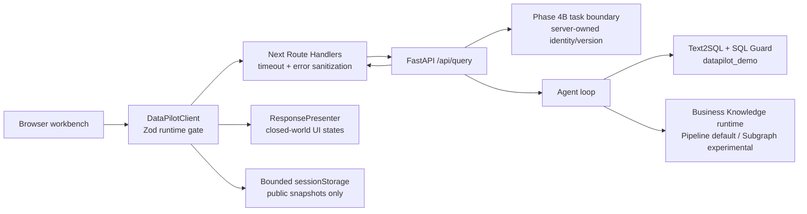

# DataPilot Web Workbench

M50 的本地展示页：Next.js App Router + React + TypeScript。它通过同源薄 BFF 消费 FastAPI 公开合同，展示 durable Agent task、SQL/图表、Document citation、Hybrid 分支和安全停止；不在浏览器复制 Agent 状态机，也不允许客户端选择模型、RAG strategy 或 corpus。

## 架构



关键 seam：Python/Pydantic 是业务合同 authority；前端 Zod 只负责拒绝网络漂移。一次 mutation 只有在完整响应通过 runtime validation 后才推进 last-acknowledged task version。timeout、abort、non-JSON 或合同漂移都会冻结当前 lineage，且不会自动 retry；页面会保存冻结现场，并允许通过只读 GET 核对服务端 task 状态。BFF 默认等待上限为 300 秒，可用服务端环境变量 `DATAPILOT_BFF_TIMEOUT_MS` 收窄。

## 首次准备

在仓库根目录执行。`prepare` 会重建且只允许重建精确命名的 `datapilot_demo`，必须显式确认：

```powershell
& 'D:\.Programs\Python\anaconda3\envs\fastapi0614\python.exe' -m scripts.prepare_m50_demo prepare --confirm-database datapilot_demo
```

日常启动前可用零 provider 只读 preflight：

```powershell
& 'D:\.Programs\Python\anaconda3\envs\fastapi0614\python.exe' -m scripts.prepare_m50_demo preflight --confirm-database datapilot_demo
```

`ready=true` 要求 migration=`20260827_0005`、7/8 月 oracle=`120000/180000`，并且没有遗留 synthetic task/event。

## 本地启动

终端 1：启动 guarded FastAPI。普通演示可用默认 Pipeline；招牌 Hybrid 演示显式使用服务端 experimental Subgraph。页面不会收到 strategy 开关。

```powershell
& 'D:\.Programs\Python\anaconda3\envs\fastapi0614\python.exe' scripts/run_m50_demo_api.py --rag-strategy subgraph --proxy http://127.0.0.1:7897
```

终端 2：启动 Web。下面的命令同时适用于 PowerShell、Windows cmd 和 Anaconda Prompt；请先确认当前目录是仓库根目录 `data-pilot`：

```powershell
cd web
npm ci
npm run dev -- --hostname 127.0.0.1 --port 3100
```

打开 `http://127.0.0.1:3100`。BFF 默认连接 `http://127.0.0.1:8000`；如需改变，只能由服务端启动环境设置 `DATAPILOT_API_BASE_URL`，不要把 FastAPI 地址或凭据暴露给浏览器。

## 招牌演示

选择“退款趋势 · 招牌多轮”，按同一 task 依次提交：

1. 查询 2026 年 7 月实际净退款金额。
2. 比较 2026 年 7 月和 8 月实际净退款金额，并计算差额和变化率。
3. 比较 2026 年 7 月和 8 月实际净退款金额，并说明质量问题全额退款的前提和材料。

预期依次看到 120000、`120000/180000/60000/50%`，以及包含 SQL + Document Evidence、citation、Hybrid 双分支和 Subgraph experimental runtime identity 的完整结果。演示结束使用页面“清理任务与本地快照”；开发 Probe 的 tombstone/event 还需用精确 safe ref cleanup，不能全库删除。

## 验证

```powershell
npm run typecheck
npm run lint
npm test
npm run test:e2e
npm run build
```

fixture gallery 仅在开发环境提供：`http://127.0.0.1:3100/gallery`。它用于视觉与自动化验证，不能替代真实 Browser → BFF → FastAPI → Qwen/MySQL/RAG Probe。
